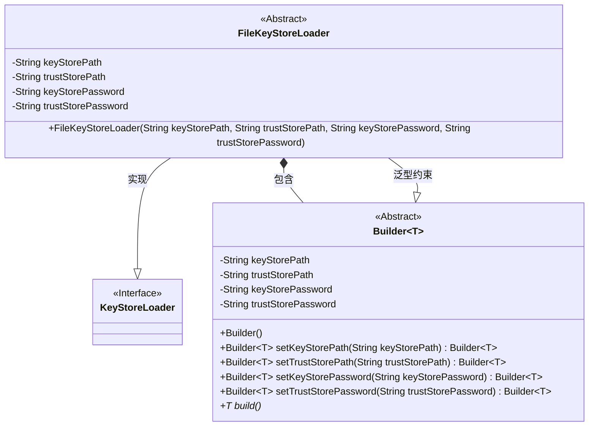
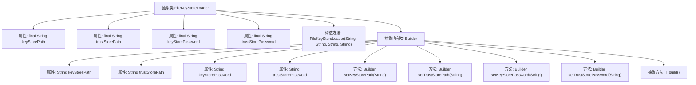

# 基础信息

|      |      |
|------|------|
| 名称 | FileKeyStoreLoader |
| 编码语言 | .java |
| 代码路径 | zookeeper/zookeeper-server/src/main/java/org/apache/zookeeper/common/FileKeyStoreLoader.java |
| 包名 | org.apache.zookeeper.common |
| 依赖项 | ['java.util.Objects'] |
| 概述说明 | 抽象类FileKeyStoreLoader实现密钥库加载，包含路径和密码字段。其静态抽象Builder类支持链式调用设置参数并构建子类实例。 |

# 说明

FileKeyStoreLoader是一个抽象类，实现了KeyStoreLoader接口，用于加载密钥库和信任库。它包含四个final字段：keyStorePath、trustStorePath、keyStorePassword和trustStorePassword，通过构造函数初始化。内部抽象静态类Builder采用建造者模式，提供设置路径和密码的方法，并返回当前Builder实例以支持链式调用。Builder要求所有参数非空，并定义了抽象方法build用于创建具体子类实例。

# 类列表 Class Summary

| 名称   | 类型  | 说明 |
|-------|------|-------------|
| FileKeyStoreLoader | class | FileKeyStoreLoader类实现密钥库加载，包含路径和密码字段，提供构建器模式支持子类扩展。 |

## 类 FileKeyStoreLoader

|      |      |
|------|------|
| 访问范围 | abstract |
| 类型 | class |
| 名称 | FileKeyStoreLoader |
| 说明 | FileKeyStoreLoader类实现密钥库加载，包含路径和密码字段，提供构建器模式支持子类扩展。 |

### UML类图

这段代码展示了一个抽象类FileKeyStoreLoader及其内部抽象建造者类的结构。FileKeyStoreLoader实现了KeyStoreLoader接口，包含密钥库和信任库的路径及密码字段。内部抽象建造者类Builder采用泛型设计（T需继承FileKeyStoreLoader），通过链式方法设置参数并定义抽象构建方法。类图清晰呈现了接口实现、内部类包含以及泛型约束关系，体现了建造者模式在安全凭证加载场景中的应用。

### 内部方法调用关系图

这段代码描述了一个抽象类FileKeyStoreLoader及其内部抽象构建器类Builder的结构。FileKeyStoreLoader包含四个final字符串属性用于存储密钥库和信任库的路径及密码，并通过构造函数初始化。内部抽象类Builder采用建造者模式，提供链式调用的属性设置方法(setKeyStorePath等)和抽象的build方法，要求子类实现具体构建逻辑。整体设计实现了密钥库加载器的可扩展配置机制，通过类型参数T确保构建器与具体子类的类型安全关联。

### 字段列表 Field List

| 名称  | 类型  | 说明 |
|-------|-------|------|
| trustStorePath | String | 声明一个不可变的字符串变量trustStorePath，用于存储信任库路径。 |
| keyStorePath | String | 声明一个不可变的字符串变量keyStorePath，用于存储密钥库路径。 |
| keyStorePassword | String | 声明最终字符串变量keyStorePassword，用于存储密钥库密码。 |
| trustStorePassword | String | 声明一个不可变的字符串变量trustStorePassword，用于存储信任库密码。 |

### 方法列表 Method List

| 名称  | 类型  | 说明 |
|-------|-------|------|

