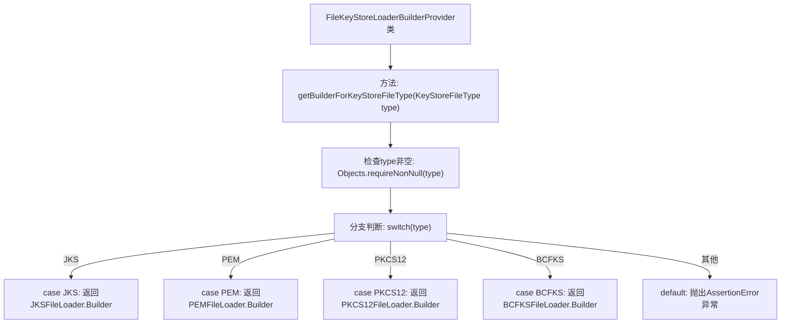

# 基础信息

|      |      |
|------|------|
| 名称 | FileKeyStoreLoaderBuilderProvider |
| 编码语言 | .java |
| 代码路径 | zookeeper/zookeeper-server/src/main/java/org/apache/zookeeper/common/FileKeyStoreLoaderBuilderProvider.java |
| 包名 | org.apache.zookeeper.common |
| 依赖项 | ['java.util.Objects'] |
| 概述说明 | FileKeyStoreLoaderBuilderProvider类提供根据KeyStoreFileType返回对应文件加载器Builder的方法，支持JKS、PEM、PKCS12和BCFKS类型。 |

# 说明

该代码定义了一个名为FileKeyStoreLoaderBuilderProvider的公共类，其中包含一个静态方法getBuilderForKeyStoreFileType。该方法根据传入的KeyStoreFileType参数返回对应的FileKeyStoreLoader.Builder实例，用于从指定类型的密钥库文件中加载密钥和证书。支持的密钥库文件类型包括JKS、PEM、PKCS12和BCFKS，每种类型对应不同的Builder实现。如果传入不支持的类型，方法会抛出AssertionError异常。该方法要求传入参数不能为null。

# 类列表 Class Summary

| 名称   | 类型  | 说明 |
|-------|------|-------------|
| FileKeyStoreLoaderBuilderProvider | class | FileKeyStoreLoaderBuilderProvider类提供根据KeyStoreFileType获取对应文件加载器Builder的方法，支持JKS、PEM、PKCS12和BCFKS类型。 |


## 类 FileKeyStoreLoaderBuilderProvider

|      |      |
|------|------|
| 访问范围 | public |
| 类型 | class |
| 名称 | FileKeyStoreLoaderBuilderProvider |
| 说明 | FileKeyStoreLoaderBuilderProvider类提供根据KeyStoreFileType获取对应文件加载器Builder的方法，支持JKS、PEM、PKCS12和BCFKS类型。 |


### UML类图

```mermaid
classDiagram
    class FileKeyStoreLoaderBuilderProvider {
        <<static>>
        +getBuilderForKeyStoreFileType(KeyStoreFileType type) FileKeyStoreLoader.Builder~? extends FileKeyStoreLoader~
    }

    class FileKeyStoreLoader {
        <<Interface>>
    }

    class "FileKeyStoreLoader.Builder~T~" {
        <<Interface>>
    }

    class JKSFileLoader {
    }
    class PEMFileLoader {
    }
    class PKCS12FileLoader {
    }
    class BCFKSFileLoader {
    }

    FileKeyStoreLoaderBuilderProvider --> KeyStoreFileType : 依赖
    FileKeyStoreLoaderBuilderProvider --> "FileKeyStoreLoader.Builder~? extends FileKeyStoreLoader~" : 返回
    "FileKeyStoreLoader.Builder~T~" ..|> FileKeyStoreLoader : 实现
    JKSFileLoader.Builder ..|> "FileKeyStoreLoader.Builder~T~" : 实现
    PEMFileLoader.Builder ..|> "FileKeyStoreLoader.Builder~T~" : 实现
    PKCS12FileLoader.Builder ..|> "FileKeyStoreLoader.Builder~T~" : 实现
    BCFKSFileLoader.Builder ..|> "FileKeyStoreLoader.Builder~T~" : 实现
```

这段代码展示了一个工厂模式的设计，`FileKeyStoreLoaderBuilderProvider` 根据不同的 `KeyStoreFileType` 返回对应的 `Builder` 实现类（如 `JKSFileLoader.Builder`、`PEMFileLoader.Builder` 等）。这些 `Builder` 都实现了泛型接口 `FileKeyStoreLoader.Builder<T>`，而该接口又继承自 `FileKeyStoreLoader` 接口。类图清晰地体现了静态工厂方法的分发逻辑，以及各 `Builder` 实现类与接口之间的层级关系，同时通过泛型约束保证了类型安全。


### 内部方法调用关系图



这段代码流程图展示了FileKeyStoreLoaderBuilderProvider类的核心工厂方法逻辑。该方法根据不同的KeyStoreFileType类型(JKS/PEM/PKCS12/BCFKS)返回对应的Builder实现类，包含空值检查和异常处理分支。流程从方法入口开始，经过参数校验后进入多路分支选择，最后返回具体Builder实例或抛出异常，清晰地反映了工厂模式的分发逻辑。

### 字段列表 Field List

| 名称  | 类型  | 说明 |
|-------|-------|------|

### 方法列表 Method List

| 名称  | 类型  | 说明 |
|-------|-------|------|
| getBuilderForKeyStoreFileType | FileKeyStoreLoader.Builder<? extends FileKeyStoreLoader> | 根据密钥库文件类型返回对应的构建器：JKS返回JKSFileLoader.Builder，PEM返回PEMFileLoader.Builder，PKCS12返回PKCS12FileLoader.Builder，BCFKS返回BCFKSFileLoader.Builder，不支持的类型抛出异常。 |


