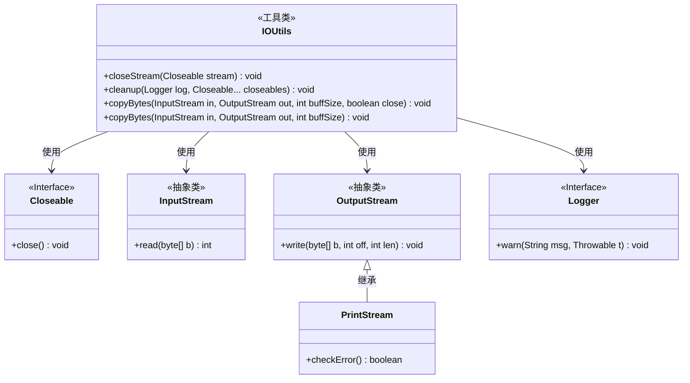
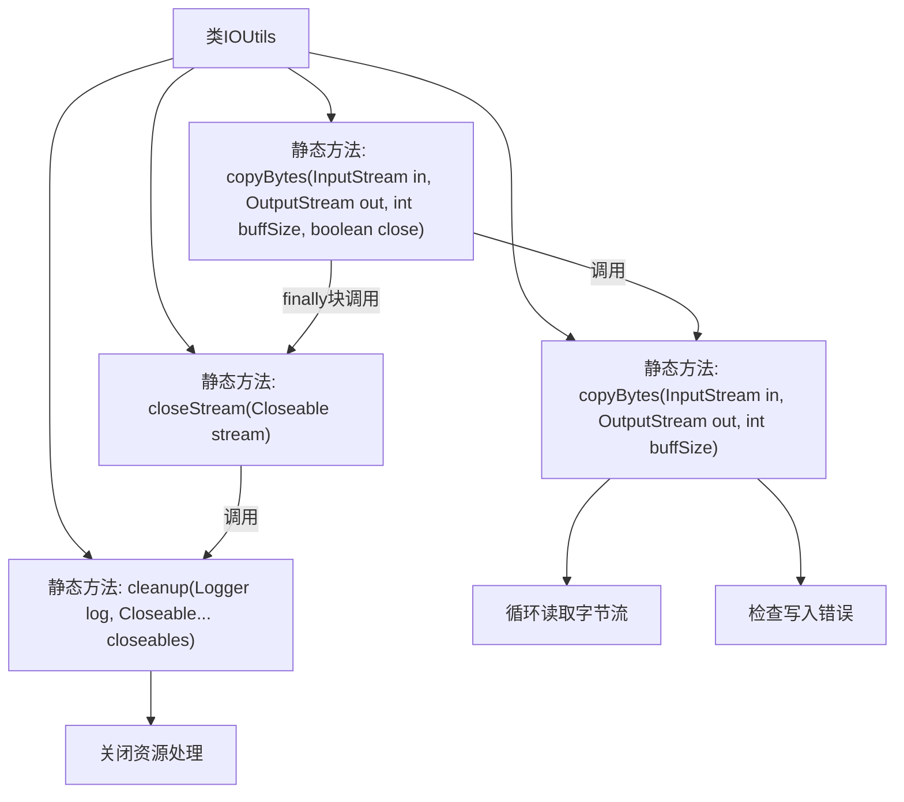
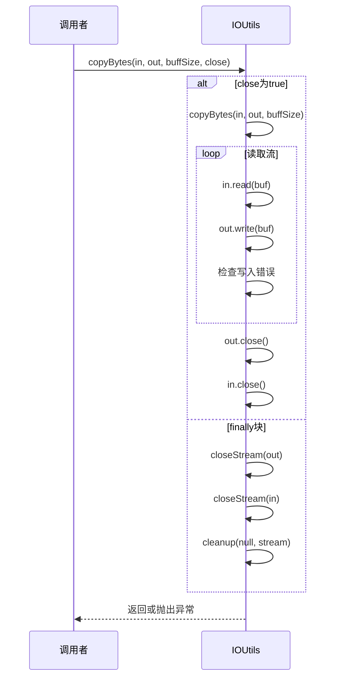

# 基础信息

|      |      |
|------|------|
| 名称 | IOUtils |
| 编码语言 | .java |
| 代码路径 | zookeeper/zookeeper-server/src/main/java/org/apache/zookeeper/common/IOUtils.java |
| 包名 | org.apache.zookeeper.common |
| 依赖项 | ['java.io.Closeable', 'java.io.IOException', 'java.io.InputStream', 'java.io.OutputStream', 'java.io.PrintStream', 'org.slf4j.Logger'] |
| 概述说明 | IOUtils类提供静态方法处理流操作：closeStream关闭流忽略异常；cleanup关闭多个流并记录异常；copyBytes在流间复制数据，可选关闭流。 |

# 说明

IOUtils类提供了处理IO流的实用方法。closeStream方法用于关闭流并忽略异常，适用于异常处理中的清理。cleanup方法可关闭多个Closeable对象，忽略异常并可选择记录日志。copyBytes方法有两个版本：一个在复制字节后根据参数决定是否关闭流，并在finally块中确保关闭；另一个仅执行复制，使用缓冲区提高效率，并检查输出流错误。所有方法都注重资源管理和异常处理。

# 类列表 Class Summary

| 名称   | 类型  | 说明 |
|-------|------|-------------|
| IOUtils | class | IOUtils类提供静态方法处理流操作：closeStream忽略异常关闭流；cleanup关闭多个流并可选记录异常；copyBytes在流间复制数据，支持自定义缓冲区大小和自动关闭。 |

## 类 IOUtils

|      |      |
|------|------|
| 访问范围 | public |
| 类型 | class |
| 名称 | IOUtils |
| 说明 | IOUtils类提供静态方法处理流操作：closeStream忽略异常关闭流；cleanup关闭多个流并可选记录异常；copyBytes在流间复制数据，支持自定义缓冲区大小和自动关闭。 |

### UML类图

该类图展示了IOUtils工具类的结构及其与相关接口/类的关系。IOUtils提供静态方法用于流操作，包括安全关闭流对象(cleanup/closeStream)和流数据复制(copyBytes)。它依赖Closeable接口处理可关闭资源，使用InputStream/OutputStream进行数据读写，并通过Logger记录异常。PrintStream作为OutputStream的子类提供额外错误检查功能。所有方法都设计为静态方法，体现工具类特性，重点关注资源关闭时的异常处理和流操作可靠性。

### 内部方法调用关系图

流程图描述：该流程图展示了IOUtils工具类的核心方法调用关系。closeStream方法直接委托给cleanup方法处理资源关闭，copyBytes方法通过重载实现两种不同的流复制方式。主复制逻辑包含循环读取字节流、写入输出流和错误检查机制，最终通过finally块确保资源释放。所有方法都采用静态设计，重点关注异常处理和资源管理。

时序图描述：时序图演示了copyBytes方法的完整执行过程。当close参数为true时，先执行流复制操作（包含循环读写过程），然后主动关闭流；无论是否异常，最终都会通过finally块确保调用closeStream方法释放资源。cleanup方法作为底层实现处理实际的关闭操作和异常捕获。

### 字段列表 Field List

| 名称  | 类型  | 说明 |
|-------|-------|------|

### 方法列表 Method List

| 名称  | 类型  | 说明 |
|-------|-------|------|
| closeStream | void | 静态方法closeStream用于关闭可关闭流，调用cleanup处理。 |
| cleanup | void | 静态方法cleanup用于安全关闭多个Closeable对象，遇到异常时通过Logger记录警告。 |
| copyBytes | void | 静态方法copyBytes从输入流读取字节写入输出流，支持指定缓冲区大小和自动关闭流。若关闭标志为真，则操作完成后关闭流并置空。异常时确保流被关闭。 |
| copyBytes | void | 静态方法copyBytes从输入流读取字节并写入输出流，使用指定缓冲区大小，检查写入错误时抛出IOException。 |

