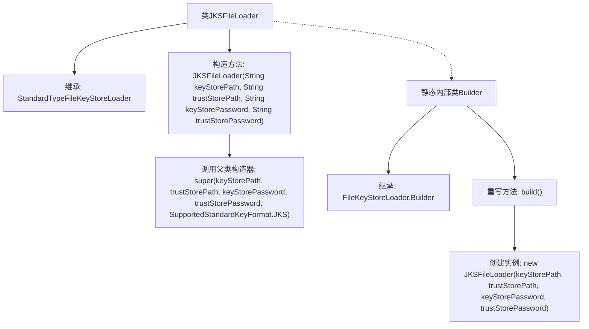

# 基础信息

|      |      |
|------|------|
| 名称 | JKSFileLoader |
| 编码语言 | .java |
| 代码路径 | zookeeper/zookeeper-server/src/main/java/org/apache/zookeeper/common/JKSFileLoader.java |
| 包名 | org.apache.zookeeper.common |
| 依赖项 | [] |
| 概述说明 | JKSFileLoader继承StandardTypeFileKeyStoreLoader，通过私有构造器和静态Builder类创建实例，支持JKS格式密钥库加载。 |

# 说明

JKSFileLoader是StandardTypeFileKeyStoreLoader的子类，专门用于加载JKS格式的密钥库和信任库。它通过私有构造函数接收密钥库路径、信任库路径及对应密码，并调用父类构造函数指定JKS格式。内部静态类Builder继承自FileKeyStoreLoader.Builder，重写build方法以创建JKSFileLoader实例。该设计封装了JKS密钥库的加载逻辑，确保类型安全且易于扩展。

# 类列表 Class Summary

| 名称   | 类型  | 说明 |
|-------|------|-------------|
| JKSFileLoader | class | JKSFileLoader继承StandardTypeFileKeyStoreLoader，通过Builder构建，支持JKS格式密钥库和信任库加载。 |


## 类 JKSFileLoader

|      |      |
|------|------|
| 访问范围 | None |
| 类型 | class |
| 名称 | JKSFileLoader |
| 说明 | JKSFileLoader继承StandardTypeFileKeyStoreLoader，通过Builder构建，支持JKS格式密钥库和信任库加载。 |


### UML类图

```mermaid
classDiagram
    class StandardTypeFileKeyStoreLoader {
        <<abstract>>
        +StandardTypeFileKeyStoreLoader(String keyStorePath, String trustStorePath, String keyStorePassword, String trustStorePassword, SupportedStandardKeyFormat format)
    }
    
    class JKSFileLoader {
        -JKSFileLoader(String keyStorePath, String trustStorePath, String keyStorePassword, String trustStorePassword)
    }
    
    class FileKeyStoreLoader {
        <<abstract>>
        +String keyStorePath
        +String trustStorePath
        +String keyStorePassword
        +String trustStorePassword
    }
    
    class "Builder~JKSFileLoader~" {
        <<inner>>
        +JKSFileLoader build()
    }
    
    StandardTypeFileKeyStoreLoader <|-- JKSFileLoader
    FileKeyStoreLoader <|-- StandardTypeFileKeyStoreLoader
    JKSFileLoader *-- "1" "Builder~JKSFileLoader~" : 构造
    FileKeyStoreLoader <|-- "Builder~JKSFileLoader~"
    
    note for JKSFileLoader "专用于加载JKS格式的密钥库文件"
    note for "Builder~JKSFileLoader~" "采用建造者模式实现链式调用"
```

这段代码展示了一个JKS文件加载器的类结构，其中JKSFileLoader继承自StandardTypeFileKeyStoreLoader，用于处理JKS格式的密钥库文件。通过内部Builder类实现建造者模式，提供安全的参数校验和对象构建方式。类图清晰地反映了继承关系（StandardTypeFileKeyStoreLoader作为抽象基类）和组合关系（Builder作为内部类），同时标注了JKS专用加载器的设计意图和建造者模式的应用场景。


### 内部方法调用关系图



这段代码展示了一个JKS文件加载器类及其构建器模式实现。JKSFileLoader继承自StandardTypeFileKeyStoreLoader，通过私有构造方法初始化JKS格式的密钥库。内部Builder类继承自泛型基类，重写build()方法时调用JKSFileLoader的构造器创建实例。整个设计实现了密钥库加载的可扩展性和类型安全，特别适用于需要处理JKS格式证书的场景。

### 字段列表 Field List

| 名称  | 类型  | 说明 |
|-------|-------|------|

### 方法列表 Method List

| 名称  | 类型  | 说明 |
|-------|-------|------|


