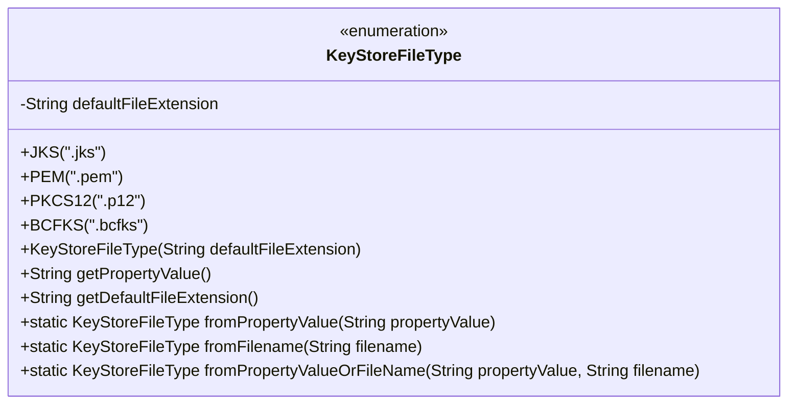
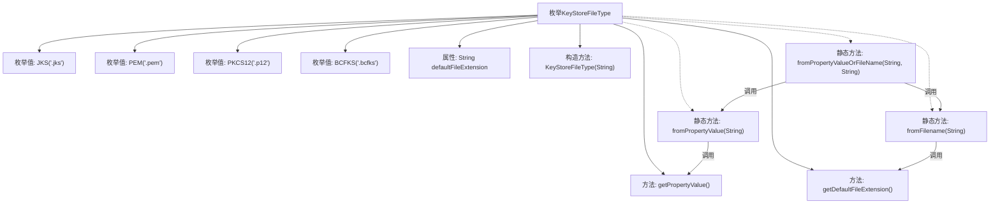

# 基础信息

|      |      |
|------|------|
| 名称 | KeyStoreFileType |
| 编码语言 | .java |
| 代码路径 | zookeeper/zookeeper-server/src/main/java/org/apache/zookeeper/common/KeyStoreFileType.java |
| 包名 | org.apache.zookeeper.common |
| 依赖项 | [] |
| 概述说明 | KeyStoreFileType枚举定义密钥存储文件类型，包含JKS、PEM、PKCS12和BCFKS四种格式，提供根据属性值或文件名自动检测类型的方法。 |

# 说明

这是一个枚举类KeyStoreFileType，定义了四种密钥存储文件类型：JKS、PEM、PKCS12和BCFKS，每种类型关联一个默认文件扩展名。类提供了获取属性值和文件扩展名的方法，以及三个静态方法：fromPropertyValue根据属性值转换为枚举，fromFilename根据文件扩展名检测类型，fromPropertyValueOrFileName结合前两者，优先使用属性值，其次根据文件名自动检测类型。无效输入会抛出异常。

# 类列表 Class Summary

| 名称   | 类型  | 说明 |
|-------|------|-------------|
| KeyStoreFileType | enum | KeyStoreFileType枚举定义了JKS、PEM等密钥存储文件类型，提供文件扩展名获取、属性值转换及文件名检测功能。支持通过属性值或文件名自动确定文件类型，无效输入抛出异常。 |

## 类 KeyStoreFileType

|      |      |
|------|------|
| 访问范围 | public |
| 类型 | enum |
| 名称 | KeyStoreFileType |
| 说明 | KeyStoreFileType枚举定义了JKS、PEM等密钥存储文件类型，提供文件扩展名获取、属性值转换及文件名检测功能。支持通过属性值或文件名自动确定文件类型，无效输入抛出异常。 |

### UML类图

这段代码定义了一个枚举类`KeyStoreFileType`，用于表示密钥库文件的类型。枚举包含四种文件类型(JKS/PEM/PKCS12/BCFKS)，每个类型都有对应的默认文件扩展名。类提供了三个核心静态方法：`fromPropertyValue`根据属性值转换枚举，`fromFilename`根据文件扩展名识别类型，`fromPropertyValueOrFileName`则结合前两者实现优先按属性值、其次按文件名识别的逻辑。所有方法都包含完善的空值检查和异常处理，确保类型转换的可靠性。

### 内部方法调用关系图

该流程图展示了KeyStoreFileType枚举类的完整结构，包含4个预定义枚举值(JKS/PEM/PKCS12/BCFKS)和核心方法。类通过defaultFileExtension属性存储文件扩展名，提供三种静态工厂方法(fromPropertyValue/fromFilename/fromPropertyValueOrFileName)来实现灵活的密钥库类型检测逻辑。方法间存在明确的调用关系，fromPropertyValueOrFileName作为综合方法会优先尝试属性值解析，失败时再通过文件名后缀自动检测类型。

### 字段列表 Field List

| 名称  | 类型  | 说明 |
|-------|-------|------|

### 方法列表 Method List

| 名称  | 类型  | 说明 |
|-------|-------|------|

