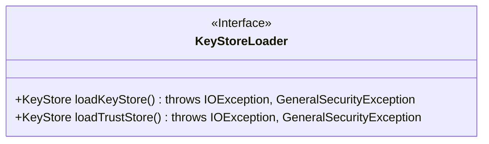
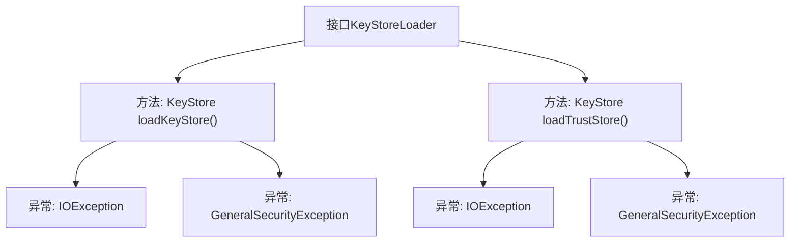

# 基础信息

|      |      |
|------|------|
| 名称 | KeyStoreLoader |
| 编码语言 | .java |
| 代码路径 | zookeeper/zookeeper-server/src/main/java/org/apache/zookeeper/common/KeyStoreLoader.java |
| 包名 | org.apache.zookeeper.common |
| 依赖项 | ['java.io.IOException', 'java.security.GeneralSecurityException', 'java.security.KeyStore'] |
| 概述说明 | 接口KeyStoreLoader定义了两个方法：loadKeyStore加载含私钥和X509证书链的密钥库，loadTrustStore加载含CA信任证书链的密钥库，均可能抛出IO或安全异常。 |

# 说明

KeyStoreLoader接口定义了两个方法：loadKeyStore用于加载包含至少一个私钥及关联X509证书链的密钥库，loadTrustStore用于加载包含至少一个可信CA的X509证书链的信任库。两个方法均可能抛出IO异常（如文件未找到）或安全异常（如不支持的加密算法）。

# 类列表 Class Summary

| 名称   | 类型  | 说明 |
|-------|------|-------------|
| KeyStoreLoader | interface | 接口KeyStoreLoader定义了两个方法：loadKeyStore加载含私钥和X509证书链的密钥库，loadTrustStore加载含CA信任证书链的密钥库，均可能抛出IO或安全异常。 |

## 类 KeyStoreLoader

|      |      |
|------|------|
| 访问范围 | None |
| 类型 | interface |
| 名称 | KeyStoreLoader |
| 说明 | 接口KeyStoreLoader定义了两个方法：loadKeyStore加载含私钥和X509证书链的密钥库，loadTrustStore加载含CA信任证书链的密钥库，均可能抛出IO或安全异常。 |

### UML类图

该图展示了一个名为KeyStoreLoader的接口，定义了两个公有方法：loadKeyStore()和loadTrustStore()，两者都返回KeyStore对象并可能抛出IOException和GeneralSecurityException异常。接口用于加载包含私钥/X509证书链的密钥库和可信CA证书库，体现了安全凭证加载的核心功能契约。

### 内部方法调用关系图

这段流程图展示了KeyStoreLoader接口的结构，包含两个核心方法：loadKeyStore()和loadTrustStore()。每个方法都声明可能抛出两种异常：IOException和GeneralSecurityException。loadKeyStore()用于加载包含私钥和X509证书链的密钥库，而loadTrustStore()用于加载包含可信CA证书链的信任库。该接口规范了密钥管理系统的核心操作，要求实现类必须处理文件I/O和加密算法相关的异常情况。

### 字段列表 Field List

| 名称  | 类型  | 说明 |
|-------|-------|------|

### 方法列表 Method List

| 名称  | 类型  | 说明 |
|-------|-------|------|
| loadTrustStore | KeyStore | 加载信任存储库，可能抛出IO和安全异常。 |
| loadKeyStore | KeyStore | 方法`loadKeyStore`加载密钥库，可能抛出`IOException`和`GeneralSecurityException`异常。 |

