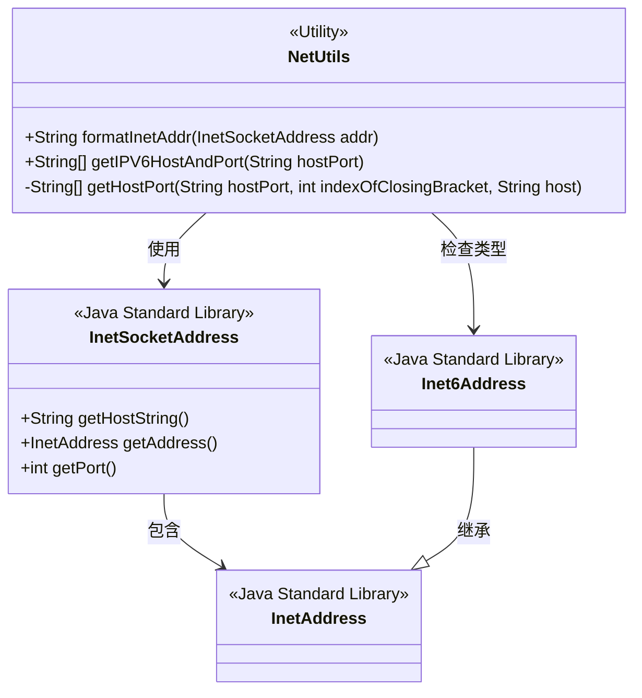
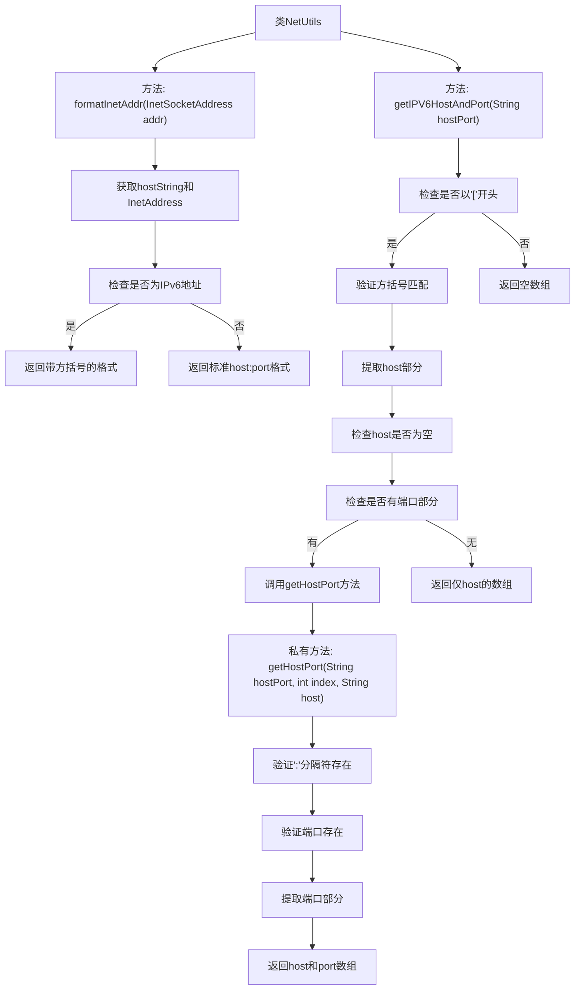

# 基础信息

|      |      |
|------|------|
| 名称 | NetUtils |
| 编码语言 | .java |
| 代码路径 | zookeeper/zookeeper-server/src/main/java/org/apache/zookeeper/common/NetUtils.java |
| 包名 | org.apache.zookeeper.common |
| 依赖项 | ['java.net.Inet6Address', 'java.net.InetAddress', 'java.net.InetSocketAddress'] |
| 概述说明 | NetUtils类提供两个方法：formatInetAddr格式化网络地址，优先使用主机名，IPv6地址加方括号；getIPV6HostAndPort解析IPv6主机端口字符串，返回主机和端口数组。 |

# 说明

NetUtils类包含两个静态方法：formatInetAddr和getIPV6HostAndPort。formatInetAddr方法用于格式化网络地址，优先使用主机名，若不可用则回退到IP地址，并对IPv6地址使用方括号。getIPV6HostAndPort方法从给定的主机端口字符串中分离出主机和端口，特别处理IPv6格式的地址，若字符串不以方括号开头则返回空数组。两个方法都包含对输入有效性的检查，并在无效时抛出异常。

# 类列表 Class Summary

| 名称   | 类型  | 说明 |
|-------|------|-------------|
| NetUtils | class | NetUtils类提供两个方法：formatInetAddr格式化网络地址，优先使用主机名，IPv6地址加方括号；getIPV6HostAndPort解析IPv6主机端口字符串，支持[host]:port格式，验证格式有效性。 |

## 类 NetUtils

|      |      |
|------|------|
| 访问范围 | public |
| 类型 | class |
| 名称 | NetUtils |
| 说明 | NetUtils类提供两个方法：formatInetAddr格式化网络地址，优先使用主机名，IPv6地址加方括号；getIPV6HostAndPort解析IPv6主机端口字符串，支持[host]:port格式，验证格式有效性。 |

### UML类图

**类图描述**：  
该图展示了NetUtils工具类与Java标准网络类的关系。NetUtils提供两个核心方法：formatInetAddr用于格式化带端口号的网络地址（自动处理IPv6的方括号语法），getIPV6HostAndPort用于解析IPv6主机端口字符串。它依赖InetSocketAddress获取主机信息，并通过Inet6Address检查IPv6类型。私有方法getHostPort处理端口提取逻辑，严格验证输入格式。所有方法均包含完善的边界条件检查，确保处理异常输入时抛出明确错误。

### 内部方法调用关系图

流程图描述了NetUtils类的三个核心方法：formatInetAddr用于格式化网络地址，根据IPv6或IPv4采用不同格式；getIPV6HostAndPort处理IPv6地址解析，包含严格的格式验证；getHostPort作为辅助方法专门提取端口信息。该流程图清晰展示了方法间的调用关系和条件分支，特别是对IPv6地址的特殊处理逻辑，包括方括号验证、分隔符检查和异常情况处理。

### 字段列表 Field List

| 名称  | 类型  | 说明 |
|-------|-------|------|

### 方法列表 Method List

| 名称  | 类型  | 说明 |
|-------|-------|------|
| getIPV6HostAndPort | String[] | 解析IPv6主机端口字符串，检查格式有效性，提取主机和端口。无效格式抛出异常。非IPv6返回空数组。 |
| formatInetAddr | String | Java方法：格式化InetSocketAddress，IPv6地址加方括号，输出"主机:端口"或"[主机]:端口"。 |
| getHostPort | String[] | 解析主机端口字符串，验证格式并提取主机和端口。检查冒号存在及端口非空，返回主机和端口数组。 |

