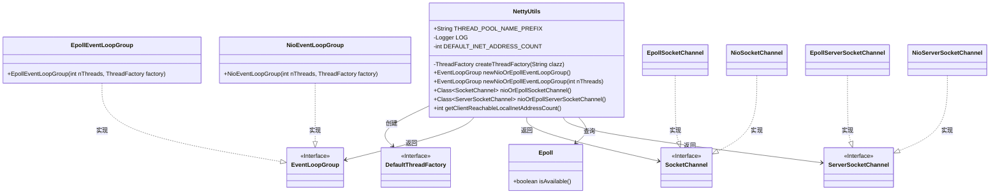
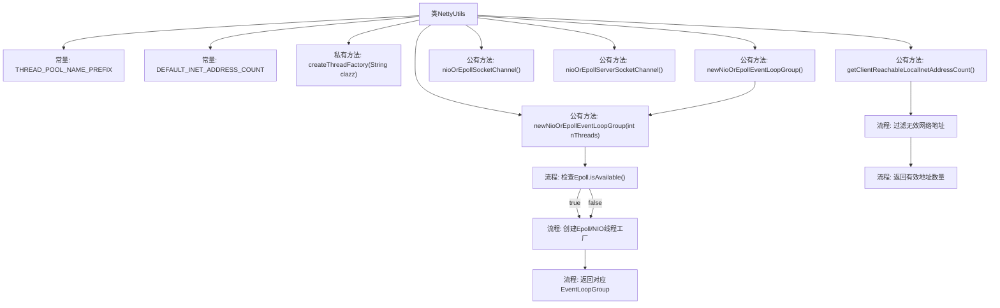

# 基础信息

|      |      |
|------|------|
| 名称 | NettyUtils |
| 编码语言 | .java |
| 代码路径 | zookeeper/zookeeper-server/src/main/java/org/apache/zookeeper/common/NettyUtils.java |
| 包名 | org.apache.zookeeper.common |
| 依赖项 | ['io.netty.channel.EventLoopGroup', 'io.netty.channel.epoll.Epoll', 'io.netty.channel.epoll.EpollEventLoopGroup', 'io.netty.channel.epoll.EpollServerSocketChannel', 'io.netty.channel.epoll.EpollSocketChannel', 'io.netty.channel.nio.NioEventLoopGroup', 'io.netty.channel.socket.ServerSocketChannel', 'io.netty.channel.socket.SocketChannel', 'io.netty.channel.socket.nio.NioServerSocketChannel', 'io.netty.channel.socket.nio.NioSocketChannel', 'io.netty.util.concurrent.DefaultThreadFactory', 'java.net.InetAddress', 'java.net.NetworkInterface', 'java.net.SocketException', 'java.util.Collections', 'java.util.Enumeration', 'java.util.HashSet', 'java.util.Set', 'java.util.concurrent.ThreadFactory', 'org.slf4j.Logger', 'org.slf4j.LoggerFactory'] |
| 概述说明 | NettyUtils工具类提供创建Netty线程工厂、事件循环组及选择Epoll/NIO通道的方法，并检测客户端可达的本地网络地址数量。 |

# 说明

NettyUtils是一个工具类，提供与Netty网络框架相关的实用方法。主要功能包括创建线程工厂，根据系统支持情况选择Epoll或NIO事件循环组和通道类型，以及检测客户端可访问的本地网络地址数量。线程工厂方法生成守护线程，并使用指定类名作为线程名前缀。事件循环组和通道方法会根据Epoll是否可用自动选择Epoll或NIO实现。网络地址检测方法会过滤掉多播、链路本地和环回地址，返回有效的本地网络地址数量，默认值为1。所有方法都包含详细的日志记录，并在异常情况下提供合理的默认值。

# 类列表 Class Summary

| 名称   | 类型  | 说明 |
|-------|------|-------------|
| NettyUtils | class | Netty工具类，提供线程工厂创建、基于Epoll/NIO的事件循环组和Socket通道选择，以及检测客户端可达网络地址数量的功能。 |

## 类 NettyUtils

|      |      |
|------|------|
| 访问范围 | public |
| 类型 | class |
| 名称 | NettyUtils |
| 说明 | Netty工具类，提供线程工厂创建、基于Epoll/NIO的事件循环组和Socket通道选择，以及检测客户端可达网络地址数量的功能。 |

### UML类图

该类图展示了NettyUtils工具类的核心结构和依赖关系。NettyUtils主要提供线程工厂创建、事件循环组实例化、Socket通道选择及网络地址检测等功能，通过静态方法封装了Netty底层API的差异化处理（如Epoll/NIO选择）。它依赖于多个接口（如EventLoopGroup、SocketChannel）及其实现类（如EpollEventLoopGroup、NioSocketChannel），并通过Epoll类检测系统特性。所有公共方法均为静态，包含对网络接口异常处理的健壮性设计。

### 内部方法调用关系图

该流程图展示了NettyUtils工具类的核心结构，包含5个主要方法和2个常量定义。关键逻辑分支体现在Epoll可用性检查（决定使用Epoll或NIO实现）和网络地址过滤（排除组播、链路本地和回环地址）。地址计数方法包含异常处理，失败时返回默认值1。所有网络操作都带有日志记录，体现了健壮性设计。线程工厂创建方法被两个事件循环组构造方法复用，显示代码复用性。

### 字段列表 Field List

| 名称  | 类型  | 说明 |
|-------|-------|------|
| LOG = LoggerFactory.getLogger(NettyUtils.class) | Logger | 声明NettyUtils类的私有静态日志对象LOG，使用LoggerFactory创建。 |
| THREAD_POOL_NAME_PREFIX = "zkNetty-" | String | 线程池名称前缀为"zkNetty-"。 |
| DEFAULT_INET_ADDRESS_COUNT = 1 | int | 定义私有静态常量DEFAULT_INET_ADDRESS_COUNT，默认值为1。 |

### 方法列表 Method List

| 名称  | 类型  | 说明 |
|-------|-------|------|
| nioOrEpollServerSocketChannel | Class<? extends ServerSocketChannel> | 检查系统是否支持Epoll，支持则返回EpollServerSocketChannel类，否则返回NioServerSocketChannel类。 |
| newNioOrEpollEventLoopGroup | EventLoopGroup | 创建NIO或Epoll事件循环组，默认线程数为0。 |
| createThreadFactory | ThreadFactory | 创建线程工厂方法，生成带前缀的自定义线程池名称，返回默认线程工厂实例。 |
| getClientReachableLocalInetAddressCount | int | 方法统计可用的本地网络地址数，排除链路本地、组播和环回地址，失败时返回默认值1。 |
| nioOrEpollSocketChannel | Class<? extends SocketChannel> | 根据系统支持返回Epoll或NIO的SocketChannel类。 |
| newNioOrEpollEventLoopGroup | EventLoopGroup | 根据系统支持创建NIO或Epoll事件循环组，自动选择可用实现并指定线程工厂。 |

