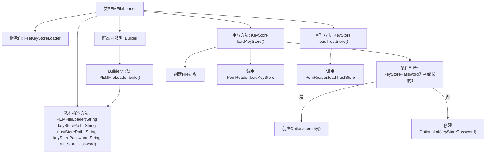

# 基础信息

|      |      |
|------|------|
| 名称 | PEMFileLoader |
| 编码语言 | .java |
| 代码路径 | zookeeper/zookeeper-server/src/main/java/org/apache/zookeeper/common/PEMFileLoader.java |
| 包名 | org.apache.zookeeper.common |
| 依赖项 | ['java.io.File', 'java.io.IOException', 'java.security.GeneralSecurityException', 'java.security.KeyStore', 'java.util.Optional', 'org.apache.zookeeper.util.PemReader'] |
| 概述说明 | PEMFileLoader类继承FileKeyStoreLoader，通过PEM文件加载密钥库和信任库，支持密码可选，使用构建器模式创建实例。 |

# 说明

PEMFileLoader是FileKeyStoreLoader的子类，用于加载PEM格式的密钥库和信任库。它通过私有构造方法接收密钥库路径、信任库路径及对应密码。loadKeyStore方法根据密码是否为空调用PemReader加载密钥库，loadTrustStore方法直接加载信任库。内部Builder类继承父类Builder，用于构建PEMFileLoader实例。

# 类列表 Class Summary

| 名称   | 类型  | 说明 |
|-------|------|-------------|
| PEMFileLoader | class | PEMFileLoader类继承FileKeyStoreLoader，通过PEM文件加载密钥库和信任库，支持密码可选，使用构建器模式创建实例。 |


## 类 PEMFileLoader

|      |      |
|------|------|
| 访问范围 | None |
| 类型 | class |
| 名称 | PEMFileLoader |
| 说明 | PEMFileLoader类继承FileKeyStoreLoader，通过PEM文件加载密钥库和信任库，支持密码可选，使用构建器模式创建实例。 |


### UML类图

```mermaid
classDiagram
    class FileKeyStoreLoader {
        <<abstract>>
        #String keyStorePath
        #String trustStorePath
        #String keyStorePassword
        #String trustStorePassword
        +FileKeyStoreLoader(String keyStorePath, String trustStorePath, String keyStorePassword, String trustStorePassword)
        +abstract KeyStore loadKeyStore() throws IOException, GeneralSecurityException
        +abstract KeyStore loadTrustStore() throws IOException, GeneralSecurityException
    }

    class PEMFileLoader {
        -PEMFileLoader(String keyStorePath, String trustStorePath, String keyStorePassword, String trustStorePassword)
        +KeyStore loadKeyStore() throws IOException, GeneralSecurityException
        +KeyStore loadTrustStore() throws IOException, GeneralSecurityException
    }

    class "Builder" {
        <<static>>
        +PEMFileLoader build()
    }

    FileKeyStoreLoader <|-- PEMFileLoader : 继承
    PEMFileLoader *-- "Builder" : 嵌套类
    PEMFileLoader ..|> PemReader : 依赖

    note for PEMFileLoader "实现PEM格式密钥库加载逻辑\n- loadKeyStore处理带密码的私钥文件\n- loadTrustStore加载信任证书链"
```

该类图展示了一个PEM文件加载器架构。PEMFileLoader继承自抽象基类FileKeyStoreLoader，实现了加载PEM格式密钥库的核心功能。通过嵌套Builder类实现建造者模式，依赖PemReader工具类完成实际文件解析。loadKeyStore方法支持可选密码保护，loadTrustStore处理无密码的证书链加载，两者都需处理IO和加密相关异常。整体设计符合密钥库加载的标准流程，同时针对PEM格式特性进行了专门实现。


### 内部方法调用关系图



这段代码展示了一个PEM文件加载器的实现，继承自FileKeyStoreLoader基类。主要功能包括通过PEM格式加载密钥库和信任库，其中loadKeyStore()方法会处理密码选项并调用PemReader工具类，而loadTrustStore()则直接加载信任库。内部Builder类提供了构建PEMFileLoader实例的方式。流程图清晰地展示了类继承关系、方法重写逻辑以及关键的条件分支处理流程，特别是密码选项的处理和PemReader工具类的调用过程。

### 字段列表 Field List

| 名称  | 类型  | 说明 |
|-------|-------|------|

### 方法列表 Method List

| 名称  | 类型  | 说明 |
|-------|-------|------|
| loadKeyStore | KeyStore | 重写loadKeyStore方法，根据密码是否存在加载密钥库文件，使用PemReader工具类处理。 |
| loadTrustStore | KeyStore | 重写loadTrustStore方法，使用PemReader从指定路径加载信任库文件。 |


