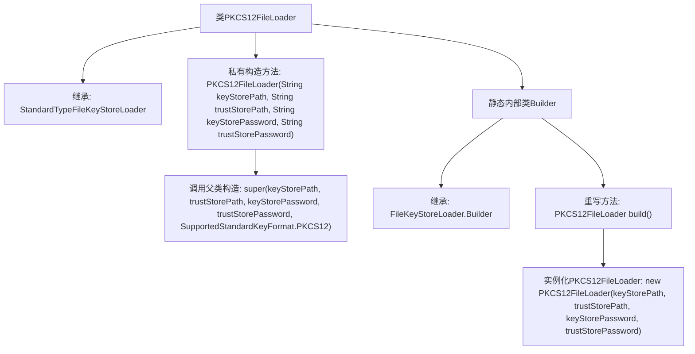

# 基础信息

|      |      |
|------|------|
| 名称 | PKCS12FileLoader |
| 编码语言 | .java |
| 代码路径 | zookeeper/zookeeper-server/src/main/java/org/apache/zookeeper/common/PKCS12FileLoader.java |
| 包名 | org.apache.zookeeper.common |
| 依赖项 | [] |
| 概述说明 | PKCS12FileLoader继承StandardTypeFileKeyStoreLoader，通过Builder构建，支持PKCS12格式密钥库和信任库加载。 |

# 说明

PKCS12FileLoader是StandardTypeFileKeyStoreLoader的子类，专门用于加载PKCS12格式的密钥库文件。它通过私有构造函数接收密钥库路径、信任库路径及对应密码，并调用父类构造方法指定PKCS12格式。内部静态类Builder继承自FileKeyStoreLoader.Builder，提供build方法创建PKCS12FileLoader实例。该设计遵循建造者模式，封装了PKCS12密钥库的加载逻辑。

# 类列表 Class Summary

| 名称   | 类型  | 说明 |
|-------|------|-------------|
| PKCS12FileLoader | class | PKCS12FileLoader继承StandardTypeFileKeyStoreLoader，通过Builder构建，支持PKCS12格式密钥库和信任库加载。 |


## 类 PKCS12FileLoader

|      |      |
|------|------|
| 访问范围 | None |
| 类型 | class |
| 名称 | PKCS12FileLoader |
| 说明 | PKCS12FileLoader继承StandardTypeFileKeyStoreLoader，通过Builder构建，支持PKCS12格式密钥库和信任库加载。 |


### UML类图

```mermaid
classDiagram
    class StandardTypeFileKeyStoreLoader {
        <<abstract>>
        +StandardTypeFileKeyStoreLoader(String keyStorePath, String trustStorePath, String keyStorePassword, String trustStorePassword, SupportedStandardKeyFormat format)
    }

    class PKCS12FileLoader {
        -PKCS12FileLoader(String keyStorePath, String trustStorePath, String keyStorePassword, String trustStorePassword)
    }

    class FileKeyStoreLoader {
        <<abstract>>
    }

    class "Builder~PKCS12FileLoader~" {
        <<Builder>>
        +PKCS12FileLoader build()
    }

    StandardTypeFileKeyStoreLoader <|-- PKCS12FileLoader
    FileKeyStoreLoader <|-- StandardTypeFileKeyStoreLoader
    PKCS12FileLoader --> "Builder~PKCS12FileLoader~" : 创建实例
    "Builder~PKCS12FileLoader~" --> PKCS12FileLoader : 构建
```

这段类图展示了PKCS12文件加载器的继承结构和构建模式。PKCS12FileLoader继承自StandardTypeFileKeyStoreLoader，后者又继承自抽象基类FileKeyStoreLoader。Builder作为PKCS12FileLoader的静态内部类，遵循建造者模式负责实例化PKCS12FileLoader。整体设计采用分层架构，通过标准类型加载器实现PKCS12格式密钥库的加载功能，同时保持构建过程的灵活性。


### 内部方法调用关系图



这段代码展示了一个PKCS12文件加载器的实现，通过继承StandardTypeFileKeyStoreLoader类实现特定格式的密钥库加载功能。核心包含一个私有构造方法和一个静态内部类Builder，后者通过建造者模式提供实例化入口。构造方法调用父类初始化参数并指定PKCS12格式，Builder类重写build方法完成具体实例构造。整体结构体现了类型安全的建造者模式和标准密钥库加载的扩展机制。

### 字段列表 Field List

| 名称  | 类型  | 说明 |
|-------|-------|------|

### 方法列表 Method List

| 名称  | 类型  | 说明 |
|-------|-------|------|


