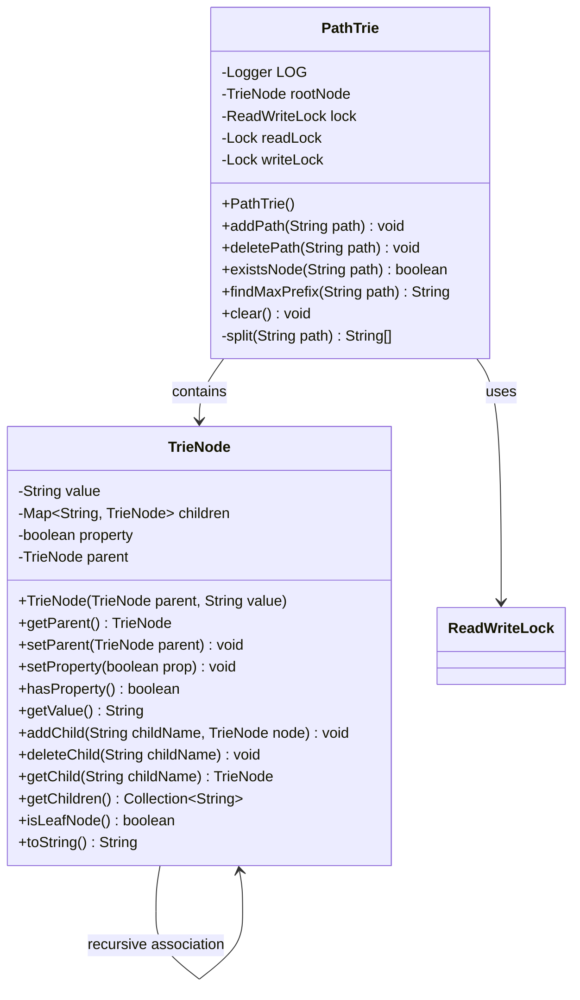

# 基础信息

|      |      |
|------|------|
| 名称 | PathTrie |
| 编码语言 | .java |
| 代码路径 | zookeeper/zookeeper-server/src/main/java/org/apache/zookeeper/common/PathTrie.java |
| 包名 | org.apache.zookeeper.common |
| 依赖项 | ['java.util.ArrayDeque', 'java.util.Collection', 'java.util.Deque', 'java.util.HashMap', 'java.util.Map', 'java.util.Objects', 'java.util.concurrent.locks.Lock', 'java.util.concurrent.locks.ReadWriteLock', 'java.util.concurrent.locks.ReentrantReadWriteLock', 'java.util.stream.Stream', 'org.slf4j.Logger', 'org.slf4j.LoggerFactory'] |
| 概述说明 | PathTrie类实现线程安全路径树，含根节点、读写锁及TrieNode内部类，支持增删查路径、查找最大前缀和清空操作。 |

# 说明

PathTrie是一个线程安全的路径前缀树实现，用于高效存储和检索路径字符串。核心组件TrieNode包含节点值、子节点映射、父节点引用及标记属性。主要功能包括：添加路径（自动创建中间节点并标记末端节点）、删除路径（清理无子节点）、检查路径存在性、查找最大前缀路径（返回最深标记节点的完整路径）。通过读写锁保证并发安全，根节点固定为"/"，路径分割忽略空段。适用于需要快速路径匹配的场景。

# 类列表 Class Summary

| 名称   | 类型  | 说明 |
|-------|------|-------------|
| PathTrie | class | PathTrie类实现线程安全的前缀树结构，支持路径增删查操作，使用读写锁保证并发安全，节点可标记属性，提供最大前缀查询功能。 |

## 类 PathTrie

|      |      |
|------|------|
| 访问范围 | public |
| 类型 | class |
| 名称 | PathTrie |
| 说明 | PathTrie类实现线程安全的前缀树结构，支持路径增删查操作，使用读写锁保证并发安全，节点可标记属性，提供最大前缀查询功能。 |

### UML类图

这段代码实现了一个路径前缀树(PathTrie)数据结构，用于高效存储和查询路径字符串。核心类PathTrie包含一个TrieNode内部类作为树节点，每个节点存储路径片段、子节点映射和特殊属性标记。PathTrie提供了添加路径、删除路径、检查存在性、查找最大前缀等操作，并使用读写锁保证线程安全。TrieNode实现了树形结构的基本操作，包括父子节点管理、属性设置和子节点查询等功能。该设计适用于需要高效路径匹配的场景，如URL路由或文件系统路径管理。

### 内部方法调用关系图

```mermaid
graph TD
    A["类PathTrie"]
    B["属性: Logger LOG"]
    C["属性: TrieNode rootNode"]
    D["属性: ReadWriteLock lock"]
    E["属性: Lock readLock"]
    F["属性: Lock writeLock"]
    G["内部类: TrieNode"]
    H["方法: PathTrie()构造器"]
    I["方法: addPath(String path)"]
    J["方法: deletePath(String path)"]
    K["方法: existsNode(String path)"]
    L["方法: findMaxPrefix(String path)"]
    M["方法: clear()"]
    N["私有方法: split(String path)"]

    A --> B
    A --> C
    A --> D
    A --> E
    A --> F
    A --> G
    A --> H
    A --> I
    A --> J
    A --> K
    A --> L
    A --> M
    A --> N

    G --> G1["属性: String value"]
    G --> G2["属性: Map<String, TrieNode> children"]
    G --> G3["属性: boolean property"]
    G --> G4["属性: TrieNode parent"]
    G --> G5["方法: TrieNode(TrieNode, String)"]
    G --> G6["方法: getParent()"]
    G --> G7["方法: setParent(TrieNode)"]
    G --> G8["方法: setProperty(boolean)"]
    G --> G9["方法: hasProperty()"]
    G --> G10["方法: getValue()"]
    G --> G11["方法: addChild(String, TrieNode)"]
    G --> G12["方法: deleteChild(String)"]
    G --> G13["方法: getChild(String)"]
    G --> G14["方法: getChildren()"]
    G --> G15["方法: isLeafNode()"]
    G --> G16["方法: toString()"]
```

这段代码实现了一个线程安全的路径前缀树(PathTrie)数据结构，主要用于高效存储和查询路径字符串。核心功能包括路径的添加、删除、存在性检查以及最长前缀匹配。内部使用读写锁保证线程安全，TrieNode类封装了树节点操作，包含父子关系维护和属性标记功能。流程图展示了类结构和主要方法调用关系，反映了该数据结构的分层特性和线程安全机制。

### 字段列表 Field List

| 名称  | 类型  | 说明 |
|-------|-------|------|
| LOG = LoggerFactory.getLogger(PathTrie.class) | Logger | 定义PathTrie类的私有静态日志常量LOG。 |
| writeLock = lock.writeLock() | Lock | 私有写锁变量writeLock通过lock.writeLock()初始化。 |
| lock = new ReentrantReadWriteLock(true) | ReadWriteLock | 私有读写锁实例，使用公平策略的ReentrantReadWriteLock实现。 |
| rootNode | TrieNode | 私有成员变量，类型为TrieNode，命名为rootNode。 |
| readLock = lock.readLock() | Lock | 私有只读锁，通过lock.readLock()初始化。 |

### 方法列表 Method List

| 名称  | 类型  | 说明 |
|-------|-------|------|
| clear | void | 该方法使用写锁保护，清空根节点的子节点列表，确保线程安全。 |
| findMaxPrefix | String | 查找路径中的最长有效前缀。使用Trie树结构，从根节点开始匹配路径组件，记录最近的有效节点。若无匹配则返回根路径，否则拼接节点值返回完整前缀。线程安全，使用读锁保护操作。 |
| existsNode | boolean | 检查路径是否存在：非空验证后拆分路径，加读锁遍历Trie树，若中途节点缺失则返回false，否则返回true，确保锁释放。 |
| split | String[] | 拆分路径字符串，过滤空值后转为数组。 |
| deletePath | void | 删除指定路径的方法。检查路径非空且有效，拆分路径后加写锁遍历Trie树。若路径存在则删除对应节点，最后释放锁。含空值校验和异常处理。 |
| addPath | void | 方法`addPath`用于添加路径到字典树：检查路径非空后拆分路径，加写锁遍历节点，不存在则创建，最后标记路径存在并释放锁。 |

