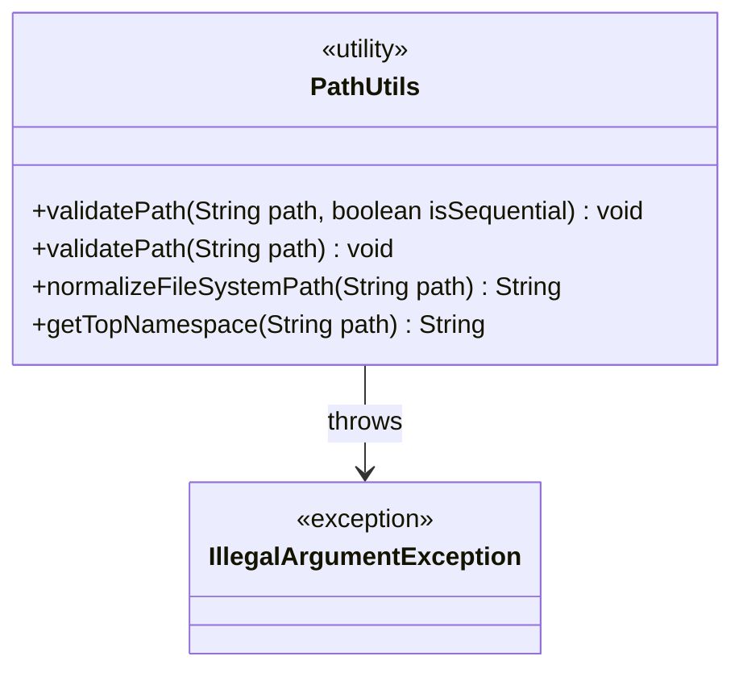
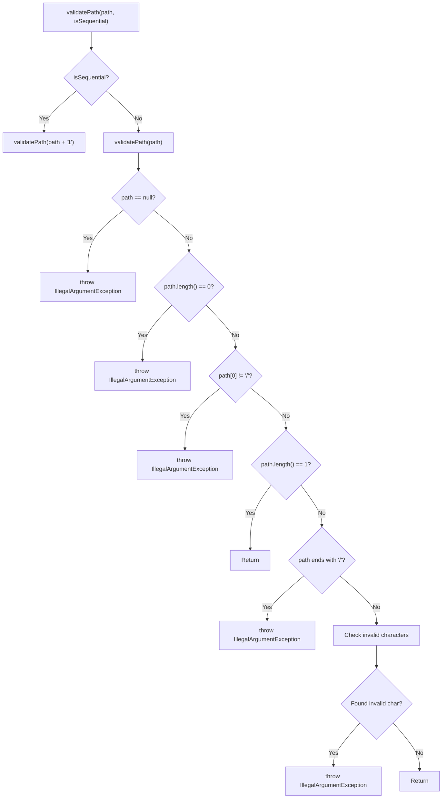
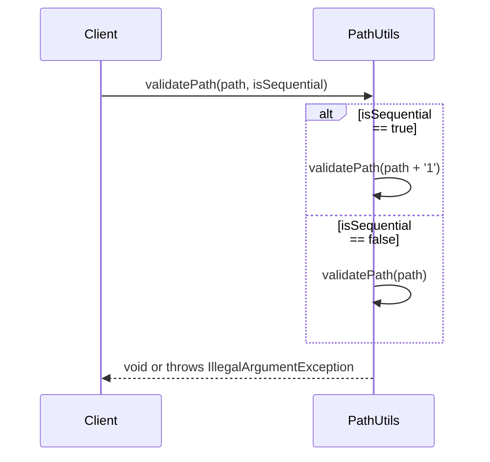
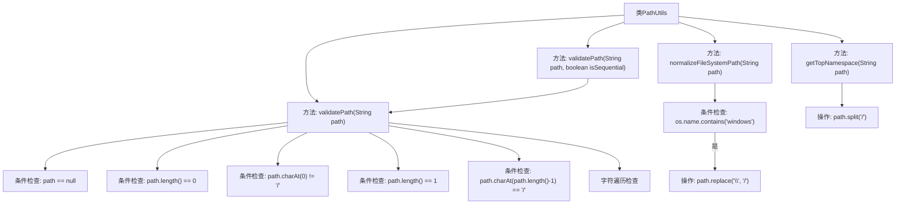

# 基础信息

|      |      |
|------|------|
| 名称 | PathUtils |
| 编码语言 | .java |
| 代码路径 | zookeeper/zookeeper-server/src/main/java/org/apache/zookeeper/common/PathUtils.java |
| 包名 | org.apache.zookeeper.common |
| 依赖项 | [] |
| 概述说明 | PathUtils类提供路径处理功能：验证znode路径合法性（非空、首字符为/、无连续/等），转换Windows路径为Unix格式，提取路径顶层命名空间。 |

# 说明

PathUtils类提供四个静态方法处理路径字符串。validatePath方法检查znode路径有效性，包括非空、首字符为/、末字符不为/、禁止空节点名和相对路径等规则，支持顺序路径标记。normalizeFileSystemPath将Windows路径反斜杠转换为Unix斜杠。getTopNamespace提取路径第一层命名空间，无则返回null。所有方法均进行严格输入校验并抛出IllegalArgumentException异常。

# 类列表 Class Summary

| 名称   | 类型  | 说明 |
|-------|------|-------------|
| PathUtils | class | PathUtils类提供路径处理功能：验证znode路径格式（非空、首尾字符、非法字符等），转换Windows路径为Unix格式，提取路径顶层命名空间。 |

## 类 PathUtils

|      |      |
|------|------|
| 访问范围 | public |
| 类型 | class |
| 名称 | PathUtils |
| 说明 | PathUtils类提供路径处理功能：验证znode路径格式（非空、首尾字符、非法字符等），转换Windows路径为Unix格式，提取路径顶层命名空间。 |

### UML类图

这段代码定义了一个PathUtils工具类，主要用于处理路径相关的操作。它包含四个静态方法：两个重载的validatePath方法用于验证znode路径的合法性，normalizeFileSystemPath方法用于将Windows路径转换为Unix格式，getTopNamespace方法用于获取路径的顶层命名空间。类图中显示了PathUtils与IllegalArgumentException的依赖关系，流程图详细描述了validatePath方法的验证流程，时序图展示了方法调用的交互过程。这些方法共同提供了完整的路径处理功能，包括验证、格式转换和路径解析。

### 内部方法调用关系图

这段代码是PathUtils工具类，主要提供路径验证和处理功能。流程图展示了四个核心方法：validatePath(带顺序标志)会调用普通版本；validatePath进行空值、长度、首尾字符等严格校验；normalizeFileSystemPath实现Windows路径转Unix格式；getTopNamespace提取路径的顶级命名空间。所有方法都包含完整的异常处理和边界条件检查，特别是字符级校验能有效防止非法路径输入。

### 字段列表 Field List

| 名称  | 类型  | 说明 |
|-------|-------|------|

### 方法列表 Method List

| 名称  | 类型  | 说明 |
|-------|-------|------|
| validatePath | void | 验证路径字符串的静态方法，检查非空、长度、首尾字符、非法字符及相对路径，抛出异常提示具体错误。 |
| validatePath | void | 静态方法验证路径，根据是否顺序处理调整路径参数，非法时抛出异常。 |
| normalizeFileSystemPath | String | 
静态方法normalizeFileSystemPath根据操作系统类型将路径中的反斜杠替换为正斜杠，仅当系统为Windows且路径非空时执行替换，否则返回原路径。 |
| getTopNamespace | String | 静态方法getTopNamespace接收路径字符串，若路径非空则按斜杠分割，返回第二部分（存在时），否则返回空。 |

