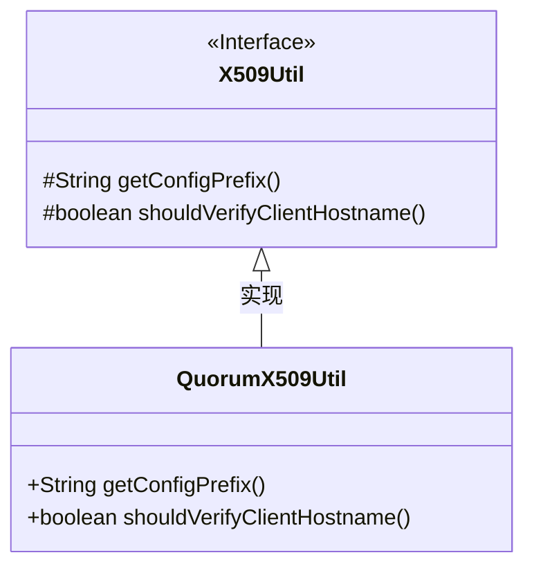
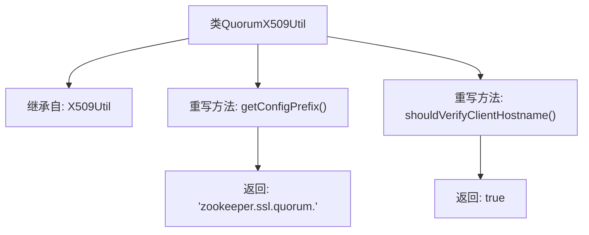

# 基础信息

|      |      |
|------|------|
| 名称 | QuorumX509Util |
| 编码语言 | .java |
| 代码路径 | zookeeper/zookeeper-server/src/main/java/org/apache/zookeeper/common/QuorumX509Util.java |
| 包名 | org.apache.zookeeper.common |
| 依赖项 | [] |
| 概述说明 | QuorumX509Util继承X509Util，重写方法设置ZooKeeper SSL配置前缀为"zookeeper.ssl.quorum."，并强制验证客户端主机名。 |

# 说明

QuorumX509Util是X509Util的子类，专门用于处理ZooKeeper仲裁通信的SSL/TLS配置。该类重写了两个方法：getConfigPrefix方法返回配置前缀"zookeeper.ssl.quorum."，用于相关SSL参数的配置；shouldVerifyClientHostname方法返回true，表示需要验证客户端主机名。该类主要用于仲裁通信场景下的证书验证和SSL配置管理。

# 类列表 Class Summary

| 名称   | 类型  | 说明 |
|-------|------|-------------|
| QuorumX509Util | class | QuorumX509Util继承X509Util，配置前缀为zookeeper.ssl.quorum.，强制验证客户端主机名。 |

## 类 QuorumX509Util

|      |      |
|------|------|
| 访问范围 | public |
| 类型 | class |
| 名称 | QuorumX509Util |
| 说明 | QuorumX509Util继承X509Util，配置前缀为zookeeper.ssl.quorum.，强制验证客户端主机名。 |

### UML类图

这段类图展示了QuorumX509Util类继承自X509Util接口的关系。X509Util是一个接口（用<<Interface>>标注），定义了两个受保护的方法：getConfigPrefix()返回字符串，shouldVerifyClientHostname()返回布尔值。QuorumX509Util作为实现类，重写了这两个方法并将访问权限提升为public。类图清晰地体现了接口与实现类之间的继承关系，其中QuorumX509Util通过重写方法提供了具体的SSL配置前缀和客户端主机名验证逻辑。

### 内部方法调用关系图

这段流程图描述了QuorumX509Util类的结构，该类继承自X509Util基类，并重写了两个关键方法。getConfigPrefix()方法返回特定的配置前缀字符串"zookeeper.ssl.quorum."，而shouldVerifyClientHostname()方法始终返回true，表示需要验证客户端主机名。该图清晰地展示了类的继承关系和方法的返回值，反映了这个SSL工具类在Zookeeper集群通信中的基本配置验证功能。

### 字段列表 Field List

| 名称  | 类型  | 说明 |
|-------|-------|------|

### 方法列表 Method List

| 名称  | 类型  | 说明 |
|-------|-------|------|
| getConfigPrefix | String | 重写方法返回ZooKeeper SSL仲裁配置前缀"zookeeper.ssl.quorum."。 |
| shouldVerifyClientHostname | boolean | 重写方法，强制验证客户端主机名，返回true表示始终验证。 |

