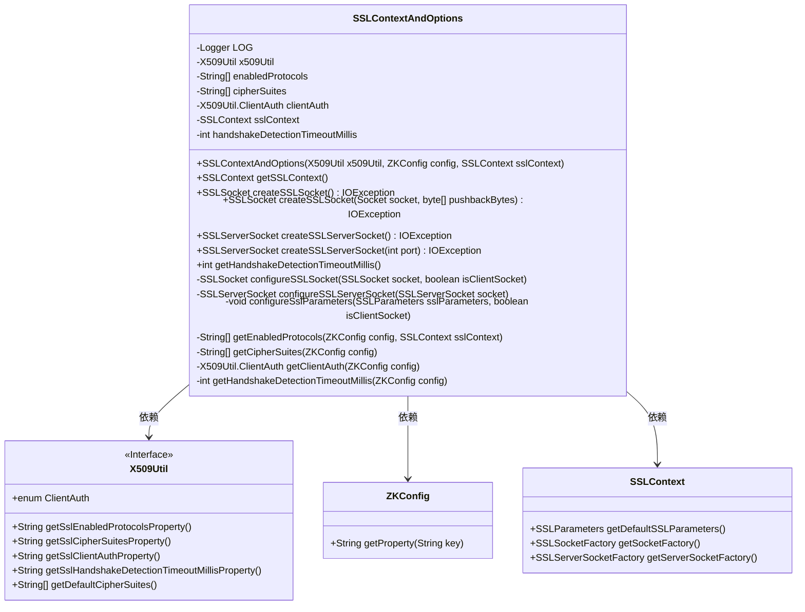

# 基础信息

|      |      |
|------|------|
| 名称 | SSLContextAndOptions |
| 编码语言 | .java |
| 代码路径 | zookeeper/zookeeper-server/src/main/java/org/apache/zookeeper/common/SSLContextAndOptions.java |
| 包名 | org.apache.zookeeper.common |
| 依赖项 | ['java.util.Objects.requireNonNull', 'java.io.ByteArrayInputStream', 'java.io.IOException', 'java.net.Socket', 'java.util.Arrays', 'javax.net.ssl.SSLContext', 'javax.net.ssl.SSLParameters', 'javax.net.ssl.SSLServerSocket', 'javax.net.ssl.SSLSocket', 'org.slf4j.Logger', 'org.slf4j.LoggerFactory'] |
| 概述说明 | SSLContextAndOptions类封装SSL配置，提供创建和配置SSLSocket及SSLServerSocket的方法，支持协议、加密套件和客户端认证设置。 |

# 说明

SSLContextAndOptions类封装了SSL/TLS配置的核心功能，包含X509Util实例、支持的协议、加密套件、客户端认证模式及SSL上下文。构造函数通过ZKConfig初始化参数，提供创建SSLSocket/SSLServerSocket的方法，并支持配置超时检测和参数设置。内部方法处理协议选择、加密套件加载及客户端认证逻辑，确保安全通信的灵活配置与默认值回退机制。

# 类列表 Class Summary

| 名称   | 类型  | 说明 |
|-------|------|-------------|
| SSLContextAndOptions | class | SSLContextAndOptions类封装SSL配置，提供创建和配置SSLSocket及SSLServerSocket的方法，支持协议、加密套件和客户端认证设置。 |

## 类 SSLContextAndOptions

|      |      |
|------|------|
| 访问范围 | public |
| 类型 | class |
| 名称 | SSLContextAndOptions |
| 说明 | SSLContextAndOptions类封装SSL配置，提供创建和配置SSLSocket及SSLServerSocket的方法，支持协议、加密套件和客户端认证设置。 |

### UML类图

这段代码描述了一个SSLContextAndOptions类，主要用于管理和配置SSL/TLS相关的参数和选项。该类依赖于X509Util、ZKConfig和SSLContext三个外部类，提供了创建和配置SSLSocket和SSLServerSocket的方法，以及获取SSL协议参数的功能。X509Util是一个接口，提供了获取SSL相关配置属性的方法；ZKConfig用于读取配置属性；SSLContext则提供了SSL上下文的基本功能。整个设计专注于SSL/TLS连接的创建和配置，支持客户端和服务端的不同需求。

### 内部方法调用关系图

```mermaid
graph TD
    A["类SSLContextAndOptions"]
    B["属性: Logger LOG"]
    C["属性: X509Util x509Util"]
    D["属性: String[] enabledProtocols"]
    E["属性: String[] cipherSuites"]
    F["属性: ClientAuth clientAuth"]
    G["属性: SSLContext sslContext"]
    H["属性: int handshakeDetectionTimeoutMillis"]
    I["构造方法: SSLContextAndOptions(X509Util, ZKConfig, SSLContext)"]
    J["方法: SSLContext getSSLContext()"]
    K["方法: SSLSocket createSSLSocket()"]
    L["方法: SSLSocket createSSLSocket(Socket, byte[])"]
    M["方法: SSLServerSocket createSSLServerSocket()"]
    N["方法: SSLServerSocket createSSLServerSocket(int)"]
    O["方法: int getHandshakeDetectionTimeoutMillis()"]
    P["私有方法: configureSSLSocket(SSLSocket, boolean)"]
    Q["私有方法: configureSSLServerSocket(SSLServerSocket)"]
    R["私有方法: configureSslParameters(SSLParameters, boolean)"]
    S["私有方法: getEnabledProtocols(ZKConfig, SSLContext)"]
    T["私有方法: getCipherSuites(ZKConfig)"]
    U["私有方法: getClientAuth(ZKConfig)"]
    V["私有方法: getHandshakeDetectionTimeoutMillis(ZKConfig)"]

    A --> B
    A --> C
    A --> D
    A --> E
    A --> F
    A --> G
    A --> H
    A --> I
    A --> J
    A --> K
    A --> L
    A --> M
    A --> N
    A --> O
    A --> P
    A --> Q
    A --> R
    A --> S
    A --> T
    A --> U
    A --> V
```

该流程图展示了SSLContextAndOptions类的完整结构，包含8个私有属性、1个包级私有构造方法和13个公开/私有方法。核心功能围绕SSL上下文配置展开，包括创建客户端/服务端SSL套接字、配置加密参数、协议协商和握手超时设置等安全通信关键操作。类通过X509Util和ZKConfig获取安全配置，并严格校验参数有效性。

### 字段列表 Field List

| 名称  | 类型  | 说明 |
|-------|-------|------|
| clientAuth | X509Util.ClientAuth | 私有终态变量clientAuth，类型为X509Util.ClientAuth。 |
| enabledProtocols | String[] | 私有字符串数组enabledProtocols，存储启用的协议列表。 |
| handshakeDetectionTimeoutMillis | int | 私有整型变量，表示握手检测超时时间（毫秒）。 |
| x509Util | X509Util | 私有不可变的X509工具类实例。 |
| sslContext | SSLContext | 私有SSLContext对象，用于安全通信。 |
| cipherSuites | String[] | 私有字符串数组，存储加密套件列表。 |
| LOG = LoggerFactory.getLogger(SSLContextAndOptions.class) | Logger | 声明私有静态日志常量LOG，用于SSLContextAndOptions类的日志记录。 |

### 方法列表 Method List

| 名称  | 类型  | 说明 |
|-------|-------|------|
| getClientAuth | X509Util.ClientAuth | 该方法根据ZKConfig配置获取X509客户端认证类型，通过属性值转换实现。 |
| configureSSLServerSocket | SSLServerSocket | 私有方法配置SSLServerSocket：获取SSL参数并配置，禁用客户端模式，返回配置后的socket。 |
| configureSslParameters | void | 配置SSL参数：设置密码套件和启用协议，根据客户端或服务端选择不同配置，处理客户端认证需求。 |
| createSSLServerSocket | SSLServerSocket | 创建一个SSL服务器套接字，指定端口，可能抛出IO异常，返回配置好的SSLServerSocket实例。 |
| getHandshakeDetectionTimeoutMillis | int | 获取SSL握手检测超时毫秒数的方法：若配置为空或小于1，使用默认值；否则解析配置值，避免无限超时导致线程阻塞。 |
| createSSLSocket | SSLSocket | 创建SSLSocket方法，根据pushbackBytes是否为空选择不同方式初始化，最终返回配置好的SSLSocket。 |
| createSSLServerSocket | SSLServerSocket | 创建SSL服务器套接字，通过SSL上下文获取套接字工厂并配置后返回。 |
| configureSSLSocket | SSLSocket | 私有方法配置SSLSocket，设置SSL参数和客户端模式，返回配置后的socket。 |
| getCipherSuites | String[] | 从配置获取加密套件，未配置则返回默认值。 |
| getHandshakeDetectionTimeoutMillis | int | 方法返回握手检测超时毫秒数。 |
| getEnabledProtocols | String[] | 获取启用的SSL协议：若配置未指定，则使用JDK默认协议（TLSv1.3含TLSv1.2，TLSv1.2仅自身）；否则按配置拆分返回。 |
| createSSLSocket | SSLSocket | 创建SSLSocket方法，通过SSL上下文工厂生成并配置SSL套接字，可能抛出IO异常。 |
| getSSLContext | SSLContext | 获取SSLContext对象的方法，返回sslContext实例。 |

