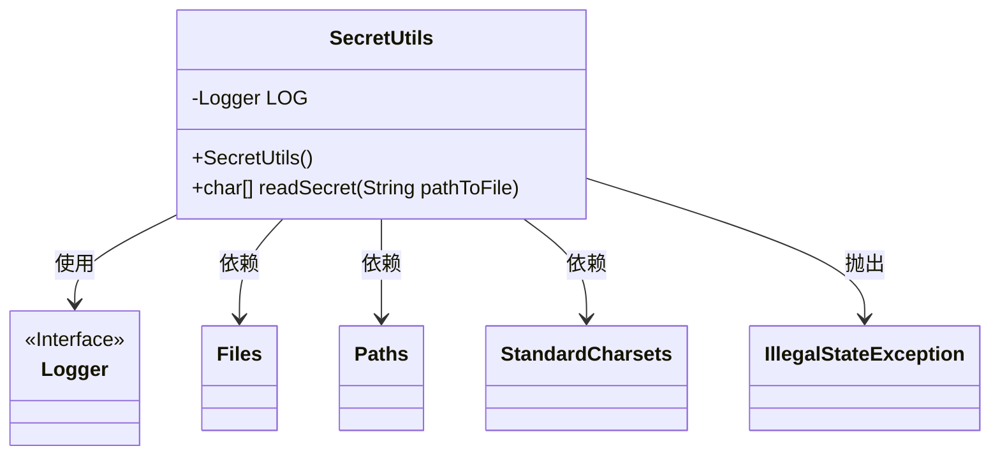
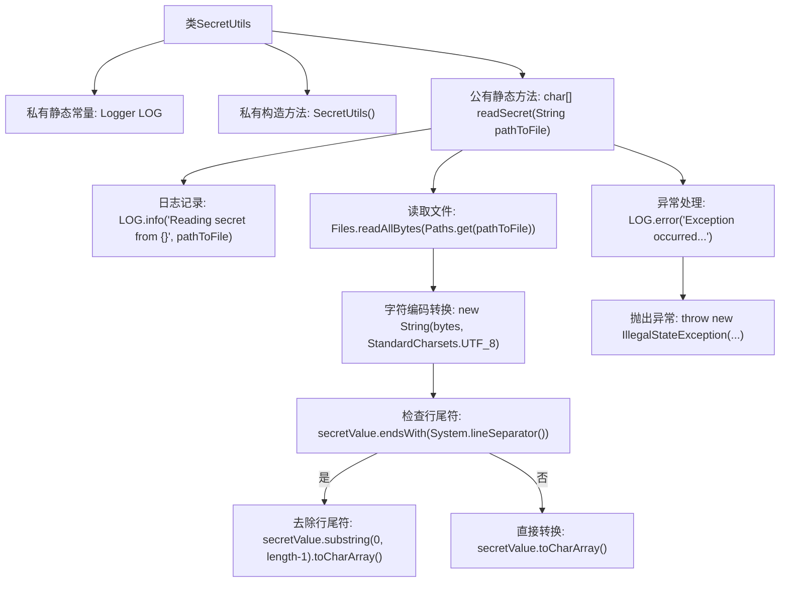

# 基础信息

|      |      |
|------|------|
| 名称 | SecretUtils |
| 编码语言 | .java |
| 代码路径 | zookeeper/zookeeper-server/src/main/java/org/apache/zookeeper/common/SecretUtils.java |
| 包名 | org.apache.zookeeper.common |
| 依赖项 | ['java.nio.charset.StandardCharsets', 'java.nio.file.Files', 'java.nio.file.Paths', 'org.slf4j.Logger', 'org.slf4j.LoggerFactory'] |
| 概述说明 | SecretUtils工具类提供静态方法readSecret，从指定路径读取文件内容并转为字符数组，自动处理末尾换行符，异常时记录日志并抛出IllegalStateException。 |

# 说明

这是一个名为SecretUtils的工具类，用于安全读取文件中的秘密信息。该类被声明为final且构造函数私有化，确保不可实例化。核心方法是readSecret，接收文件路径参数，使用UTF-8编码读取文件内容，并处理可能存在的换行符。读取过程中会记录日志，遇到异常时抛出IllegalStateException并记录错误日志。返回结果转换为字符数组形式，确保敏感信息在内存中的安全性。

# 类列表 Class Summary

| 名称   | 类型  | 说明 |
|-------|------|-------------|
| SecretUtils | class | SecretUtils工具类提供静态方法readSecret，从指定路径文件读取内容并转为字符数组，自动去除末尾换行符，异常时记录日志并抛出。 |

## 类 SecretUtils

|      |      |
|------|------|
| 访问范围 | public final |
| 类型 | class |
| 名称 | SecretUtils |
| 说明 | SecretUtils工具类提供静态方法readSecret，从指定路径文件读取内容并转为字符数组，自动去除末尾换行符，异常时记录日志并抛出。 |

### UML类图

这段代码展示了一个工具类SecretUtils，它包含一个私有构造方法和一个静态方法readSecret。该类主要用于从指定路径读取文件内容并转换为字符数组，处理时会移除末尾的换行符。代码中使用了Java标准库的Files、Paths等类进行文件操作，并通过Logger接口记录日志。当发生异常时，会抛出IllegalStateException并记录错误日志。整个设计体现了工具类的典型特征：私有构造、静态方法、异常处理和日志记录。

### 内部方法调用关系图

这段代码流程图展示了SecretUtils工具类的完整处理流程。该类通过静态方法readSecret从指定路径读取文件内容，处理UTF-8编码转换和行尾符检查，最终返回字符数组。流程包含正常路径的文件读取、字符串处理和异常处理分支，特别关注了文件末尾换行符的特殊处理情况。所有操作都通过静态日志记录器进行详细跟踪，并在异常时抛出包装后的运行时异常。

### 字段列表 Field List

| 名称  | 类型  | 说明 |
|-------|-------|------|
| LOG = LoggerFactory.getLogger(SecretUtils.class) | Logger | 私有静态日志常量LOG，用于SecretUtils类的日志记录。 |

### 方法列表 Method List

| 名称  | 类型  | 说明 |
|-------|-------|------|
| readSecret | char[] | 静态方法readSecret从指定路径读取文件内容为UTF-8字符串，去除末尾换行符后转为字符数组。若出错则记录日志并抛出异常。 |

