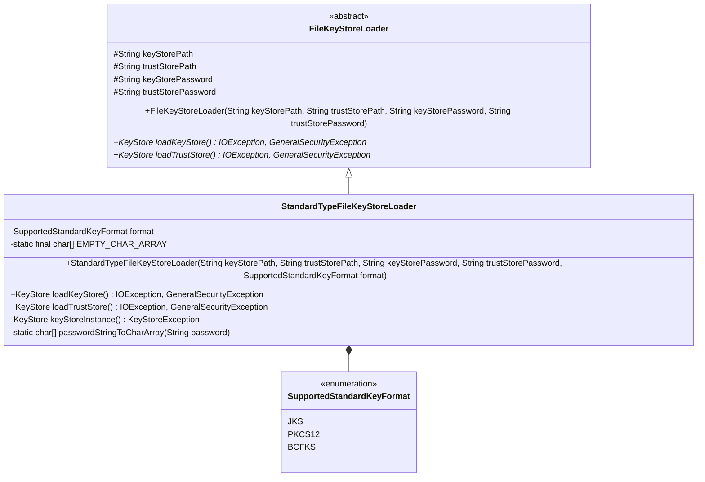
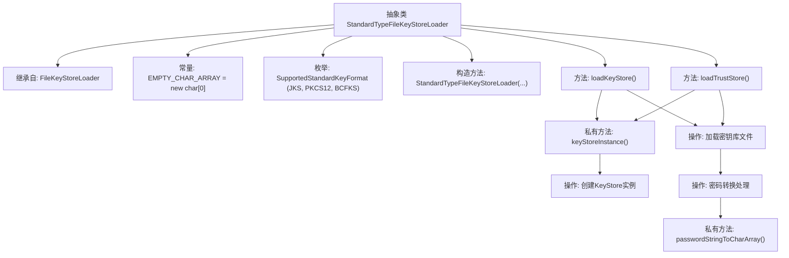

# 基础信息

|      |      |
|------|------|
| 名称 | StandardTypeFileKeyStoreLoader |
| 编码语言 | .java |
| 代码路径 | zookeeper/zookeeper-server/src/main/java/org/apache/zookeeper/common/StandardTypeFileKeyStoreLoader.java |
| 包名 | org.apache.zookeeper.common |
| 依赖项 | ['java.io.File', 'java.io.FileInputStream', 'java.io.IOException', 'java.io.InputStream', 'java.security.GeneralSecurityException', 'java.security.KeyStore', 'java.security.KeyStoreException'] |
| 概述说明 | StandardTypeFileKeyStoreLoader继承FileKeyStoreLoader，支持JKS、PKCS12、BCFKS格式密钥库，提供加载密钥库和信任库的方法，密码可转为字符数组。 |

# 说明

这是一个名为StandardTypeFileKeyStoreLoader的抽象类，继承自FileKeyStoreLoader。它用于加载标准格式的密钥库和信任库，支持JKS、PKCS12和BCFKS三种格式。类中包含一个枚举定义支持的格式类型，并通过构造函数接收密钥库路径、信任库路径及对应密码和格式参数。提供了加载密钥库和信任库的方法，使用文件输入流读取库文件内容，并根据格式类型创建相应实例。密码处理方面，将字符串密码转为字符数组，若密码为空则使用空数组。整个类封装了标准密钥库的加载逻辑，确保安全性和正确性。

# 类列表 Class Summary

| 名称   | 类型  | 说明 |
|-------|------|-------------|
| StandardTypeFileKeyStoreLoader | class | StandardTypeFileKeyStoreLoader继承FileKeyStoreLoader，支持JKS、PKCS12、BCFKS格式密钥库，提供加载密钥库和信任库的方法，密码处理为空或转为字符数组。 |

## 类 StandardTypeFileKeyStoreLoader

|      |      |
|------|------|
| 访问范围 | abstract |
| 类型 | class |
| 名称 | StandardTypeFileKeyStoreLoader |
| 说明 | StandardTypeFileKeyStoreLoader继承FileKeyStoreLoader，支持JKS、PKCS12、BCFKS格式密钥库，提供加载密钥库和信任库的方法，密码处理为空或转为字符数组。 |

### UML类图

这段代码展示了一个用于加载标准类型密钥库的抽象类继承体系。StandardTypeFileKeyStoreLoader继承自FileKeyStoreLoader，实现了具体的密钥库加载逻辑，支持JKS、PKCS12和BCFKS三种标准格式。类图中清晰地展示了继承关系、枚举类型的使用以及关键方法，包括加载密钥库和信任库的核心方法，以及处理密码的辅助方法。该设计通过抽象基类和具体实现分离了通用逻辑与特定格式的处理，体现了良好的扩展性。

### 内部方法调用关系图

这段代码流程图展示了StandardTypeFileKeyStoreLoader抽象类的结构和主要方法调用关系。该类继承自FileKeyStoreLoader，包含密钥库加载的核心功能，支持JKS、PKCS12和BCFKS三种标准格式。流程图清晰地呈现了从构造方法到具体操作的完整调用链，包括密钥库实例创建、文件加载和密码转换等关键步骤，体现了安全存储加载的完整处理流程。各方法间的调用关系通过箭头连接，展示了从入口方法到基础工具方法的层级结构。

### 字段列表 Field List

| 名称  | 类型  | 说明 |
|-------|-------|------|
| format | SupportedStandardKeyFormat | 受保护的最终支持标准键格式对象。 |
| EMPTY_CHAR_ARRAY = new char[0] | char[] | 定义空字符数组常量EMPTY_CHAR_ARRAY。 |

### 方法列表 Method List

| 名称  | 类型  | 说明 |
|-------|-------|------|
| loadKeyStore | KeyStore | 加载密钥库方法：读取指定路径文件，初始化密钥库实例并用密码加载，返回密钥库对象。异常处理IO和安全错误。 |
| loadTrustStore | KeyStore | Java方法加载信任存储：读取指定路径文件，初始化KeyStore实例，用密码加载后返回。异常处理包括IO和加密错误。 |
| keyStoreInstance | KeyStore | 创建KeyStore实例，使用指定格式名称，可能抛出KeyStoreException异常。 |
| passwordStringToCharArray | char[] | 私有方法将密码字符串转为字符数组，若输入为空则返回空数组。 |

