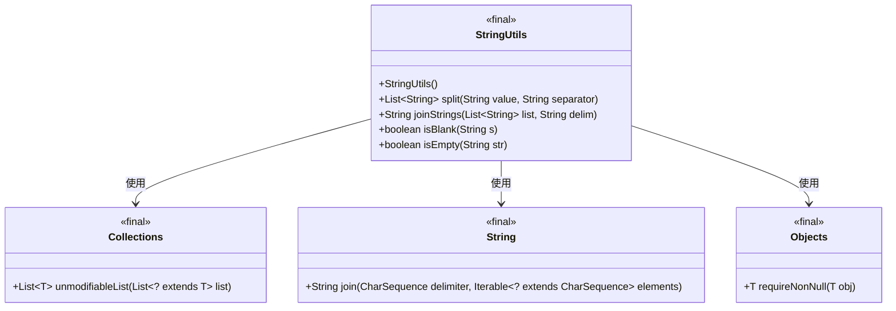
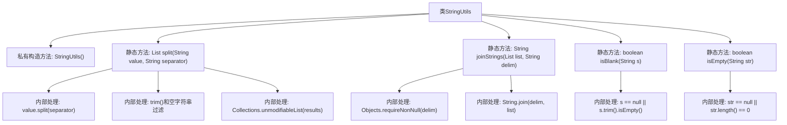

# 基础信息

|      |      |
|------|------|
| 名称 | StringUtils |
| 编码语言 | .java |
| 代码路径 | zookeeper/zookeeper-server/src/main/java/org/apache/zookeeper/common/StringUtils.java |
| 包名 | org.apache.zookeeper.common |
| 依赖项 | ['java.util.ArrayList', 'java.util.Collections', 'java.util.List', 'java.util.Objects'] |
| 概述说明 | StringUtils工具类：提供字符串分割、拼接及判空方法，分割时自动去空格和空值，拼接支持null安全，判空包含null和空白检查。 |

# 说明

这是一个名为StringUtils的工具类，提供静态方法处理字符串操作。类不可实例化和继承。主要功能包括：split方法分割字符串并去除空项和首尾空格，返回不可变列表；joinStrings方法安全地连接字符串列表，处理null值；isBlank检查字符串是否为null或仅含空格；isEmpty检查字符串是否为null或空字符串。所有方法均为静态，注重null安全性和字符串处理效率。

# 类列表 Class Summary

| 名称   | 类型  | 说明 |
|-------|------|-------------|
| StringUtils | class | 
StringUtils类提供字符串处理工具：split方法分割字符串并去除空项，joinStrings安全合并列表，isBlank检查空或空格，isEmpty检查空或null。 |

## 类 StringUtils

|      |      |
|------|------|
| 访问范围 | public |
| 类型 | class |
| 名称 | StringUtils |
| 说明 | 
StringUtils类提供字符串处理工具：split方法分割字符串并去除空项，joinStrings安全合并列表，isBlank检查空或空格，isEmpty检查空或null。 |

### UML类图

这段代码展示了一个工具类`StringUtils`，它提供了四个静态方法用于字符串处理：`split()`方法分割并清理字符串，`joinStrings()`方法安全地连接字符串列表，`isBlank()`和`isEmpty()`方法检查字符串空值或空白状态。该类不可实例化，通过依赖`Collections`、`String`和`Objects`等JDK工具类实现功能，所有方法均为静态且线程安全，适用于通用字符串操作场景。类图清晰地展示了这些工具类之间的依赖关系。

### 内部方法调用关系图

这段代码定义了一个StringUtils工具类，包含四个核心静态方法：split()用于分割并清理字符串，joinStrings()用于安全地连接字符串列表，isBlank()和isEmpty()分别检测字符串是否为空或仅含空格。所有方法都经过空值安全处理，其中split()还会自动去除结果中的空白项并返回不可变列表。

### 字段列表 Field List

| 名称  | 类型  | 说明 |
|-------|-------|------|

### 方法列表 Method List

| 名称  | 类型  | 说明 |
|-------|-------|------|
| isBlank | boolean | 检查字符串是否为空或仅含空格，返回布尔值。 |
| isEmpty | boolean | 检查字符串是否为空或null。 |
| joinStrings | String | 静态方法joinStrings接收字符串列表和分隔符，非空检查分隔符后，若列表非空则用分隔符连接列表元素，否则返回null。 |
| split | List<String> | 静态方法split接收字符串和分隔符，分割后去除空白项并返回不可修改的列表。 |

