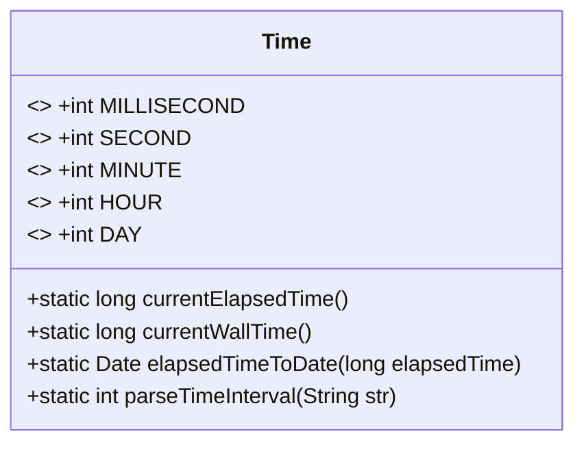
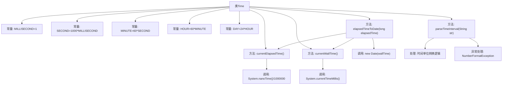

# 基础信息

|      |      |
|------|------|
| 名称 | Time |
| 编码语言 | .java |
| 代码路径 | zookeeper/zookeeper-server/src/main/java/org/apache/zookeeper/common/Time.java |
| 包名 | org.apache.zookeeper.common |
| 依赖项 | ['java.util.Date'] |
| 概述说明 | Java类Time提供时间单位常量、获取当前时间方法及时间字符串解析功能。包含毫秒、秒、分、时、日转换，支持系统时间和稳定计时器，可将时间间隔字符串转为毫秒值。 |

# 说明

该代码定义了一个Time类，包含多个时间单位常量（毫秒、秒、分、时、天）。提供了三个核心方法：currentElapsedTime返回基于系统纳秒时间的毫秒值，不受系统时钟修改影响；currentWallTime返回系统当前墙钟时间；elapsedTimeToDate将elapsedTime转换为Date对象。parseTimeInterval方法解析带后缀的时间间隔字符串（如10s、5m），将其统一转换为毫秒值，支持ms、s、m、h、d后缀，无后缀默认为毫秒。

# 类列表 Class Summary

| 名称   | 类型  | 说明 |
|-------|------|-------------|
| Time | class | Java类Time提供时间单位常量、获取当前时间方法及时间字符串解析功能。包含毫秒、秒、分、时、日单位转换，支持获取系统时间与独立计时时间，可将时间间隔字符串解析为毫秒值。 |

## 类 Time

|      |      |
|------|------|
| 访问范围 | public |
| 类型 | class |
| 名称 | Time |
| 说明 | Java类Time提供时间单位常量、获取当前时间方法及时间字符串解析功能。包含毫秒、秒、分、时、日单位转换，支持获取系统时间与独立计时时间，可将时间间隔字符串解析为毫秒值。 |

### UML类图

该代码定义了一个名为`Time`的工具类，主要用于处理时间相关的操作。类中包含五个静态常量（毫秒、秒、分钟、小时、天的毫秒数转换），以及四个静态方法：`currentElapsedTime()`获取基于系统纳秒时间的毫秒值，`currentWallTime()`获取系统当前时间，`elapsedTimeToDate()`将相对时间转换为绝对日期，`parseTimeInterval()`解析带单位的时间字符串为毫秒数。类设计为纯工具类，所有成员均为静态，不维护实例状态，提供时间单位转换和计算功能。

### 内部方法调用关系图

这段代码定义了一个Time工具类，包含时间单位常量定义和四个核心方法。currentElapsedTime()使用纳秒计时器提供相对时间，currentWallTime()获取系统墙钟时间，elapsedTimeToDate()将相对时间转换为Date对象，parseTimeInterval()实现带单位的时间字符串解析。流程图清晰展示了类结构、常量定义、方法调用关系和时间转换的核心逻辑，特别突出了parseTimeInterval()中的多分支处理流程。

### 字段列表 Field List

| 名称  | 类型  | 说明 |
|-------|-------|------|
| DAY = 24 * HOUR | int | 定义常量DAY，值为24乘以HOUR的积。 |
| HOUR = 60 * MINUTE | int | 定义常量HOUR，值为60乘以MINUTE的积。 |
| SECOND = 1000 * MILLISECOND | int | 定义常量SECOND为1000毫秒。 |
| MINUTE = 60 * SECOND | int | 定义常量MINUTE，值为60秒。 |
| MILLISECOND = 1 | int | 定义静态常量MILLISECOND，值为1，表示毫秒单位。 |

### 方法列表 Method List

| 名称  | 类型  | 说明 |
|-------|-------|------|
| parseTimeInterval | int | 解析时间间隔字符串为毫秒数，支持无后缀（毫秒）、"ms"后缀或单字母后缀（S/M/H/D分别表示秒/分/时/天）。无效格式抛出异常。 |
| currentWallTime | long | 静态方法currentWallTime返回当前系统时间毫秒数。 |
| elapsedTimeToDate | Date | 将流逝时间转换为日期：计算当前墙钟时间加上流逝时间差，生成对应日期对象。 |
| currentElapsedTime | long | 静态方法返回当前系统时间的毫秒值，基于纳秒时间转换。 |

