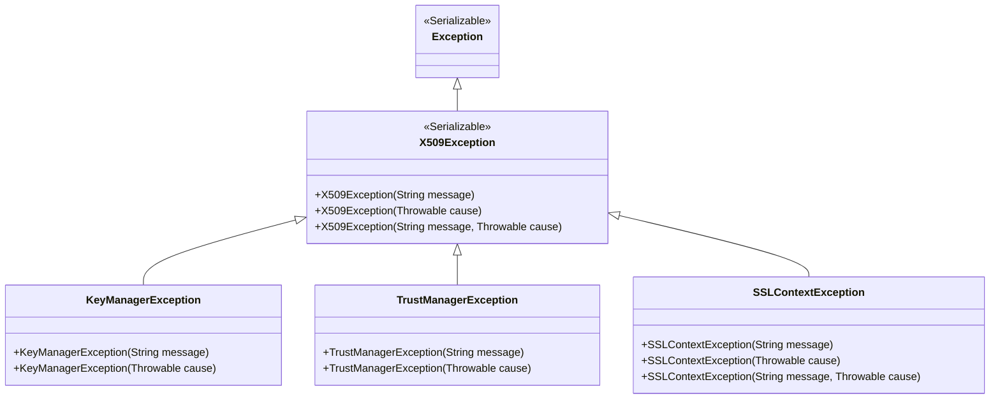
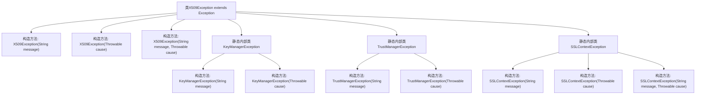

# 基础信息

|      |      |
|------|------|
| 名称 | X509Exception |
| 编码语言 | .java |
| 代码路径 | zookeeper/zookeeper-server/src/main/java/org/apache/zookeeper/common/X509Exception.java |
| 包名 | org.apache.zookeeper.common |
| 依赖项 | [] |
| 概述说明 | X509Exception及其子类KeyManagerException、TrustManagerException、SSLContextException，用于处理X509相关异常，支持消息和原因构造。 |

# 说明

该内容定义了一个名为X509Exception的异常类，继承自Exception类。X509Exception提供了三种构造函数，分别接受消息字符串、原因Throwable对象或两者。此外，还定义了三个静态内部异常类：KeyManagerException、TrustManagerException和SSLContextException，它们都继承自X509Exception。KeyManagerException和TrustManagerException各有两个构造函数，分别接受消息或原因；SSLContextException则额外提供了一个同时接受消息和原因的构造函数。所有构造函数都通过super调用父类对应构造函数。

# 类列表 Class Summary

| 名称   | 类型  | 说明 |
|-------|------|-------------|
| X509Exception | class | X509Exception是处理X509相关错误的异常类，包含KeyManagerException、TrustManagerException和SSLContextException三个子类，分别用于密钥管理器、信任管理器和SSL上下文错误。 |

## 类 X509Exception

|      |      |
|------|------|
| 访问范围 | @SuppressWarnings("serial");public |
| 类型 | class |
| 名称 | X509Exception |
| 说明 | X509Exception是处理X509相关错误的异常类，包含KeyManagerException、TrustManagerException和SSLContextException三个子类，分别用于密钥管理器、信任管理器和SSL上下文错误。 |

### UML类图

该类图展示了一个X509异常处理体系结构，其中X509Exception继承自Java标准Exception类，并包含三个静态内部类：KeyManagerException、TrustManagerException和SSLContextException。这些异常类专门用于处理X.509证书相关的不同场景错误，如密钥管理器错误、信任管理器错误和SSL上下文错误。所有子类都继承了父类的构造方法，并可根据需要提供特定场景的异常处理能力。类间关系通过继承符号<|--清晰表示，形成层次分明的异常处理结构。

### 内部方法调用关系图

这段代码定义了一个X509Exception异常类及其三个静态内部异常类。X509Exception继承自Exception，提供三种构造方法分别处理消息、原因或两者。KeyManagerException和TrustManagerException是简单的子类，仅支持消息或原因的构造。SSLContextException作为最复杂的子类，额外提供了同时接收消息和原因的构造方法。整个结构形成了清晰的异常层次，专门用于处理X.509证书相关的不同场景错误。

### 字段列表 Field List

| 名称  | 类型  | 说明 |
|-------|-------|------|

### 方法列表 Method List

| 名称  | 类型  | 说明 |
|-------|-------|------|

