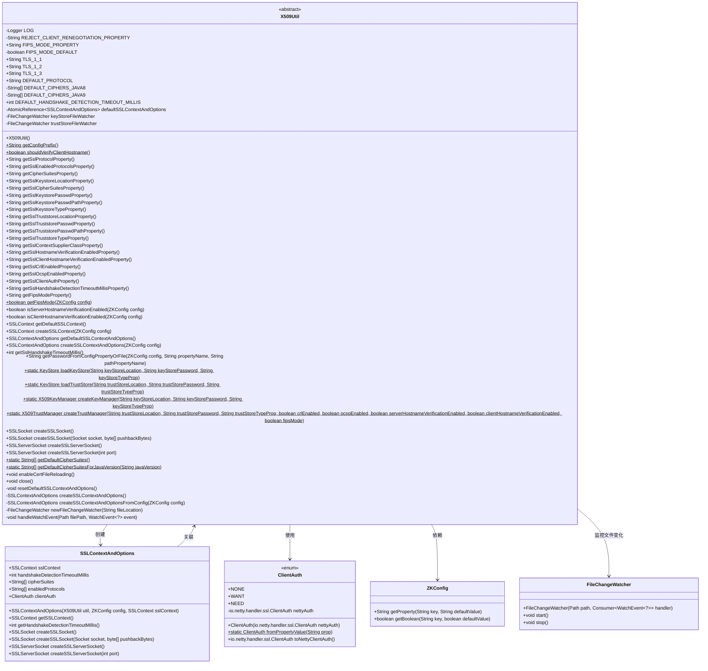
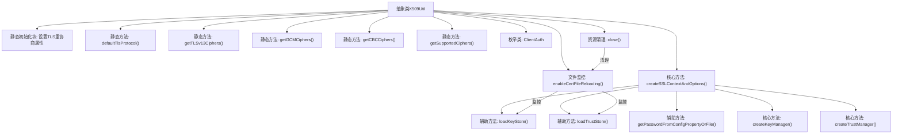

# 基础信息

|      |      |
|------|------|
| 名称 | X509Util |
| 编码语言 | .java |
| 代码路径 | zookeeper/zookeeper-server/src/main/java/org/apache/zookeeper/common/X509Util.java |
| 包名 | org.apache.zookeeper.common |
| 依赖项 | ['java.io.Closeable', 'java.io.IOException', 'java.lang.reflect.InvocationTargetException', 'java.net.Socket', 'java.nio.file.Path', 'java.nio.file.Paths', 'java.nio.file.StandardWatchEventKinds', 'java.nio.file.WatchEvent', 'java.security.GeneralSecurityException', 'java.security.KeyManagementException', 'java.security.KeyStore', 'java.security.NoSuchAlgorithmException', 'java.security.Security', 'java.security.cert.PKIXBuilderParameters', 'java.security.cert.X509CertSelector', 'java.util.ArrayList', 'java.util.Arrays', 'java.util.List', 'java.util.Objects', 'java.util.concurrent.atomic.AtomicReference', 'java.util.function.Supplier', 'java.util.stream.Collectors', 'javax.net.ssl.CertPathTrustManagerParameters', 'javax.net.ssl.KeyManager', 'javax.net.ssl.KeyManagerFactory', 'javax.net.ssl.SSLContext', 'javax.net.ssl.SSLServerSocket', 'javax.net.ssl.SSLServerSocketFactory', 'javax.net.ssl.SSLSocket', 'javax.net.ssl.TrustManager', 'javax.net.ssl.TrustManagerFactory', 'javax.net.ssl.X509ExtendedTrustManager', 'javax.net.ssl.X509KeyManager', 'javax.net.ssl.X509TrustManager', 'org.apache.zookeeper.common.X509Exception.KeyManagerException', 'org.apache.zookeeper.common.X509Exception.SSLContextException', 'org.apache.zookeeper.common.X509Exception.TrustManagerException', 'org.apache.zookeeper.server.NettyServerCnxnFactory', 'org.apache.zookeeper.server.auth.ProviderRegistry', 'org.slf4j.Logger', 'org.slf4j.LoggerFactory'] |
| 概述说明 | X509Util是一个抽象类，用于管理TLS/SSL配置，包括密钥库、信任库、协议版本、密码套件等。它支持自动重新加载证书文件，提供默认TLS协议选择（TLSv1.2或TLSv1.3），并包含客户端认证选项（NONE/WANT/NEED）。类实现了Closeable和AutoCloseable接口，确保资源正确释放。 |

# 说明

X509Util是一个抽象类，实现了Closeable和AutoCloseable接口，用于处理X.509证书相关的SSL/TLS操作。它包含以下核心功能：1) 管理TLS协议版本（TLSv1.1/1.2/1.3）和默认协议选择逻辑；2) 提供密码套件配置，根据Java版本自动优化选择；3) 支持密钥库和信任库的加载与管理，包括JKS/PEM/PKCS12/BCFKS格式；4) 实现证书撤销检查（CRL/OCSP）；5) 支持客户端认证模式（NONE/WANT/NEED）；6) 提供主机名验证功能；7) 支持FIPS模式；8) 通过文件监视器实现证书文件自动重载；9) 包含SSLContext创建和管理的全套工具方法。该类通过系统属性和配置文件进行灵活配置，并处理各种安全异常情况。

# 类列表 Class Summary

| 名称   | 类型  | 说明 |
|-------|------|-------------|
| X509Util | class | X509Util是一个抽象类，提供TLS/SSL相关功能，包括密钥库/信任库管理、协议配置、密码套件选择、证书验证和自动重载机制。支持TLS 1.1-1.3，默认禁用客户端重协商，可根据Java版本优化密码套件性能。包含客户端认证枚举和文件变更监听功能。 |

## 类 X509Util

|      |      |
|------|------|
| 访问范围 | public abstract |
| 类型 | class |
| 名称 | X509Util |
| 说明 | X509Util是一个抽象类，提供TLS/SSL相关功能，包括密钥库/信任库管理、协议配置、密码套件选择、证书验证和自动重载机制。支持TLS 1.1-1.3，默认禁用客户端重协商，可根据Java版本优化密码套件性能。包含客户端认证枚举和文件变更监听功能。 |

### UML类图

这段代码定义了一个抽象类X509Util，主要用于处理X.509证书相关的操作，包括SSL/TLS协议的配置、密钥和信任存储的管理、证书验证等。它实现了Closeable和AutoCloseable接口，支持自动关闭资源。类中包含多个静态常量定义TLS协议版本，提供了丰富的配置属性和方法用于创建SSLContext、管理密钥库/信任库、处理证书验证等。通过FileChangeWatcher实现了证书文件变更时的自动重载功能，支持多种密钥存储格式（JKS/PEM/PKCS12等）。ClientAuth枚举定义了客户端认证的三种模式，SSLContextAndOptions是辅助类用于封装SSL上下文和相关配置选项。整体设计注重安全性和灵活性，适用于需要严格证书管理的网络通信场景。

### 内部方法调用关系图

该流程图展示了X509Util类的核心架构和关键方法调用关系。作为TLS/SSL安全工具类，它通过静态初始化块确保安全默认配置，提供密码套件管理、密钥/信任存储加载、SSL上下文创建等核心功能。特别设计了证书文件动态重载机制，通过文件监控实现配置热更新。整体采用分层设计，上层业务方法依赖底层安全原语操作，同时严格处理各类安全异常情况，确保在Java不同版本间的兼容性。

### 字段列表 Field List

| 名称  | 类型  | 说明 |
|-------|-------|------|
| LOG = LoggerFactory.getLogger(X509Util.class) | Logger | X509Util类中定义了一个私有静态日志记录器LOG。 |
| sslTruststoreTypeProperty = getConfigPrefix() + "trustStore.type" | String | 私有字符串变量sslTruststoreTypeProperty定义为获取配置前缀与"trustStore.type"的拼接结果。 |
| sslProtocolProperty = getConfigPrefix() + "protocol" | String | 私有字符串变量sslProtocolProperty赋值为getConfigPrefix()与"protocol"拼接结果。 |
| TLS_1_2 = "TLSv1.2" | String | 定义常量TLS_1_2，值为TLSv1.2，表示TLS 1.2协议版本。 |
| sslKeystorePasswdPathProperty = getConfigPrefix() + "keyStore.passwordPath" | String | 私有字符串变量sslKeystorePasswdPathProperty通过getConfigPrefix方法拼接keyStore.passwordPath生成配置路径。 |
| sslTruststoreLocationProperty = getConfigPrefix() + "trustStore.location" | String | 私有字符串变量sslTruststoreLocationProperty定义为配置前缀加trustStore.location。 |
| TLS_1_1 = "TLSv1.1" | String | 定义TLS 1.1版本的常量字符串。 |
| sslOcspEnabledProperty = getConfigPrefix() + "ocsp" | String | 私有字符串变量sslOcspEnabledProperty存储配置前缀与"ocsp"拼接的值。 |
| cipherSuitesProperty = getConfigPrefix() + "ciphersuites" | String | 私有字符串变量cipherSuitesProperty存储配置前缀与"ciphersuites"的组合值。 |
| sslClientHostnameVerificationEnabledProperty = getConfigPrefix() + "clientHostnameVerification" | String | 私有字符串变量sslClientHostnameVerificationEnabledProperty，通过getConfigPrefix方法拼接配置前缀和固定字符串"clientHostnameVerification"生成。 |
| FIPS_MODE_PROPERTY = "zookeeper.fips-mode" | String | 这是一个Java静态常量，定义FIPS模式属性名为"zookeeper.fips-mode"。 |
| DEFAULT_HANDSHAKE_DETECTION_TIMEOUT_MILLIS = 5000 | int | 静态常量DEFAULT_HANDSHAKE_DETECTION_TIMEOUT_MILLIS值为5000，表示默认握手检测超时时间为5秒。 |
| TLS_1_3 = "TLSv1.3" | String | 定义TLS 1.3版本的常量字符串。 |
| sslHostnameVerificationEnabledProperty = getConfigPrefix() + "hostnameVerification" | String | 私有字符串变量sslHostnameVerificationEnabledProperty存储配置前缀与hostnameVerification的组合值。 |
| sslEnabledProtocolsProperty = getConfigPrefix() + "enabledProtocols" | String | 私有字符串变量sslEnabledProtocolsProperty通过getConfigPrefix方法拼接"enabledProtocols"生成配置前缀。 |
| sslCrlEnabledProperty = getConfigPrefix() + "crl" | String | 私有字符串变量sslCrlEnabledProperty存储配置前缀与crl拼接值。 |
| sslTruststorePasswdPathProperty = getConfigPrefix() + "trustStore.passwordPath" | String | 私有字符串变量sslTruststorePasswdPathProperty定义为配置前缀加trustStore.passwordPath的拼接值。 |
| sslClientAuthProperty = getConfigPrefix() + "clientAuth" | String | 私有字符串变量sslClientAuthProperty通过getConfigPrefix()方法拼接"clientAuth"初始化。 |
| keyStoreFileWatcher | FileChangeWatcher | 监控密钥存储文件变化的私有观察器。 |
| sslTruststorePasswdProperty = getConfigPrefix() + "trustStore.password" | String | 代码定义了一个私有常量字符串变量sslTruststorePasswdProperty，其值为getConfigPrefix()方法返回值拼接上trustStore.password。 |
| sslContextSupplierClassProperty = getConfigPrefix() + "context.supplier.class" | String | 私有字符串变量sslContextSupplierClassProperty由getConfigPrefix()方法返回值与固定字符串拼接而成。 |
| sslHandshakeDetectionTimeoutMillisProperty = getConfigPrefix() + "handshakeDetectionTimeoutMillis" | String | 私有字符串变量sslHandshakeDetectionTimeoutMillisProperty存储配置前缀加handshakeDetectionTimeoutMillis的组合值。 |
| FIPS_MODE_DEFAULT = true | boolean | 私有静态常量FIPS模式默认启用。 |
| DEFAULT_CIPHERS_JAVA8 = getSupportedCiphers(getCBCCiphers(), getGCMCiphers(), getTLSv13Ciphers()) | String[] | Java8默认密码套件初始化，整合CBC、GCM和TLSv1.3支持的加密算法。 |
| REJECT_CLIENT_RENEGOTIATION_PROPERTY = "jdk.tls.rejectClientInitiatedRenegotiation" | String | 私有静态常量，用于控制是否拒绝客户端发起的TLS重新协商，属性名为"jdk.tls.rejectClientInitiatedRenegotiation"。 |
| sslKeystorePasswdProperty = getConfigPrefix() + "keyStore.password" | String | 私有字符串变量sslKeystorePasswdProperty通过getConfigPrefix方法拼接"keyStore.password"生成。 |
| sslKeystoreLocationProperty = getConfigPrefix() + "keyStore.location" | String | 私有字符串变量sslKeystoreLocationProperty通过getConfigPrefix方法拼接keyStore.location生成配置路径。 |
| DEFAULT_PROTOCOL = defaultTlsProtocol() | String | 定义静态常量DEFAULT_PROTOCOL，其值为defaultTlsProtocol()方法的返回值。 |
| DEFAULT_CIPHERS_JAVA9 = getSupportedCiphers(getGCMCiphers(), getCBCCiphers(), getTLSv13Ciphers()) | String[] | Java9默认密码套件设置，整合GCM、CBC和TLSv1.3支持的加密算法。 |
| sslKeystoreTypeProperty = getConfigPrefix() + "keyStore.type" | String | 定义私有常量sslKeystoreTypeProperty，值为配置前缀与keyStore.type拼接的字符串。 |
| defaultSSLContextAndOptions = new AtomicReference<>(null) | AtomicReference<SSLContextAndOptions> | 私有原子引用变量，存储SSL上下文及配置，初始值为null。 |
| trustStoreFileWatcher | FileChangeWatcher | 私有文件监视器trustStoreFileWatcher |

### 方法列表 Method List

| 名称  | 类型  | 说明 |
|-------|-------|------|
| getSslCrlEnabledProperty | String | 方法返回SSL证书吊销列表启用属性的字符串值。 |
| getTLSv13Ciphers | String[] | 该方法返回TLS 1.3支持的三种加密套件：AES-256-GCM、AES-128-GCM和CHACHA20-POLY1305。 |
| close | void | 重写close方法，清空默认SSL配置，停止并置空密钥库和信任库的文件监视器。 |
| getSslHandshakeDetectionTimeoutMillisProperty | String | 方法返回SSL握手检测超时属性的字符串值。 |
| getSslTruststoreTypeProperty | String | 获取SSL信任库类型属性的方法，返回字符串类型值。 |
| getSslContextSupplierClassProperty | String | 该方法返回SSL上下文供应商类的属性值。 |
| getGCMCiphers | String[] | 定义私有静态方法getGCMCiphers，返回包含四种TLS加密套件的字符串数组，支持ECDHE密钥交换和AES-GCM加密算法。 |
| getSslOcspEnabledProperty | String | 方法返回SSL OCSP启用属性的字符串值。 |
| getConfigPrefix | String | 获取配置前缀的受保护抽象方法。 |
| createSSLSocket | SSLSocket | 创建SSL套接字，基于现有套接字和回推字节，使用默认SSL上下文和选项，可能抛出X509异常或IO异常。 |
| getSslHostnameVerificationEnabledProperty | String | 获取SSL主机名验证启用属性的字符串值。 |
| getSslProtocolProperty | String | 获取SSL协议属性的字符串方法。 |
| getSupportedCiphers | String[] | 获取支持的加密套件列表，合并输入的多组套件并筛选出系统实际支持的。 |
| getSslKeystorePasswdPathProperty | String | 该方法返回SSL密钥库密码路径属性值。 |
| getFipsModeProperty | String | 方法返回FIPS模式属性常量值。 |
| getSslKeystorePasswdProperty | String | 方法返回SSL密钥库密码属性值。 |
| getSslKeystoreTypeProperty | String | 获取SSL密钥库类型属性的字符串值。 |
| getCipherSuitesProperty | String | 方法返回字符串属性cipherSuitesProperty的值。 |
| getSslKeystoreLocationProperty | String | 方法返回SSL密钥库位置属性值。 |
| isClientHostnameVerificationEnabled | boolean | 该方法检查客户端主机名验证是否启用，需同时满足服务器主机名验证启用且配置中明确开启客户端验证。 |
| createSSLContextAndOptions | SSLContextAndOptions | 创建SSL上下文和选项，通过ZKConfig初始化密钥库和信任库配置，读取系统属性。 |
| getSslEnabledProtocolsProperty | String | 这是一个Java方法，返回字符串类型的sslEnabledProtocolsProperty属性值。 |
| getSslCipherSuitesProperty | String | 获取SSL加密套件属性的方法，返回字符串类型值。 |
| getDefaultSSLContextAndOptions | SSLContextAndOptions | 方法getDefaultSSLContextAndOptions返回默认SSL上下文和选项。若未初始化，则创建并原子性设置，避免多线程竞争。返回现有或新建的实例。 |
| getSslTruststorePasswdProperty | String | 该方法返回SSL信任库密码属性值。 |
| getSslTruststorePasswdPathProperty | String | 这是一个Java方法，返回字符串类型的sslTruststorePasswdPathProperty属性值。 |
| getSslTruststoreLocationProperty | String | 方法返回SSL信任库位置属性值。 |
| createSSLContextAndOptions | SSLContextAndOptions | 方法根据配置创建SSLContext和选项，若配置指定供应商类则实例化该类获取SSLContext，否则从配置生成。异常时抛出SSLContextException。 |
| loadTrustStore | KeyStore | 静态方法loadTrustStore加载信任库，参数为路径、密码和类型，返回KeyStore实例。根据类型和路径确定文件类型，使用构建器设置路径和密码后加载。可能抛出IO和安全异常。 |
| getSslHandshakeTimeoutMillis | int | 获取SSL握手超时毫秒数。成功返回默认SSL上下文的超时值；失败则记录错误并返回默认超时值。 |
| loadKeyStore | KeyStore | 静态方法loadKeyStore加载密钥库，需传入路径、密码和类型参数，返回密钥库实例，可能抛出IO和安全异常。 |
| getCBCCiphers | String[] | 方法返回一组CBC模式TLS加密套件，包含ECDHE密钥交换和AES加密算法，支持128/256位密钥及SHA/SHA384哈希。 |
| getPasswordFromConfigPropertyOrFile | String | 从配置属性或文件中获取密码：优先读取属性值，若路径属性非空则从文件读取密码并覆盖属性值。 |
| createKeyManager | X509KeyManager | 创建X509KeyManager方法：加载密钥库，初始化工厂，查找X509KeyManager实例，失败抛出KeyManagerException。处理空密码及异常情况。 |
| isServerHostnameVerificationEnabled | boolean | 该方法检查服务器主机名验证是否启用，通过配置参数获取布尔值，默认返回true。 |
| defaultTlsProtocol | String | 方法默认返回TLS 1.2，若支持TLS 1.3则返回1.3，并记录支持的协议列表。 |
| createSSLContextAndOptionsFromConfig | SSLContextAndOptions | 方法根据配置创建SSL上下文和选项，处理密钥库和信任库路径、密码、类型，支持CRL、OCSP和主机名验证，最终初始化SSL上下文。异常时抛出SSLContextException。 |
| getFipsMode | boolean | 静态方法getFipsMode检查配置中的FIPS模式状态，默认返回FIPS_MODE_DEFAULT值。 |
| shouldVerifyClientHostname | boolean | 受保护抽象方法，返回布尔值，用于验证客户端主机名。 |
| createSSLSocket | SSLSocket | 创建SSL套接字方法，使用默认SSL上下文和选项，可能抛出X509证书异常或IO异常。 |
| getDefaultCipherSuitesForJavaVersion | String[] | 根据Java版本返回默认加密套件：Java9+返回DEFAULT_CIPHERS_JAVA9，否则返回DEFAULT_CIPHERS_JAVA8。 |
| newFileChangeWatcher | FileChangeWatcher | 创建文件监视器，检查路径有效性，处理父路径异常，返回监视指定文件变更的实例。 |
| enableCertFileReloading | void | 启用证书文件重载功能，创建并启动新的密钥库和信任库文件监视器，替换旧监视器。 |
| handleWatchEvent | void | 处理文件监视事件，若事件为溢出、修改或创建且路径匹配，则重置SSL上下文；忽略删除事件。重置失败抛出异常。 |
| resetDefaultSSLContextAndOptions | void | 方法重置默认SSL上下文和选项，创建新实例并更新。若启用客户端证书重载，则更新X509认证提供者。 |
| getSslClientHostnameVerificationEnabledProperty | String | 获取SSL客户端主机名验证启用属性的字符串值。 |
| createTrustManager | X509TrustManager | 创建X509TrustManager的方法，支持信任库加载、CRL/OCSP吊销检查、主机名验证及FIPS模式配置。异常时抛出TrustManagerException。 |
| createSSLContext | SSLContext | 创建SSLContext方法，接收ZKConfig参数，返回SSLContext，可能抛出SSLContextException异常。 |
| getDefaultSSLContext | SSLContext | 获取默认SSL上下文，可能抛出X509Exception.SSLContextException异常。 |
| getSslClientAuthProperty | String | 这是一个Java方法，返回名为sslClientAuthProperty的字符串变量值。 |
| createSSLServerSocket | SSLServerSocket | 创建SSL服务器套接字方法，可能抛出X509证书异常和IO异常。 |
| createSSLServerSocket | SSLServerSocket | 创建SSL服务器套接字，指定端口，可能抛出X509异常和IO异常。 |
| getDefaultCipherSuites | String[] | 获取Java默认加密套件，基于当前Java版本号。 |

