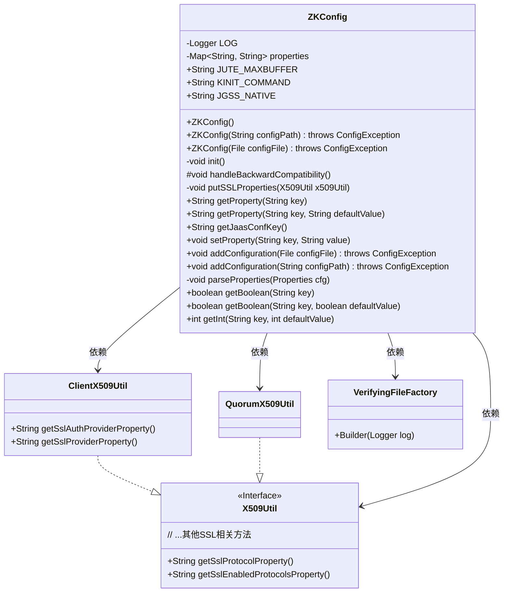
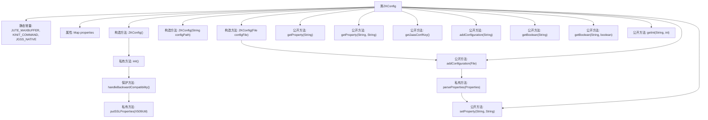

# 基础信息

|      |      |
|------|------|
| 名称 | ZKConfig |
| 编码语言 | .java |
| 代码路径 | zookeeper/zookeeper-server/src/main/java/org/apache/zookeeper/common/ZKConfig.java |
| 包名 | org.apache.zookeeper.common |
| 依赖项 | ['java.io.File', 'java.io.FileInputStream', 'java.io.IOException', 'java.util.HashMap', 'java.util.Map', 'java.util.Map.Entry', 'java.util.Properties', 'org.apache.zookeeper.Environment', 'org.apache.zookeeper.server.quorum.QuorumPeerConfig.ConfigException', 'org.apache.zookeeper.server.util.VerifyingFileFactory', 'org.slf4j.Logger', 'org.slf4j.LoggerFactory'] |
| 概述说明 | ZKConfig类用于管理ZooKeeper配置，支持从文件和系统属性加载配置，提供获取和设置属性方法，包括字符串、布尔值和整数值，并处理SSL和向后兼容性。 |

# 说明

ZKConfig类是一个用于管理ZooKeeper配置的工具类，主要功能包括初始化系统属性、处理向后兼容性、加载配置文件以及提供多种类型的属性获取方法。该类通过静态常量定义关键配置项如JUTE_MAXBUFFER和KINIT_COMMAND，并使用Map存储属性键值对。构造函数支持从文件或路径加载配置，并自动处理SSL相关属性。提供了获取字符串、布尔值和整型配置的方法，同时支持默认值设置。该类还包含日志记录功能，确保配置变更可追踪。整体设计注重兼容性和灵活性，能够适应新旧客户端的不同需求。

# 类列表 Class Summary

| 名称   | 类型  | 说明 |
|-------|------|-------------|
| ZKConfig | class | ZKConfig类用于管理ZooKeeper配置，支持从文件和系统属性加载配置，包含SSL、认证等属性处理，提供获取和设置属性的方法。 |

## 类 ZKConfig

|      |      |
|------|------|
| 访问范围 | public |
| 类型 | class |
| 名称 | ZKConfig |
| 说明 | ZKConfig类用于管理ZooKeeper配置，支持从文件和系统属性加载配置，包含SSL、认证等属性处理，提供获取和设置属性的方法。 |

### UML类图

类图描述：
ZKConfig类是一个ZooKeeper配置管理类，负责加载和处理系统属性及配置文件中的配置项。它包含多个常量定义和核心方法，通过Map存储配置属性，支持从文件路径或File对象初始化配置。类中实现了向后兼容处理、SSL属性设置、多种类型配置获取等功能，依赖X509Util接口及其实现类(ClientX509Util/QuorumX509Util)处理SSL相关属性，同时使用VerifyingFileFactory验证配置文件。该类提供了完整的配置管理能力，包括读取、设置、类型转换等操作，并处理各种异常情况。

### 内部方法调用关系图

这段代码定义了一个ZKConfig类，主要用于管理ZooKeeper的配置属性。它包含多个构造方法和功能方法，支持从系统属性、配置文件加载配置，并提供了类型安全的属性获取方式（如布尔值、整型）。类内部通过properties映射存储配置，特别处理了SSL相关属性和向后兼容性问题。流程图清晰展示了类成员间的调用关系，从构造方法到核心功能方法如属性存取、配置加载和解析的完整链路。

### 字段列表 Field List

| 名称  | 类型  | 说明 |
|-------|-------|------|
| JUTE_MAXBUFFER = "jute.maxbuffer" | String | 定义静态常量JUTE_MAXBUFFER，值为字符串"jute.maxbuffer"。 |
| KINIT_COMMAND = "zookeeper.kinit" | String | 静态常量KINIT_COMMAND，值为"zookeeper.kinit"。 |
| LOG = LoggerFactory.getLogger(ZKConfig.class) | Logger | ZKConfig类中定义了一个私有静态不可变日志记录器LOG，通过LoggerFactory获取实例。 |
| JGSS_NATIVE = "sun.security.jgss.native" | String | Java系统属性"sun.security.jgss.native"，用于控制JGSS本地库的使用。 |
| properties = new HashMap<>() | Map<String, String> | 私有哈希映射属性表，键值对存储字符串类型数据。 |

### 方法列表 Method List

| 名称  | 类型  | 说明 |
|-------|-------|------|
| init | void | 初始化方法处理客户端属性的向后兼容性。 |
| getBoolean | boolean | 这是一个Java方法，通过键名获取布尔值，默认返回false。 |
| getInt | int | 获取字符串键对应的整数值，若不存在则返回默认值。处理时去除空格并解码为整数。 |
| getProperty | String | 该方法根据键获取属性值，若键不存在则返回默认值。输入为键和默认值，输出为对应值或默认值。 |
| addConfiguration | void | 方法`addConfiguration`读取配置文件，验证路径有效性后加载属性，解析失败时抛出异常并记录错误。 |
| handleBackwardCompatibility | void | 处理向后兼容性：设置系统属性到properties，包括JUTE_MAXBUFFER、KINIT_COMMAND、JGSS_NATIVE。使用ClientX509Util和QuorumX509Util处理SSL相关属性。 |
| getProperty | String | 这是一个Java方法，通过键名key获取properties中的对应值并返回。 |
| setProperty | void | 方法setProperty设置键值对，若键为空抛出异常。替换旧值时记录日志。 |
| addConfiguration | void | 该方法用于添加配置，接收配置路径字符串参数，转换为文件对象后调用同名方法。若路径无效会抛出ConfigException异常。 |
| putSSLProperties | void | 方法putSSLProperties将系统SSL属性存入properties对象，包括协议、密钥库、信任库、验证及加密相关配置。 |
| getJaasConfKey | String | 获取JAAS配置键值的方法，返回系统属性中Environment.JAAS_CONF_KEY的值。 |
| parseProperties | void | 解析Properties配置，遍历键值对并设置属性。 |
| getBoolean | boolean | 方法getBoolean根据键key获取属性值，若值为空返回默认值defaultValue，否则返回解析后的布尔值。 |

