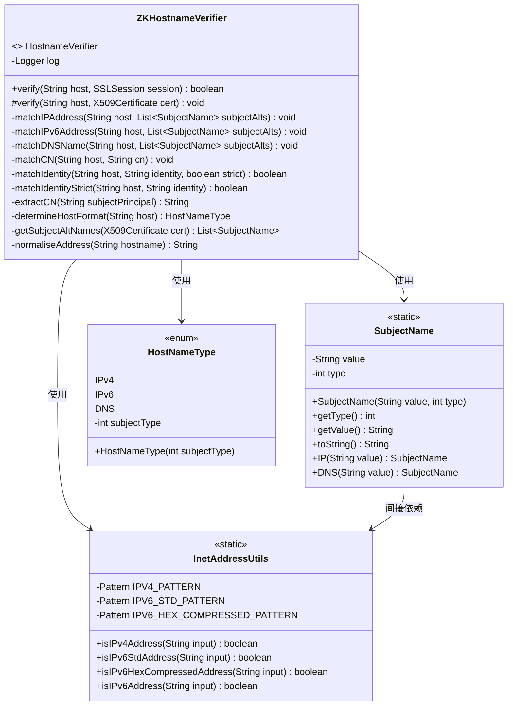
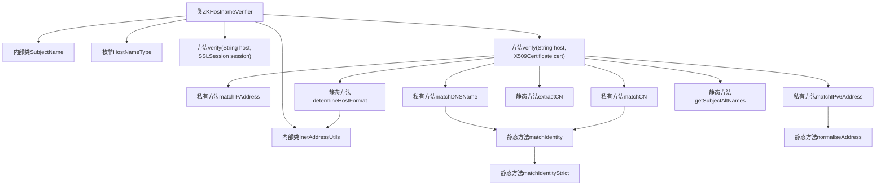
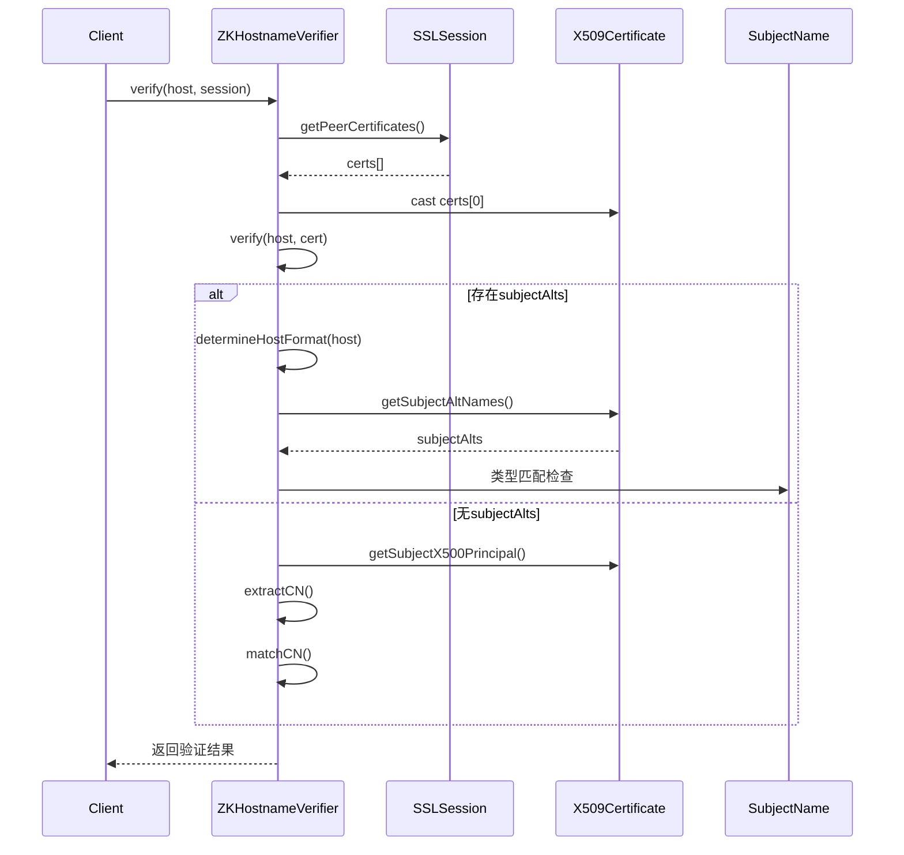

# 基础信息

|      |      |
|------|------|
| 名称 | ZKHostnameVerifier |
| 编码语言 | .java |
| 代码路径 | zookeeper/zookeeper-server/src/main/java/org/apache/zookeeper/common/ZKHostnameVerifier.java |
| 包名 | org.apache.zookeeper.common |
| 依赖项 | ['java.net.InetAddress', 'java.net.UnknownHostException', 'java.security.cert.Certificate', 'java.security.cert.CertificateParsingException', 'java.security.cert.X509Certificate', 'java.util.ArrayList', 'java.util.Collection', 'java.util.Collections', 'java.util.List', 'java.util.Locale', 'java.util.NoSuchElementException', 'java.util.Objects', 'java.util.regex.Pattern', 'javax.naming.InvalidNameException', 'javax.naming.NamingException', 'javax.naming.directory.Attribute', 'javax.naming.directory.Attributes', 'javax.naming.ldap.LdapName', 'javax.naming.ldap.Rdn', 'javax.net.ssl.HostnameVerifier', 'javax.net.ssl.SSLException', 'javax.net.ssl.SSLPeerUnverifiedException', 'javax.net.ssl.SSLSession', 'javax.security.auth.x500.X500Principal', 'org.slf4j.Logger', 'org.slf4j.LoggerFactory'] |
| 概述说明 | ZKHostnameVerifier类实现主机名验证，支持IPv4、IPv6和DNS类型，通过匹配证书主题备用名或通用名确保安全连接。 |

# 说明

ZKHostnameVerifier是一个实现HostnameVerifier接口的类，用于验证SSL证书中的主机名。它包含SubjectName和InetAddressUtils两个内部类，分别处理主题名称和IP地址验证。主要功能包括：根据主机名类型（IPv4、IPv6或DNS）匹配证书中的主题备用名称（SAN），若无SAN则回退到验证证书主题中的通用名（CN）。类中提供了严格的匹配逻辑，支持通配符处理，并包含IPv4/IPv6地址格式校验工具。验证失败时会抛出SSLPeerUnverifiedException异常。

# 类列表 Class Summary

| 名称   | 类型  | 说明 |
|-------|------|-------------|
| ZKHostnameVerifier | class | ZKHostnameVerifier实现主机名校验，支持IPv4/IPv6/DNS类型，通过匹配证书主题备用名或CN字段验证合法性。包含地址标准化和严格通配符匹配逻辑。 |

## 类 ZKHostnameVerifier

|      |      |
|------|------|
| 访问范围 | None |
| 类型 | class |
| 名称 | ZKHostnameVerifier |
| 说明 | ZKHostnameVerifier实现主机名校验，支持IPv4/IPv6/DNS类型，通过匹配证书主题备用名或CN字段验证合法性。包含地址标准化和严格通配符匹配逻辑。 |

### UML类图

这段代码实现了一个主机名验证器`ZKHostnameVerifier`，用于验证SSL证书中的主机名是否匹配请求的目标主机。核心功能包括：通过`SubjectName`类处理DNS/IP类型的主机名，使用`InetAddressUtils`进行IP地址格式验证，并通过枚举`HostNameType`区分主机类型。主要验证逻辑在`verify()`方法中，根据主机类型分别调用IP/DNS匹配方法，支持严格模式下的通配符匹配。当缺少备用名称时，会回退到验证证书的通用名称(CN)。整个设计实现了RFC 2818规范要求的主机名验证功能。

### 内部方法调用关系图

该流程图展示了ZKHostnameVerifier类的核心结构和验证流程。主类包含两个内部类(SubjectName和InetAddressUtils)和一个枚举类型，通过verify方法实现主机名验证功能。验证过程首先检查SSL证书，然后根据主机类型(IPv4/IPv6/DNS)选择不同的匹配策略，若无备用名称则回退到CN匹配。时序图详细描述了从客户端调用到最终返回验证结果的完整交互过程，包括证书获取、主机类型判断和名称匹配等关键步骤。

### 字段列表 Field List

| 名称  | 类型  | 说明 |
|-------|-------|------|
| log = LoggerFactory.getLogger(ZKHostnameVerifier.class) | Logger | 私有日志记录器，用于ZKHostnameVerifier类的日志输出。 |

### 方法列表 Method List

| 名称  | 类型  | 说明 |
|-------|-------|------|
| matchIdentityStrict | boolean | 私有静态方法matchIdentityStrict严格匹配主机和身份，调用matchIdentity并启用严格模式。 |
| matchIPv6Address | void | 私有方法matchIPv6Address校验主机IPv6地址是否匹配证书主题备用名列表，不匹配则抛出SSL异常。 |
| matchCN | void | 私有方法matchCN验证主机名与证书CN是否匹配，不匹配则抛出SSL异常。 |
| matchDNSName | void | 私有方法matchDNSName验证主机名与证书主题备用名是否匹配。若匹配成功则返回，否则抛出SSL异常提示不匹配。 |
| verify | boolean | 该方法验证主机与SSL会话证书的匹配性。获取会话的首个X509证书并调用验证逻辑，成功返回true，异常则记录日志并返回false。 |
| matchIPAddress | void | 私有方法matchIPAddress检查主机名与证书IP列表是否匹配。若匹配则返回，否则抛出SSL异常，提示证书不匹配。 |
| verify | void | 验证SSL证书主机名匹配：根据主机类型（IPv4/IPv6/DNS）检查证书主题备用名，若无则检查通用名（CN），不匹配则抛出异常。 |
| matchIdentity | boolean | 该方法检查主机名与身份标识是否匹配，支持通配符*。若标识含*，检查前后缀是否匹配主机名；严格模式下还要求通配部分不含点。无通配符时直接比较字符串。 |
| extractCN | String | 从LDAP主题中提取CN字段的静态方法。若输入为空或无效，返回null或抛出SSLException。遍历属性列表，找到第一个非空CN值返回。忽略解析异常。 |
| determineHostFormat | HostNameType | 该方法判断主机名格式：若为IPv4返回IPv4；若为IPv6（含方括号）返回IPv6；否则返回DNS。 |
| getSubjectAltNames | List<SubjectName> | 获取证书主题备用名：检查证书的备用名称列表，筛选DNS和IP类型，处理字符串或字节数组格式数据，异常时返回空列表。 |
| normaliseAddress | String | 该方法用于标准化主机地址：若输入为空则返回原值，否则尝试解析为IP地址并返回，解析失败则返回原主机名。 |

