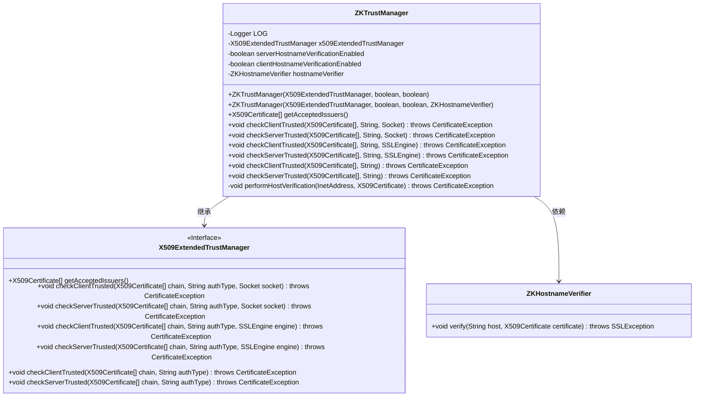

# 基础信息

|      |      |
|------|------|
| 名称 | ZKTrustManager |
| 编码语言 | .java |
| 代码路径 | zookeeper/zookeeper-server/src/main/java/org/apache/zookeeper/common/ZKTrustManager.java |
| 包名 | org.apache.zookeeper.common |
| 依赖项 | ['java.net.InetAddress', 'java.net.Socket', 'java.net.UnknownHostException', 'java.security.cert.CertificateException', 'java.security.cert.X509Certificate', 'javax.net.ssl.SSLEngine', 'javax.net.ssl.SSLException', 'javax.net.ssl.X509ExtendedTrustManager', 'org.slf4j.Logger', 'org.slf4j.LoggerFactory'] |
| 概述说明 | ZKTrustManager扩展X509ExtendedTrustManager，提供客户端和服务端主机名验证功能，支持通过Socket和SSLEngine进行验证。 |

# 说明

ZKTrustManager是一个继承自X509ExtendedTrustManager的自定义信任管理器，主要用于SSL/TLS通信中的证书验证和主机名验证。它包含一个基础X509ExtendedTrustManager实例，并提供了服务器和客户端主机名验证的开关控制。通过ZKHostnameVerifier进行具体的主机名验证，验证过程会先尝试IP地址验证，失败后再尝试主机名验证。该类重写了多个checkClientTrusted和checkServerTrusted方法，支持Socket和SSLEngine两种通信方式，并在验证失败时抛出CertificateException异常。日志记录功能用于调试和错误追踪。

# 类列表 Class Summary

| 名称   | 类型  | 说明 |
|-------|------|-------------|
| ZKTrustManager | class | ZKTrustManager扩展X509ExtendedTrustManager，支持客户端和服务端主机名验证，通过ZKHostnameVerifier执行验证逻辑。 |

## 类 ZKTrustManager

|      |      |
|------|------|
| 访问范围 | public |
| 类型 | class |
| 名称 | ZKTrustManager |
| 说明 | ZKTrustManager扩展X509ExtendedTrustManager，支持客户端和服务端主机名验证，通过ZKHostnameVerifier执行验证逻辑。 |

### UML类图

这段代码描述了一个ZKTrustManager类，它继承自X509ExtendedTrustManager接口，并实现了证书验证和主机名验证的功能。ZKTrustManager通过组合方式使用ZKHostnameVerifier来执行主机名验证，同时根据配置决定是否启用客户端或服务端的主机名验证。该类提供了多种重载方法，支持通过Socket或SSLEngine进行证书验证，并在验证失败时抛出CertificateException异常。performHostVerification私有方法实现了详细的验证逻辑，包括IP地址和主机名的双重验证机制。

### 内部方法调用关系图

```mermaid
graph TD
    A["类ZKTrustManager"]
    B["属性: X509ExtendedTrustManager x509ExtendedTrustManager"]
    C["属性: boolean serverHostnameVerificationEnabled"]
    D["属性: boolean clientHostnameVerificationEnabled"]
    E["属性: ZKHostnameVerifier hostnameVerifier"]
    F["构造方法: ZKTrustManager(X509ExtendedTrustManager, boolean, boolean)"]
    G["构造方法: ZKTrustManager(X509ExtendedTrustManager, boolean, boolean, ZKHostnameVerifier)"]
    H["方法: X509Certificate[] getAcceptedIssuers()"]
    I["方法: checkClientTrusted(X509Certificate[], String, Socket)"]
    J["方法: checkServerTrusted(X509Certificate[], String, Socket)"]
    K["方法: checkClientTrusted(X509Certificate[], String, SSLEngine)"]
    L["方法: checkServerTrusted(X509Certificate[], String, SSLEngine)"]
    M["方法: checkClientTrusted(X509Certificate[], String)"]
    N["方法: checkServerTrusted(X509Certificate[], String)"]
    O["私有方法: performHostVerification(InetAddress, X509Certificate)"]

    A --> B
    A --> C
    A --> D
    A --> E
    A --> F
    A --> G
    A --> H
    A --> I
    A --> J
    A --> K
    A --> L
    A --> M
    A --> N
    A --> O
    I -->|条件: clientHostnameVerificationEnabled| O
    J -->|条件: serverHostnameVerificationEnabled| O
    K -->|条件: clientHostnameVerificationEnabled| O
    L -->|条件: serverHostnameVerificationEnabled| O
    O -->|try| P["hostnameVerifier.verify(hostAddress, certificate)"]
    O -->|catch| Q["hostnameVerifier.verify(hostName, certificate)"]
    Q -->|失败| R["抛出CertificateException"]
```

这段代码定义了一个ZKTrustManager类，继承自X509ExtendedTrustManager，用于管理SSL/TLS证书验证。它包含两个构造方法和多个重写方法，主要功能是验证客户端和服务端的证书信任关系，并根据配置决定是否启用主机名验证。流程图展示了类结构、属性、方法调用关系，特别是performHostVerification方法的内部逻辑，该逻辑会先尝试验证IP地址，失败后再验证主机名，若两者都失败则抛出异常。

### 字段列表 Field List

| 名称  | 类型  | 说明 |
|-------|-------|------|
| serverHostnameVerificationEnabled | boolean | 私有布尔变量，用于控制服务器主机名验证是否启用。 |
| x509ExtendedTrustManager | X509ExtendedTrustManager | 私有终态X509扩展信任管理器变量x509ExtendedTrustManager。 |
| clientHostnameVerificationEnabled | boolean | 私有布尔变量，控制客户端主机名验证是否启用。 |
| LOG = LoggerFactory.getLogger(ZKTrustManager.class) | Logger | ZKTrustManager类中定义了一个私有静态常量LOG，用于日志记录。 |
| hostnameVerifier | ZKHostnameVerifier | 私有不可变的ZKHostnameVerifier主机名验证器。 |

### 方法列表 Method List

| 名称  | 类型  | 说明 |
|-------|-------|------|
| checkClientTrusted | void | 重写方法checkClientTrusted，调用x509ExtendedTrustManager的对应方法验证客户端证书链。 |
| checkServerTrusted | void | 重写方法checkServerTrusted，调用x509ExtendedTrustManager的相同方法验证服务器证书链和认证类型。 |
| performHostVerification | void | 该方法用于验证主机地址和主机名与证书的匹配性。先尝试验证IP地址，失败后验证主机名。若均失败，抛出异常并记录错误日志。 |
| checkServerTrusted | void | 重写checkServerTrusted方法，先调用x509ExtendedTrustManager验证证书链，若启用主机名验证则执行主机地址与证书匹配检查，调试时记录socket地址信息。 |
| getAcceptedIssuers | X509Certificate[] | 重写方法返回X509证书数组，调用信任管理器的获取签发者方法。 |
| checkClientTrusted | void | 重写checkClientTrusted方法，先调用x509ExtendedTrustManager验证客户端证书链，若启用主机名验证则记录调试日志并执行主机验证。 |
| checkClientTrusted | void | Java方法重写，验证客户端信任链及主机名，支持调试日志，异常处理严格。 |
| checkServerTrusted | void | 重写checkServerTrusted方法，验证服务器证书链并可选执行主机名验证，失败抛出异常。 |

