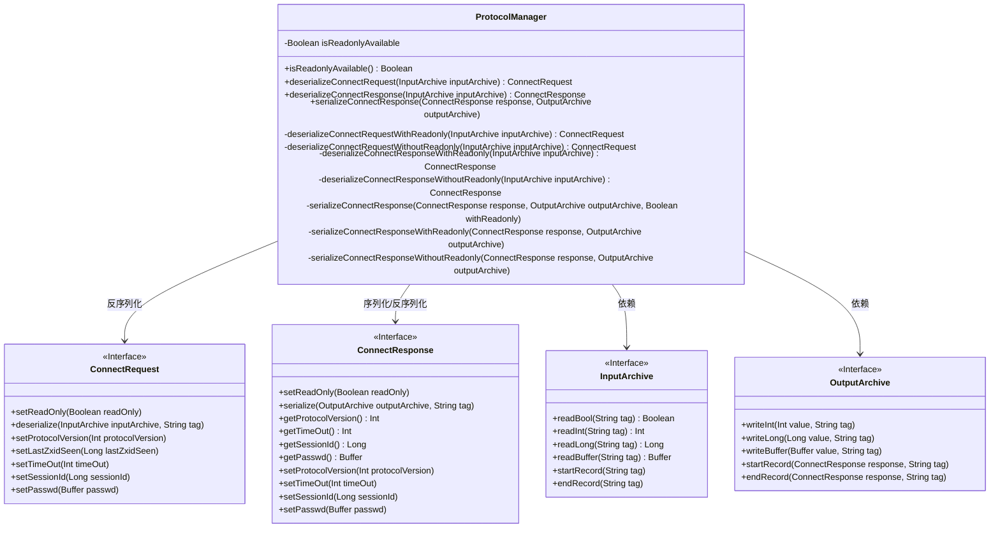
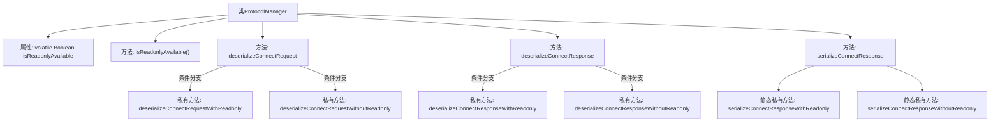

# 基础信息

|      |      |
|------|------|
| 名称 | ProtocolManager |
| 编码语言 | .java |
| 代码路径 | zookeeper/zookeeper-server/src/main/java/org/apache/zookeeper/compat/ProtocolManager.java |
| 包名 | org.apache.zookeeper.compat |
| 依赖项 | ['java.io.IOException', 'org.apache.jute.InputArchive', 'org.apache.jute.OutputArchive', 'org.apache.zookeeper.proto.ConnectRequest', 'org.apache.zookeeper.proto.ConnectResponse'] |
| 概述说明 | ProtocolManager类处理ZooKeeper连接请求和响应的序列化与反序列化，支持新旧版本兼容性检查，特别处理readOnly字段。 |

# 说明

ProtocolManager类负责处理连接请求和响应的序列化与反序列化，特别关注readOnly字段的兼容性。它维护一个isReadonlyAvailable状态，用于判断客户端或服务端是否支持readOnly字段。对于ConnectRequest和ConnectResponse，根据isReadonlyAvailable状态选择不同的处理方法。若状态未确定，则尝试读取readOnly字段以检测兼容性，并更新状态。序列化ConnectResponse时也根据readOnly支持情况选择不同方式。该类确保与ZooKeeper 3.3及以下版本的兼容性。

# 类列表 Class Summary

| 名称   | 类型  | 说明 |
|-------|------|-------------|
| ProtocolManager | class | ProtocolManager类处理ZooKeeper连接请求和响应的序列化与反序列化，支持新旧版本兼容性，自动检测并处理readOnly字段的存在与否。 |

## 类 ProtocolManager

|      |      |
|------|------|
| 访问范围 | public final |
| 类型 | class |
| 名称 | ProtocolManager |
| 说明 | ProtocolManager类处理ZooKeeper连接请求和响应的序列化与反序列化，支持新旧版本兼容性，自动检测并处理readOnly字段的存在与否。 |

### UML类图

这段类图展示了ProtocolManager类的核心结构和相关接口关系。ProtocolManager负责处理ZooKeeper客户端/服务器通信协议的序列化和反序列化，特别是针对不同版本对readOnly字段的支持情况。它通过InputArchive和OutputArchive接口进行数据读写，并分别处理ConnectRequest和ConnectResponse两种消息类型的转换。类图中清晰地展示了ProtocolManager的私有状态isReadonlyAvailable以及各种序列化/反序列化方法的分层结构，体现了对不同版本协议的兼容性处理逻辑。

### 内部方法调用关系图

该流程图展示了ProtocolManager类的核心结构和主要方法调用关系。类包含一个volatile布尔类型状态标志isReadonlyAvailable，用于控制序列化/反序列化行为。关键方法包括处理连接请求/响应的序列化(serializeConnectResponse)和反序列化(deserializeConnectRequest/Response)方法，这些方法会根据isReadonlyAvailable状态选择不同的处理路径。所有方法最终都指向具体的带readOnly和不带readOnly的私有实现方法，形成清晰的条件分支结构。

### 字段列表 Field List

| 名称  | 类型  | 说明 |
|-------|-------|------|
| isReadonlyAvailable = null | Boolean | 私有易变布尔变量isReadonlyAvailable初始化为null。 |

### 方法列表 Method List

| 名称  | 类型  | 说明 |
|-------|-------|------|
| deserializeConnectRequestWithReadonly | ConnectRequest | 私有方法，通过输入归档反序列化连接请求，返回ConnectRequest对象。 |
| serializeConnectResponse | void | 序列化连接响应，将响应和输出存档作为参数，检查可读性后处理。 |
| isReadonlyAvailable | boolean | 检查只读状态是否可用，返回布尔值。 |
| deserializeConnectResponseWithoutReadonly | ConnectResponse | 方法反序列化ConnectResponse对象，从输入存档读取协议版本、超时、会话ID和密码，返回填充后的响应对象。 |
| deserializeConnectResponse | ConnectResponse | 方法根据输入判断是否支持只读模式，若支持则调用对应方法反序列化连接响应，否则处理旧版本兼容性并设置只读状态。 |
| deserializeConnectResponseWithReadonly | ConnectResponse | 这是一个Java方法，用于从输入存档反序列化连接响应对象。方法创建新响应实例，调用其反序列化方法，然后返回该对象。 |
| deserializeConnectRequest | ConnectRequest | 根据isReadonlyAvailable状态选择反序列化方法，处理旧版本无readOnly字段的情况，返回ConnectRequest对象。 |
| deserializeConnectRequestWithoutReadonly | ConnectRequest | 反序列化ConnectRequest，从输入存档读取协议版本、最后Zxid、超时、会话ID和密码，返回请求对象。 |
| serializeConnectResponse | void | 私有方法根据条件序列化连接响应：若withReadonly为真，调用带只读参数的序列化方法；否则调用不带只读的方法。 |
| serializeConnectResponseWithReadonly | void | 私有静态方法，将ConnectResponse对象序列化到输出存档，标记为"connect"，可能抛出IO异常。 |
| serializeConnectResponseWithoutReadonly | void | 私有方法serializeConnectResponseWithoutReadonly将ConnectResponse对象序列化为输出存档，包含协议版本、超时时间、会话ID和密码字段，不处理只读属性。 |

