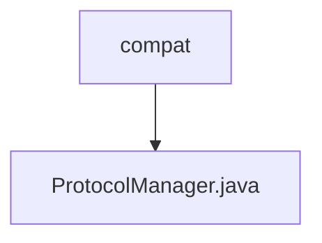

# 基础信息

|      |      |
|------|------|
| 名称 | compat |
| 编码语言 | .java |
| 代码路径 | zookeeper/zookeeper-server/src/main/java/org/apache/zookeeper/compat |
| 包名 | zookeeper.docs.zookeeper-server.src.main.java.org.apache.zookeeper.compat |
| 概述说明 | ProtocolManager类处理ZooKeeper连接请求和响应的序列化与反序列化，支持新旧版本兼容性检查，特别处理readOnly字段。 |

# 说明

ProtocolManager类负责处理连接请求和响应的序列化与反序列化，特别关注readOnly字段的兼容性。它维护一个isReadonlyAvailable状态，用于判断客户端或服务端是否支持readOnly字段。对于ConnectRequest和ConnectResponse，根据isReadonlyAvailable状态选择不同的处理方法。若状态未确定，则尝试读取readOnly字段以检测兼容性，并更新状态。序列化ConnectResponse时也根据readOnly支持情况选择不同方式。该类确保与ZooKeeper 3.3及以下版本的兼容性。

### 包内部结构视图

该流程图展示了Zookeeper项目中`compat`目录与`ProtocolManager.java`文件之间的层级关系。`compat`作为父目录节点，直接包含`ProtocolManager.java`这一实现类文件，体现了Java项目中接口兼容性模块的典型单文件结构。整个结构简洁清晰，符合Mermaid语法规范。

# 文件列表 File List

| 名称   | 类型  | 说明 |
|-------|------|-------------|
| [ProtocolManager.java](ProtocolManager.md) | file | ProtocolManager类处理ZooKeeper连接请求和响应的序列化与反序列化，支持新旧版本兼容性检查，特别处理readOnly字段。 |

