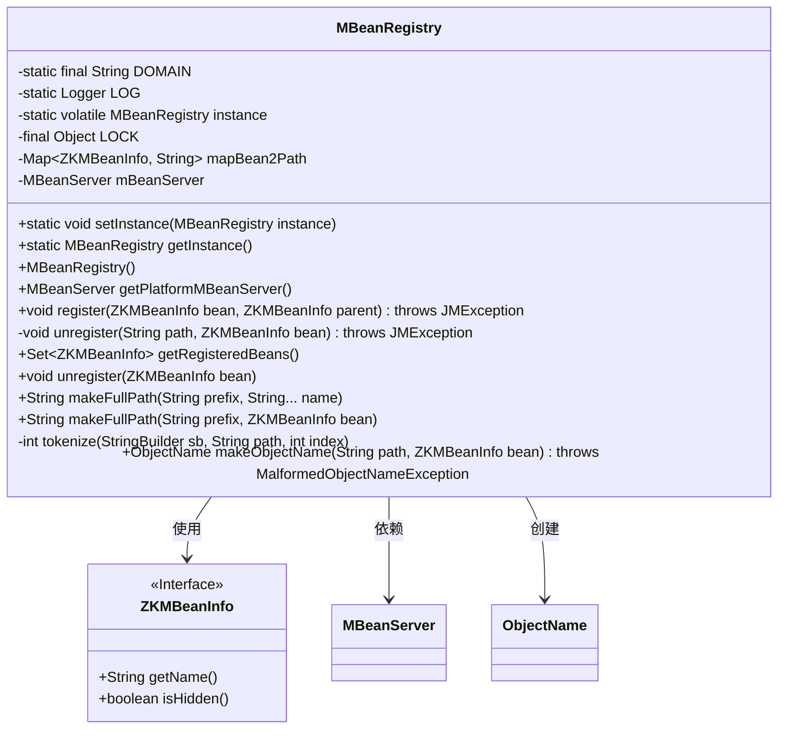

# 基础信息

|      |      |
|------|------|
| 名称 | MBeanRegistry |
| 编码语言 | .java |
| 代码路径 | zookeeper/zookeeper-server/src/main/java/org/apache/zookeeper/jmx/MBeanRegistry.java |
| 包名 | org.apache.zookeeper.jmx |
| 依赖项 | ['java.lang.management.ManagementFactory', 'java.util.Collection', 'java.util.HashSet', 'java.util.Map', 'java.util.Set', 'java.util.concurrent.ConcurrentHashMap', 'javax.management.JMException', 'javax.management.MBeanServer', 'javax.management.MBeanServerFactory', 'javax.management.MalformedObjectNameException', 'javax.management.ObjectName', 'org.slf4j.Logger', 'org.slf4j.LoggerFactory'] |
| 概述说明 | MBeanRegistry是ZooKeeper的MBean管理类，提供单例模式，支持注册、注销MBean，管理路径映射，使用ConcurrentHashMap存储信息，确保线程安全。 |

# 说明

MBeanRegistry是一个用于管理MBean注册的单例类，主要功能包括获取平台MBean服务器、注册/注销MBean以及维护MBean路径映射。它使用ConcurrentHashMap存储MBean信息与路径的映射，通过同步锁保证线程安全。类提供了静态方法获取单例实例，并支持单元测试时替换实例。注册MBean时会生成完整路径和ObjectName，处理隐藏MBean和异常情况。注销功能包括路径清理和错误处理。辅助方法包括路径生成、字符串令牌化和ObjectName构建，其中路径采用文件系统风格格式。日志记录用于跟踪操作状态和异常。

# 类列表 Class Summary

| 名称   | 类型  | 说明 |
|-------|------|-------------|
| MBeanRegistry | class | MBeanRegistry是ZooKeeper的MBean管理类，提供单例模式，支持注册、注销MBean，维护路径映射，使用平台MBeanServer或创建新实例。 |

## 类 MBeanRegistry

|      |      |
|------|------|
| 访问范围 | public |
| 类型 | class |
| 名称 | MBeanRegistry |
| 说明 | MBeanRegistry是ZooKeeper的MBean管理类，提供单例模式，支持注册、注销MBean，维护路径映射，使用平台MBeanServer或创建新实例。 |

### UML类图

类图描述：
MBeanRegistry是一个单例类，用于管理JMX MBean的注册和注销操作。它维护了一个ConcurrentHashMap来跟踪已注册的MBean及其路径，通过synchronized块保证线程安全。核心功能包括register()注册MBean、unregister()注销MBean，以及路径处理相关方法。该类依赖ZKMBeanInfo接口获取MBean元数据，使用MBeanServer进行实际注册操作，并会创建ObjectName对象作为MBean的唯一标识。异常处理机制完善，包含对IKVM环境的特殊处理。

### 内部方法调用关系图

```mermaid
graph TD
    A["类MBeanRegistry"]
    B["静态常量: DOMAIN = 'org.apache.ZooKeeperService'"]
    C["静态变量: LOG = LoggerFactory.getLogger(MBeanRegistry.class)"]
    D["静态变量: instance = new MBeanRegistry()"]
    E["私有锁对象: LOCK = new Object()"]
    F["容器: mapBean2Path = ConcurrentHashMap<ZKMBeanInfo, String>"]
    G["MBean服务器: mBeanServer"]

    H["静态方法: setInstance(MBeanRegistry instance)"]
    I["静态方法: getInstance()"]
    J["构造方法: MBeanRegistry()"]
    K["方法: getPlatformMBeanServer()"]
    L["方法: register(ZKMBeanInfo bean, ZKMBeanInfo parent)"]
    M["私有方法: unregister(String path, ZKMBeanInfo bean)"]
    N["方法: getRegisteredBeans()"]
    O["方法: unregister(ZKMBeanInfo bean)"]
    P["方法: makeFullPath(String prefix, String... name)"]
    Q["受保护方法: makeFullPath(String prefix, ZKMBeanInfo bean)"]
    R["私有方法: tokenize(StringBuilder sb, String path, int index)"]
    S["受保护方法: makeObjectName(String path, ZKMBeanInfo bean)"]

    A --> B
    A --> C
    A --> D
    A --> E
    A --> F
    A --> G
    A --> H
    A --> I
    A --> J
    A --> K
    A --> L
    A --> M
    A --> N
    A --> O
    A --> P
    A --> Q
    A --> R
    A --> S

    L --> M
    L --> S
    O --> M
    S --> R
    P --> Q
```

该流程图展示了MBeanRegistry类的完整结构，包含静态变量、实例变量和主要方法调用关系。核心功能围绕MBean的注册/注销管理，通过ConcurrentHashMap维护Bean-path映射，使用同步锁保证线程安全。关键方法包括register()通过makeObjectName创建对象名并注册到MBeanServer，unregister()反向操作，以及路径处理的makeFullPath和tokenize方法。异常处理通过LOG记录警告和错误信息，整体设计符合JMX管理规范。

### 字段列表 Field List

| 名称  | 类型  | 说明 |
|-------|-------|------|
| instance = new MBeanRegistry() | MBeanRegistry | 私有静态易变MBeanRegistry实例初始化。 |
| mapBean2Path = new ConcurrentHashMap<>() | Map<ZKMBeanInfo, String> | 私有并发映射，存储ZKMBeanInfo到字符串的键值对。 |
| LOG = LoggerFactory.getLogger(MBeanRegistry.class) | Logger | 声明一个私有静态不可变日志对象LOG，用于MBeanRegistry类的日志记录。 |
| mBeanServer | MBeanServer | 私有MBeanServer变量声明。 |
| DOMAIN = "org.apache.ZooKeeperService" | String | 定义常量DOMAIN，值为"org.apache.ZooKeeperService"，表示ZooKeeper服务的域名。 |
| LOCK = new Object() | Object | 私有锁对象用于同步控制。 |

### 方法列表 Method List

| 名称  | 类型  | 说明 |
|-------|-------|------|
| getInstance | MBeanRegistry | 这是一个静态方法，返回单例实例MBeanRegistry。 |
| getRegisteredBeans | Set<ZKMBeanInfo> | 该方法返回一个包含所有已注册ZKMBeanInfo对象的集合，通过复制mapBean2Path的键集实现。 |
| unregister | void | 该方法用于注销ZKMBeanInfo对象。若对象为空则直接返回，否则移除对象路径映射并尝试注销。处理JMException记录警告，其他异常记录错误需修复。 |
| getPlatformMBeanServer | MBeanServer | 该方法返回平台MBeanServer实例，直接获取成员变量mBeanServer的值。 |
| setInstance | void | 设置MBeanRegistry单例实例的静态方法。 |
| makeFullPath | String | 该方法将前缀和多个名称拼接成完整路径，处理空值和斜杠，确保路径格式正确。 |
| unregister | void | 该方法用于注销指定路径的MBean。若路径为空或MBean为隐藏状态则直接返回。否则创建对象名并加锁执行注销操作，同时记录日志。 |
| makeFullPath | String | Java方法：根据前缀和bean名称生成完整路径，若bean为空则传null。 |
| tokenize | int | 方法拆分路径字符串为令牌，非空令牌以"name序号=值,"格式追加到StringBuilder，返回更新后的序号。 |
| makeObjectName | ObjectName | 方法根据路径和bean信息生成对象名。若路径为空返回null，否则拼接域名和路径/bean名，移除末尾字符后创建ObjectName。若名称无效则记录日志并抛出异常。 |
| register | void | 该方法用于注册ZKMBeanInfo对象，检查父节点路径后生成完整路径，若非隐藏对象则同步注册到MBeanServer并记录路径，失败时记录警告并抛出异常。 |

