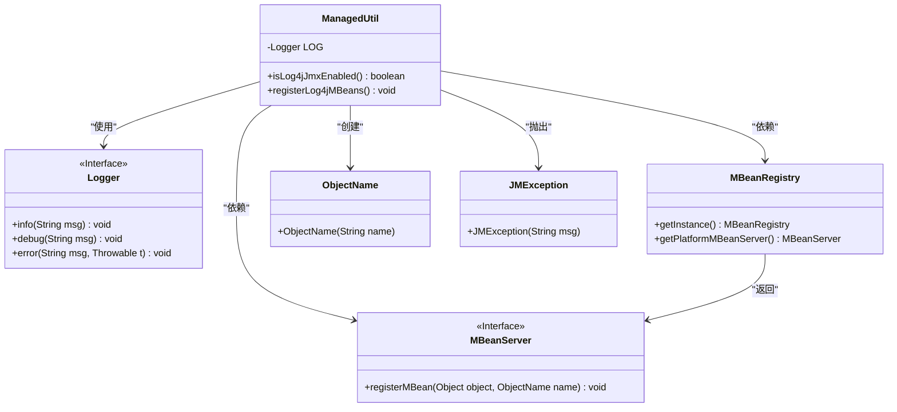
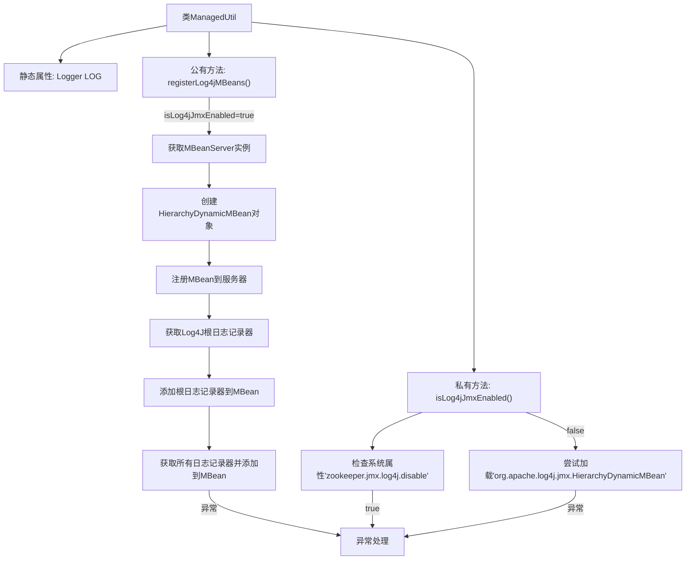

# 基础信息

|      |      |
|------|------|
| 名称 | ManagedUtil |
| 编码语言 | .java |
| 代码路径 | zookeeper/zookeeper-server/src/main/java/org/apache/zookeeper/jmx/ManagedUtil.java |
| 包名 | org.apache.zookeeper.jmx |
| 依赖项 | ['java.util.Enumeration', 'javax.management.JMException', 'javax.management.MBeanServer', 'javax.management.ObjectName', 'org.slf4j.Logger', 'org.slf4j.LoggerFactory'] |
| 概述说明 | 该代码检查并启用Log4j 1.2的JMX支持，注册MBean以管理日志层次结构。通过系统属性控制是否禁用，若启用则动态加载类并注册MBean。 |

# 说明

ManagedUtil类提供Log4j 1.2的JMX管理功能。通过isLog4jJmxEnabled方法检查JMX支持是否启用，受系统属性zookeeper.jmx.log4j.disable控制。registerLog4jMBeans方法注册Log4j的MBean，包括HierarchyDynamicMBean和所有当前Logger。若注册失败抛出JMException。使用反射动态加载Log4j类，避免直接依赖。

# 类列表 Class Summary

| 名称   | 类型  | 说明 |
|-------|------|-------------|
| ManagedUtil | class | ManagedUtil类提供Log4j 1.2 JMX支持，通过检查系统属性zookeeper.jmx.log4j.disable决定是否启用，注册MBean并管理日志器。 |

## 类 ManagedUtil

|      |      |
|------|------|
| 访问范围 | public |
| 类型 | class |
| 名称 | ManagedUtil |
| 说明 | ManagedUtil类提供Log4j 1.2 JMX支持，通过检查系统属性zookeeper.jmx.log4j.disable决定是否启用，注册MBean并管理日志器。 |

### UML类图

**类图描述**：  
该图展示了ManagedUtil工具类的结构及其依赖关系。ManagedUtil通过反射机制动态加载Log4j 1.2的JMX功能，主要包含两个核心方法：isLog4jJmxEnabled()用于检测JMX支持状态，registerLog4jMBeans()用于注册MBean。类依赖Logger接口记录日志，通过MBeanRegistry获取MBeanServer实例，使用ObjectName注册MBean对象，并在异常时抛出JMException。整体设计体现了动态加载和JMX管理的功能隔离。

### 内部方法调用关系图

流程图描述：该流程图展示了ManagedUtil类的核心逻辑，主要包含两个关键方法。isLog4jJmxEnabled()方法检查JMX支持是否可用，通过系统属性和类加载验证。registerLog4jMBeans()方法在JMX可用时，通过反射机制动态加载Log4J组件，创建并注册MBean，然后遍历所有日志记录器进行注册。整个过程包含完善的异常处理机制，确保系统稳定性。

### 字段列表 Field List

| 名称  | 类型  | 说明 |
|-------|-------|------|
| LOG = LoggerFactory.getLogger(ManagedUtil.class) | Logger | 私有静态日志常量LOG，用于ManagedUtil类的日志记录。 |

### 方法列表 Method List

| 名称  | 类型  | 说明 |
|-------|-------|------|
| isLog4jJmxEnabled | boolean | 检查Log4j的JMX支持是否启用，通过系统属性禁用或尝试加载相关类判断，返回启用状态并记录日志。 |
| registerLog4jMBeans | void | 注册Log4j MBeans，包括根日志和所有当前日志，通过反射动态调用类方法，处理异常并记录错误。 |

