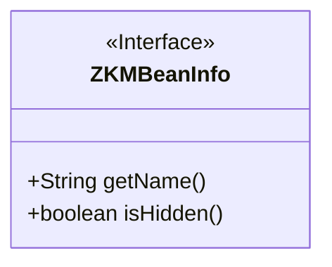
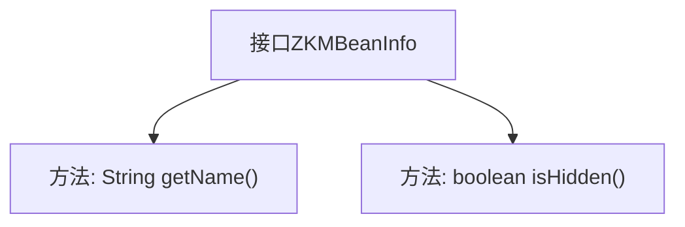

# 基础信息

|      |      |
|------|------|
| 名称 | ZKMBeanInfo |
| 编码语言 | .java |
| 代码路径 | zookeeper/zookeeper-server/src/main/java/org/apache/zookeeper/jmx/ZKMBeanInfo.java |
| 包名 | org.apache.zookeeper.jmx |
| 依赖项 | [] |
| 概述说明 | ZKMBeanInfo接口定义MBean信息，包含获取名称的getName()和判断是否隐藏的isHidden()方法，隐藏的MBean不会被注册到MBean服务器。 |

# 说明

这是一个名为ZKMBeanInfo的公共接口，定义了两个关键方法。getName方法返回一个字符串用于标识MBean。isHidden方法返回布尔值，若为true则该MBean不会被注册到MBean服务器，管理工具也无法访问，通常用于MBean分组。该接口用于控制MBean的可见性和标识。

# 类列表 Class Summary

| 名称   | 类型  | 说明 |
|-------|------|-------------|
| ZKMBeanInfo | interface | ZKMBeanInfo接口定义MBean信息，包含获取名称的getName方法和判断是否隐藏的isHidden方法，隐藏的MBean不会被注册到MBean服务器。 |

## 类 ZKMBeanInfo

|      |      |
|------|------|
| 访问范围 | public |
| 类型 | interface |
| 名称 | ZKMBeanInfo |
| 说明 | ZKMBeanInfo接口定义MBean信息，包含获取名称的getName方法和判断是否隐藏的isHidden方法，隐藏的MBean不会被注册到MBean服务器。 |

### UML类图

这段代码定义了一个名为ZKMBeanInfo的接口，该接口用于描述MBean（管理Bean）的元信息。接口包含两个方法：getName()用于获取MBean的标识字符串，isHidden()用于判断该MBean是否应该被隐藏（不注册到MBean服务器）。该接口通常用于JMX（Java管理扩展）体系中，为管理工具提供MBean的可见性控制和基础标识功能。

### 内部方法调用关系图

这段流程图描述了ZKMBeanInfo接口的结构，该接口定义了两个关键方法：getName()用于获取MBean标识字符串，isHidden()用于控制MBean是否注册到MBean服务器。通过隐藏机制可实现MBean分组管理，流程图清晰展示了接口与方法的从属关系，符合面向对象设计中接口定义规范。

### 字段列表 Field List

| 名称  | 类型  | 说明 |
|-------|-------|------|

### 方法列表 Method List

| 名称  | 类型  | 说明 |
|-------|-------|------|
| getName | String | 获取名称的方法。 |
| isHidden | boolean | 方法isHidden返回布尔值，表示是否隐藏。 |

