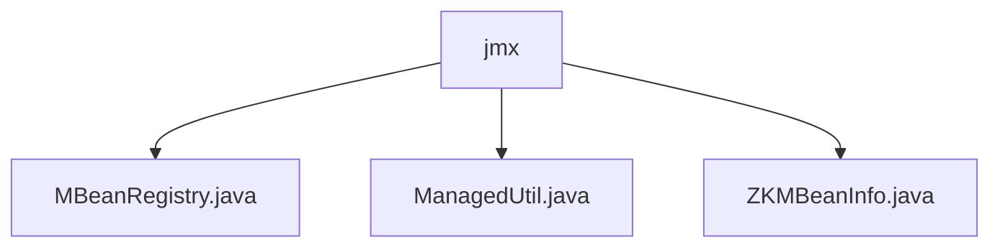

# 基础信息

|      |      |
|------|------|
| 名称 | jmx |
| 编码语言 | .java |
| 代码路径 | zookeeper/zookeeper-server/src/main/java/org/apache/zookeeper/jmx |
| 包名 | zookeeper.docs.zookeeper-server.src.main.java.org.apache.zookeeper.jmx |
| 概述说明 | MBeanRegistry管理MBean注册，线程安全，支持路径映射和测试替换。ManagedUtil提供Log4j JMX管理，检查启用状态并注册MBean。ZKMBeanInfo接口控制MBean可见性，定义名称和隐藏属性。 |

# 说明

## 概述  
1. 模块核心职责是提供JMX管理功能，包括MBean注册管理和Log4j日志系统的JMX集成，类似系统监控的控制面板。  
2. 主要接口包括MBean注册/注销API和Log4j JMX启用检查接口，例如通过静态方法`MBeanRegistry.getInstance()`获取单例实例。  
3. 关键数据结构为ConcurrentHashMap，用于存储MBean路径映射，例如文件系统风格的路径格式`type=Name,key=value`。  
4. 外部依赖包括JMX框架和Log4j 1.2，例如通过反射动态加载Log4j类避免强依赖。  
5. 实现特性包含线程安全设计，例如使用同步锁保证MBean注册操作的原子性。  

## 主要业务场景  
1. 业务流程包括MBean生命周期管理，例如注册时自动生成ObjectName并处理隐藏标记。  
2. 交互模式采用单例访问，例如测试场景可通过`setTestProvider`替换实例。  
3. 功能完整性体现在异常处理和日志跟踪，例如捕获JMException并记录操作状态。  
4. 主要应用于ZooKeeper服务监控，例如通过JMX管理工具查看Logger状态。  
5. 提供静态工具类API，例如`ManagedUtil.registerLog4jMBeans()`动态注册MBean。  
6. 集成案例包括与JMX控制台交互，例如隐藏MBean通过`ZKMBeanInfo.isHidden()`控制可见性。

### 包内部结构视图

该流程图展示了ZooKeeper项目中JMX模块的Java文件结构。根节点"jmx"表示org/apache/zookeeper/jmx目录，其下包含三个Java实现文件：MBeanRegistry.java用于MBean注册管理，ManagedUtil.java提供JMX管理工具类，ZKMBeanInfo.java定义ZooKeeper的MBean接口。这些文件共同构成了ZooKeeper的JMX管理功能基础。

# 文件列表 File List

| 名称   | 类型  | 说明 |
|-------|------|-------------|
| [ZKMBeanInfo.java](ZKMBeanInfo.md) | file | ZKMBeanInfo接口定义MBean信息，包含获取名称的getName()和判断是否隐藏的isHidden()方法，隐藏的MBean不会被注册到MBean服务器。 |
| [ManagedUtil.java](ManagedUtil.md) | file | 该代码检查并启用Log4j 1.2的JMX支持，注册MBean以管理日志层次结构。通过系统属性控制是否禁用，若启用则动态加载类并注册MBean。 |
| [MBeanRegistry.java](MBeanRegistry.md) | file | MBeanRegistry是ZooKeeper的MBean管理类，提供单例模式，支持注册、注销MBean，管理路径映射，使用ConcurrentHashMap存储信息，确保线程安全。 |

