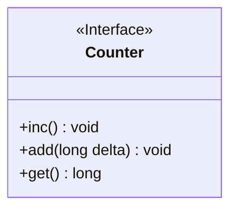
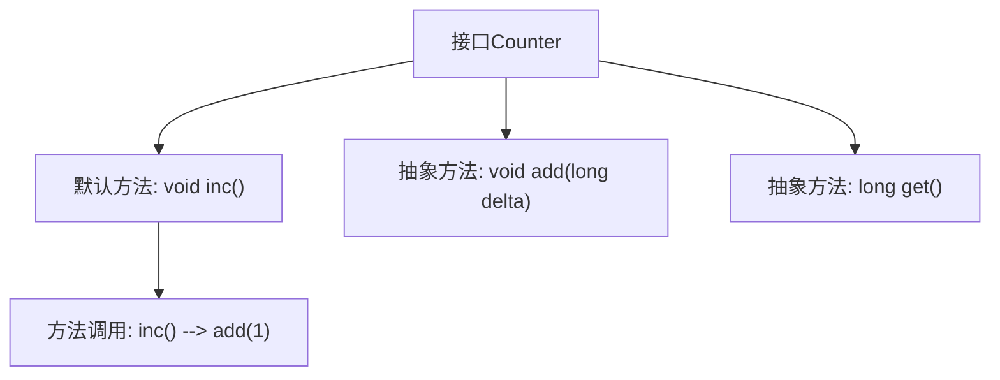

# 基础信息

|      |      |
|------|------|
| 名称 | Counter |
| 编码语言 | .java |
| 代码路径 | zookeeper/zookeeper-server/src/main/java/org/apache/zookeeper/metrics/Counter.java |
| 包名 | org.apache.zookeeper.metrics |
| 依赖项 | [] |
| 概述说明 | 计数器接口提供线程安全操作：inc()默认加1，add(long delta)按指定值增加（非负），get()获取当前值。MetricsProvider负责同步。 |

# 说明

该内容定义了一个名为Counter的公共接口，包含三个方法。inc方法默认实现将计数器值加1，线程安全由MetricsProvider处理。add方法将计数器值增加指定非负数值，同样线程安全。get方法返回当前计数器值，线程安全也由MetricsProvider保障。所有方法均强调线程安全性。

# 类列表 Class Summary

| 名称   | 类型  | 说明 |
|-------|------|-------------|
| Counter | interface | 计数器接口，提供线程安全的inc()、add(long delta)和get()方法，MetricsProvider负责同步。 |

## 类 Counter

|      |      |
|------|------|
| 访问范围 | public |
| 类型 | interface |
| 名称 | Counter |
| 说明 | 计数器接口，提供线程安全的inc()、add(long delta)和get()方法，MetricsProvider负责同步。 |

### UML类图

这段代码定义了一个名为`Counter`的接口，该接口提供了三个方法：`inc()`用于将计数器值增加1（默认实现调用`add(1)`），`add(long delta)`用于按指定增量增加计数器值（要求增量不能为负数），以及`get()`用于获取当前计数器值。接口文档特别强调所有方法都是线程安全的，同步机制由`MetricsProvider`负责实现。该接口适用于需要原子性计数操作的场景，如性能监控或事件统计等。

### 内部方法调用关系图

这段代码描述了一个名为Counter的接口，该接口定义了计数器的基础操作。包含三个核心方法：inc()默认方法通过调用add(1)实现原子递增；add(long delta)抽象方法用于指定增量值；get()抽象方法用于获取当前计数值。特别值得注意的是所有方法都声明为线程安全，由MetricsProvider处理同步问题，其中add方法的delta参数明确要求不能为负数。流程图清晰展示了接口结构和方法间的调用关系。

### 字段列表 Field List

| 名称  | 类型  | 说明 |
|-------|-------|------|

### 方法列表 Method List

| 名称  | 类型  | 说明 |
|-------|-------|------|
| get | long | 获取长数据方法。 |
| inc | void | 方法inc()调用add(1)实现加1操作。 |
| add | void | 增加长整型数值delta。 |

