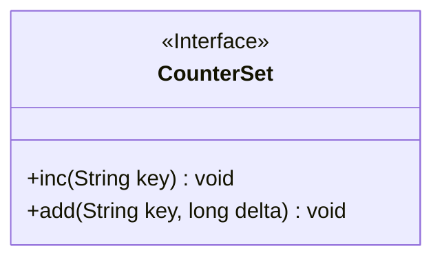
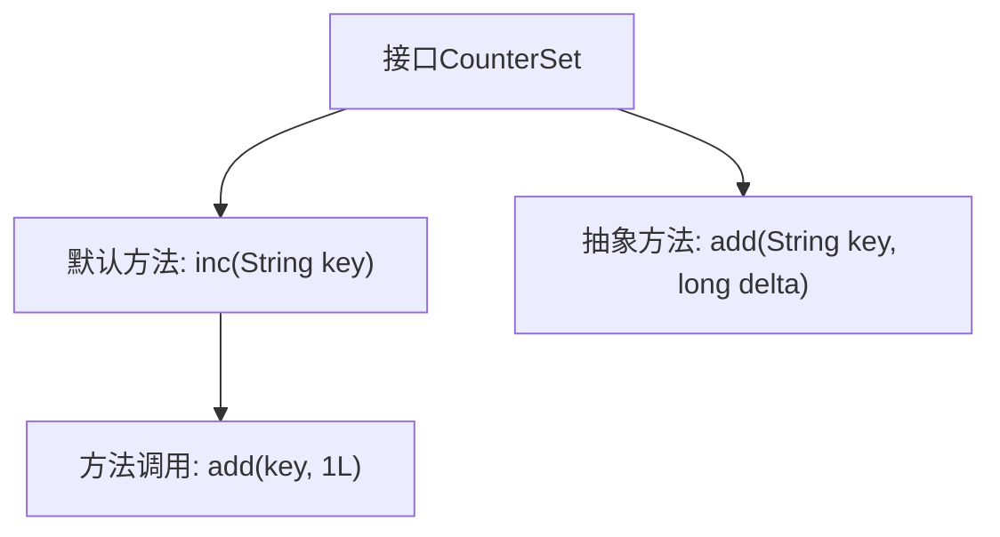

# 基础信息

|      |      |
|------|------|
| 名称 | CounterSet |
| 编码语言 | .java |
| 代码路径 | zookeeper/zookeeper-server/src/main/java/org/apache/zookeeper/metrics/CounterSet.java |
| 包名 | org.apache.zookeeper.metrics |
| 依赖项 | [] |
| 概述说明 | CounterSet接口提供线程安全的计数器功能，包含inc方法（默认+1）和add方法（自定义增量），均通过MetricsProvider保证同步。key为计数键，delta需非负。 |

# 说明

该内容定义了一个名为CounterSet的公共接口，包含两个方法。inc方法默认实现为调用add方法，将指定键的值增加1，强调线程安全由MetricsProvider处理同步。add方法允许按指定增量增加键的值，要求增量不能为负数，同样说明线程安全由MetricsProvider保障。两个方法均接受字符串类型键作为参数。

# 类列表 Class Summary

| 名称   | 类型  | 说明 |
|-------|------|-------------|
| CounterSet | interface | CounterSet接口提供线程安全的计数器功能，包含inc方法（默认+1）和add方法（指定增量），均通过key操作且禁止负值。 |

## 类 CounterSet

|      |      |
|------|------|
| 访问范围 | public |
| 类型 | interface |
| 名称 | CounterSet |
| 说明 | CounterSet接口提供线程安全的计数器功能，包含inc方法（默认+1）和add方法（指定增量），均通过key操作且禁止负值。 |

### UML类图

这段代码定义了一个名为`CounterSet`的接口，包含两个方法：`inc`和`add`。`inc`方法默认实现为调用`add`方法并传入增量值1，用于对指定键的计数器加1；`add`是抽象方法，要求实现类提供线程安全的长整型增量操作。接口明确要求增量值不能为负数，并声明线程安全由`MetricsProvider`保障。该接口适用于需要原子性计数功能的场景，如指标统计系统。

### 内部方法调用关系图

这段代码展示了一个名为CounterSet的接口，包含两个方法：inc和add。inc是一个默认方法，用于将指定键的值增加1，内部调用add方法并传入固定增量1。add是一个抽象方法，需要实现类具体定义如何增加指定键的值。接口强调这两个方法都是线程安全的，由MetricsProvider处理同步问题。流程图清晰地展示了接口结构和方法间的调用关系。

### 字段列表 Field List

| 名称  | 类型  | 说明 |
|-------|-------|------|

### 方法列表 Method List

| 名称  | 类型  | 说明 |
|-------|-------|------|
| add | void | 方法`add`接受键`key`和增量`delta`，用于更新键对应的值。 |
| inc | void | 方法inc接收字符串key，调用add方法并传入key和1L作为参数。 |

