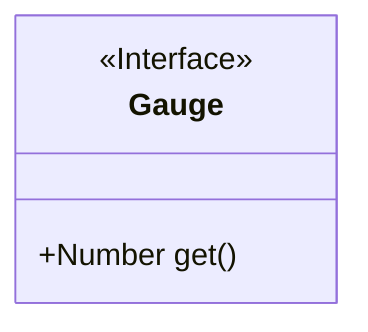
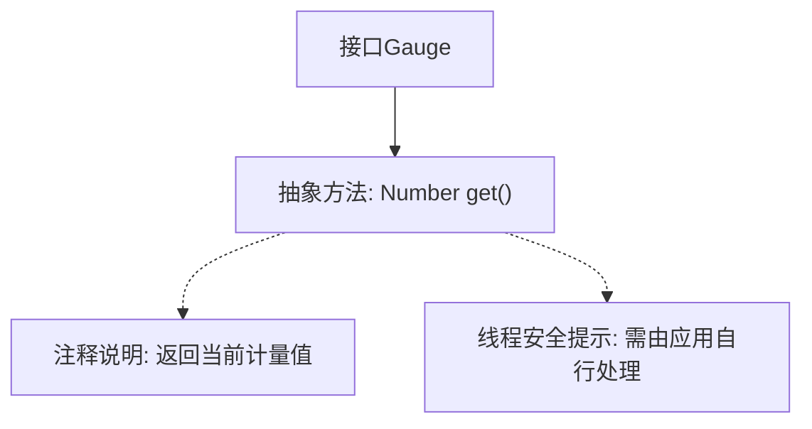

# 基础信息

|      |      |
|------|------|
| 名称 | Gauge |
| 编码语言 | .java |
| 代码路径 | zookeeper/zookeeper-server/src/main/java/org/apache/zookeeper/metrics/Gauge.java |
| 包名 | org.apache.zookeeper.metrics |
| 依赖项 | [] |
| 概述说明 | Gauge接口定义获取当前值的方法get()，应用需自行处理线程安全。 |

# 说明

该内容定义了一个名为Gauge的公共接口，主要用于获取当前测量值。接口包含一个get方法，返回Number类型的结果，表示当前测量值。文档说明MetricsProvider会调用此回调方法，但不处理同步问题，需要应用程序自行确保线程安全。

# 类列表 Class Summary

| 名称   | 类型  | 说明 |
|-------|------|-------------|
| Gauge | interface | Gauge接口定义获取当前值的方法get()，应用需自行处理线程安全。 |

## 类 Gauge

|      |      |
|------|------|
| 访问范围 | public |
| 类型 | interface |
| 名称 | Gauge |
| 说明 | Gauge接口定义获取当前值的方法get()，应用需自行处理线程安全。 |

### UML类图

这段类图描述了一个名为Gauge的接口，该接口定义了一个获取当前数值的get()方法。Gauge接口被标记为<<Interface>>，表明它是一个纯抽象接口，不包含具体实现。接口中唯一的公开方法get()返回一个Number类型的值，该方法注释说明需要由实现类自行处理线程安全问题。这个接口通常用于指标监控系统，允许应用程序提供自定义的度量值获取逻辑。

### 内部方法调用关系图

该流程图描述了Gauge接口的核心结构，主要包含一个抽象的get()方法用于获取计量数值。接口明确要求实现类自行处理线程安全问题，因为MetricsProvider调用时不会进行同步控制。注释部分强调了方法的返回值和线程安全注意事项，这些关键信息通过虚线关联到对应方法节点上。整个设计体现了监控指标采集的通用接口规范。

### 字段列表 Field List

| 名称  | 类型  | 说明 |
|-------|-------|------|

### 方法列表 Method List

| 名称  | 类型  | 说明 |
|-------|-------|------|
| get | Number | 获取数值的方法。 |

