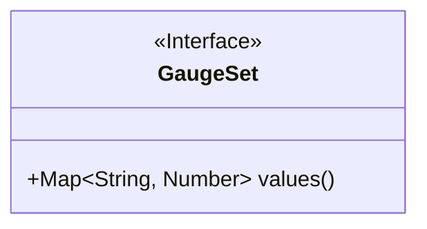
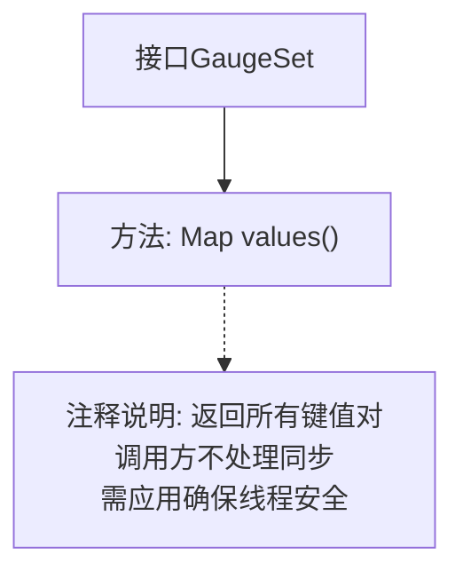

# 基础信息

|      |      |
|------|------|
| 名称 | GaugeSet |
| 编码语言 | .java |
| 代码路径 | zookeeper/zookeeper-server/src/main/java/org/apache/zookeeper/metrics/GaugeSet.java |
| 包名 | org.apache.zookeeper.metrics |
| 依赖项 | ['java.util.Map'] |
| 概述说明 | GaugeSet接口提供values方法，返回所有键值对，需应用自行处理线程安全。 |

# 说明

GaugeSet是一个公开接口，定义了一个方法values()，用于返回所有键值对。该方法返回一个Map，其中键为字符串类型，值为Number类型。接口注释明确指出，调用此方法时MetricsProvider不负责同步处理，线程安全需由应用程序自行保证。该接口主要用于度量数据收集场景。

# 类列表 Class Summary

| 名称   | 类型  | 说明 |
|-------|------|-------------|
| GaugeSet | interface | GaugeSet接口定义获取键值对的方法values()，返回Map<String, Number>，需应用自行处理线程安全。 |

## 类 GaugeSet

|      |      |
|------|------|
| 访问范围 | public |
| 类型 | interface |
| 名称 | GaugeSet |
| 说明 | GaugeSet接口定义获取键值对的方法values()，返回Map<String, Number>，需应用自行处理线程安全。 |

### UML类图

这段类图描述了一个名为GaugeSet的接口，该接口定义了一个返回Map类型数据的方法values()。Map的键是String类型，值是Number类型。接口通过<<Interface>>标记明确标识，方法作为公有成员使用+符号表示。该接口主要用于提供指标数据的键值对集合，注释说明调用方需自行处理线程安全问题。

### 内部方法调用关系图

该流程图描述了GaugeSet接口的结构，核心是values()方法，该方法返回一个包含字符串键和数值值的映射。特别强调了线程安全的注意事项，即接口不处理同步问题，需要由调用方自行保证线程安全。图中通过虚线箭头关联方法与其注释说明，清晰展示了接口的契约关系和重要约束条件。

### 字段列表 Field List

| 名称  | 类型  | 说明 |
|-------|-------|------|

### 方法列表 Method List

| 名称  | 类型  | 说明 |
|-------|-------|------|
| values | Map<String, Number> | 返回键值对集合，键为字符串，值为数字类型。 |

