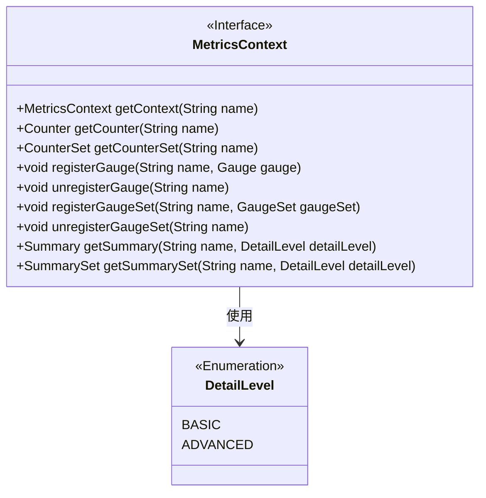
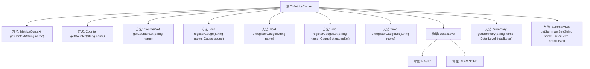

# 基础信息

|      |      |
|------|------|
| 名称 | MetricsContext |
| 编码语言 | .java |
| 代码路径 | zookeeper/zookeeper-server/src/main/java/org/apache/zookeeper/metrics/MetricsContext.java |
| 包名 | org.apache.zookeeper.metrics |
| 依赖项 | [] |
| 概述说明 | MetricsContext接口提供获取子上下文、计数器、计数器集、摘要及摘要集的方法，支持注册和注销Gauge和GaugeSet，包含BASIC和ADVANCED两种摘要级别。 |

# 说明

MetricsContext接口定义了指标上下文的操作，包括获取子上下文、计数器、计数器集合、注册和注销Gauge及GaugeSet。支持获取不同详细级别的Summary和SummarySet。所有方法均要求非空参数，注册操作会覆盖同名指标。DetailLevel枚举指定指标聚合的复杂度，分为BASIC和ADVANCED两级。

# 类列表 Class Summary

| 名称   | 类型  | 说明 |
|-------|------|-------------|
| MetricsContext | interface | MetricsContext接口提供获取子上下文、计数器、计数器集、注册/注销测量器和测量器集、获取摘要和摘要集的功能，支持基础与高级详细级别。 |

## 类 MetricsContext

|      |      |
|------|------|
| 访问范围 | public |
| 类型 | interface |
| 名称 | MetricsContext |
| 说明 | MetricsContext接口提供获取子上下文、计数器、计数器集、注册/注销测量器和测量器集、获取摘要和摘要集的功能，支持基础与高级详细级别。 |

### UML类图

这段代码定义了一个名为`MetricsContext`的接口，用于管理各种度量指标（如计数器、测量仪、摘要等）。接口包含获取子上下文、注册/注销测量仪、获取计数器集合等方法，并使用`DetailLevel`枚举来控制摘要的详细级别。该接口设计用于构建灵活的度量系统，支持多级上下文和不同类型的度量指标采集。

### 内部方法调用关系图

这段代码定义了一个名为MetricsContext的接口，主要用于指标收集和管理。接口提供了获取子上下文、计数器、计数器集合、注册/注销测量器和测量器集合、获取摘要和摘要集合等方法。其中DetailLevel枚举定义了BASIC和ADVANCED两个级别，用于控制摘要的详细程度。该接口设计用于构建灵活的指标监控系统，支持多种类型的指标操作和层级管理。

### 字段列表 Field List

| 名称  | 类型  | 说明 |
|-------|-------|------|

### 方法列表 Method List

| 名称  | 类型  | 说明 |
|-------|-------|------|
| unregisterGaugeSet | void | 取消注册指定名称的计量器集合。 |
| getSummarySet | SummarySet | 获取指定名称和详细级别的摘要集合。 |
| registerGaugeSet | void | 注册名为name的GaugeSet指标集合。 |
| unregisterGauge | void | 取消注册名为name的计量器。 |
| getCounterSet | CounterSet | 获取指定名称的计数器集合。 |
| getContext | MetricsContext | 获取指定名称的上下文对象。 |
| registerGauge | void | 注册名为name的Gauge指标。 |
| getCounter | Counter | 获取指定名称的计数器实例。 |
| getSummary | Summary | 该方法用于获取指定名称的摘要信息，可根据详细级别参数调整返回内容的详细程度。 |

