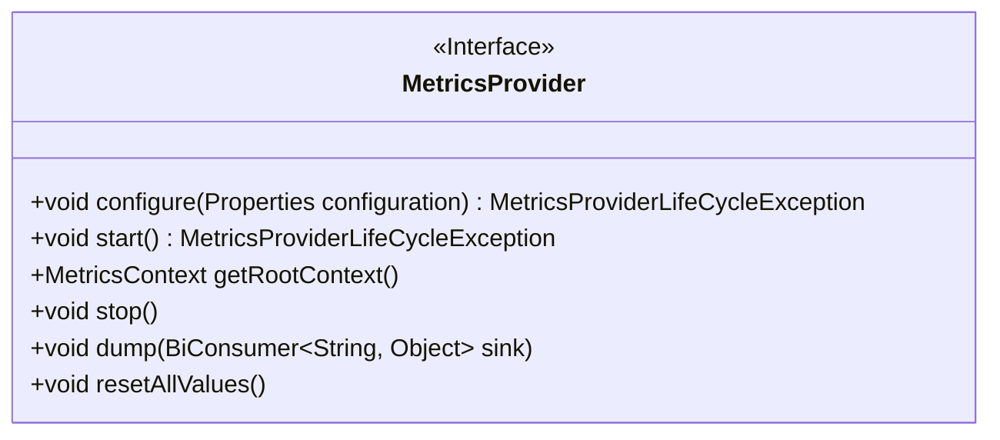
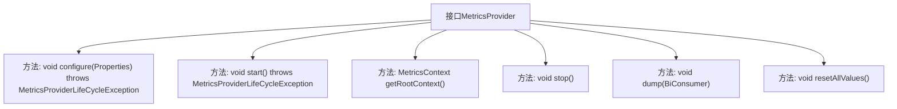

# 基础信息

|      |      |
|------|------|
| 名称 | MetricsProvider |
| 编码语言 | .java |
| 代码路径 | zookeeper/zookeeper-server/src/main/java/org/apache/zookeeper/metrics/MetricsProvider.java |
| 包名 | org.apache.zookeeper.metrics |
| 依赖项 | ['java.util.Properties', 'java.util.function.BiConsumer'] |
| 概述说明 | MetricsProvider接口定义了指标提供者的核心功能：配置、启动、获取根上下文、停止、导出指标和重置。配置和启动可能抛出异常，停止需幂等，重置可选实现。 |

# 说明

MetricsProvider是一个接口，定义了指标提供者的核心功能。它包含配置方法configure，接收Properties参数，可能抛出配置异常。start方法用于启动提供者，可能抛出生命周期异常。getRootContext返回根上下文对象。stop方法释放资源，可多次调用且不抛异常。dump方法将所有指标以键值对形式输出到指定接收器。resetAllValues用于重置所有指标值，具体实现可选。该接口规范了指标提供者的完整生命周期管理及数据操作。

# 类列表 Class Summary

| 名称   | 类型  | 说明 |
|-------|------|-------------|
| MetricsProvider | interface | MetricsProvider接口定义了配置、启动、获取根上下文、停止服务、导出指标数据和重置指标值的方法，可能抛出生命周期异常。 |

## 类 MetricsProvider

|      |      |
|------|------|
| 访问范围 | public |
| 类型 | interface |
| 名称 | MetricsProvider |
| 说明 | MetricsProvider接口定义了配置、启动、获取根上下文、停止服务、导出指标数据和重置指标值的方法，可能抛出生命周期异常。 |

### UML类图

这段代码定义了一个名为`MetricsProvider`的接口，该接口提供了指标监控系统所需的核心功能。接口包含6个方法：`configure()`用于配置提供者，`start()`用于启动服务，`getRootContext()`获取根上下文，`stop()`安全释放资源，`dump()`导出所有指标数据，`resetAllValues()`重置所有指标值。该接口设计考虑了生命周期管理（通过start/stop）、异常处理（MetricsProviderLifeCycleException）和灵活性（resetAllValues可选择性实现），是监控系统的核心抽象层。

### 内部方法调用关系图

这段流程图展示了MetricsProvider接口的结构及其所有方法。该接口定义了指标提供者的核心生命周期操作，包括配置(configure)、启动(start)、获取根上下文(getRootContext)、停止(stop)、数据转储(dump)和重置(resetAllValues)等方法。其中configure和start方法可能抛出生命周期异常，而stop方法被特别注明不能抛出异常且可被多次调用。resetAllValues被标记为可选实现，体现了接口设计的灵活性和对实现类的约束要求。

### 字段列表 Field List

| 名称  | 类型  | 说明 |
|-------|-------|------|

### 方法列表 Method List

| 名称  | 类型  | 说明 |
|-------|-------|------|
| getRootContext | MetricsContext | 获取根上下文MetricsContext对象。 |
| configure | void | 配置方法，接收Properties参数，可能抛出MetricsProviderLifeCycleException异常。 |
| stop | void | 停止当前操作或功能。 |
| start | void | 方法start()可能抛出MetricsProviderLifeCycleException异常，用于启动操作。 |
| resetAllValues | void | 重置所有数值。 |
| dump | void | 方法dump接收一个BiConsumer参数sink，用于处理字符串和对象的键值对。 |

