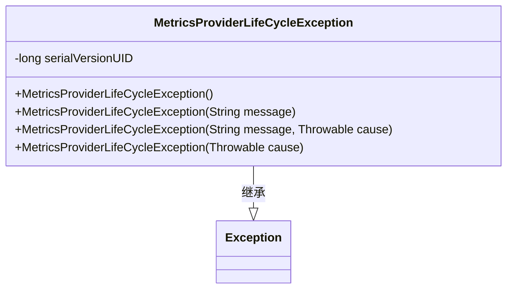
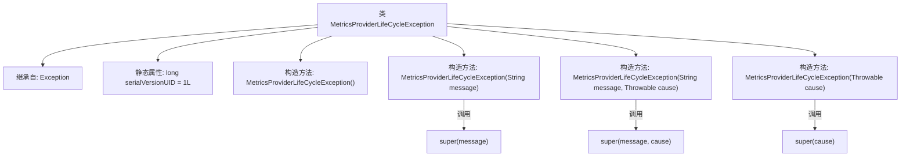

# 基础信息

|      |      |
|------|------|
| 名称 | MetricsProviderLifeCycleException |
| 编码语言 | .java |
| 代码路径 | zookeeper/zookeeper-server/src/main/java/org/apache/zookeeper/metrics/MetricsProviderLifeCycleException.java |
| 包名 | org.apache.zookeeper.metrics |
| 依赖项 | [] |
| 概述说明 | 自定义异常类MetricsProviderLifeCycleException，继承Exception，提供四种构造方法，支持消息、原因或两者组合传递。序列化ID为1L。 |

# 说明

这是一个自定义异常类MetricsProviderLifeCycleException，继承自Exception类。它包含四个构造函数：无参构造函数、带消息参数的构造函数、带消息和原因参数的构造函数，以及带原因参数的构造函数。该类用于处理指标提供者生命周期中的异常情况，序列化版本号为1L。

# 类列表 Class Summary

| 名称   | 类型  | 说明 |
|-------|------|-------------|
| MetricsProviderLifeCycleException | class | 自定义异常类MetricsProviderLifeCycleException，继承Exception，提供四种构造方法，支持消息和异常原因传递。 |

## 类 MetricsProviderLifeCycleException

|      |      |
|------|------|
| 访问范围 | public |
| 类型 | class |
| 名称 | MetricsProviderLifeCycleException |
| 说明 | 自定义异常类MetricsProviderLifeCycleException，继承Exception，提供四种构造方法，支持消息和异常原因传递。 |

### UML类图

这段代码定义了一个自定义异常类`MetricsProviderLifeCycleException`，它继承自Java标准库中的`Exception`类。该类提供了四种构造函数：默认无参构造、带错误消息的构造、带错误消息和原因的构造，以及仅带原因的构造。serialVersionUID用于序列化版本控制。这是一个典型的自定义异常实现，用于在指标提供者生命周期管理中出现问题时抛出特定类型的异常。

### 内部方法调用关系图

该流程图展示了自定义异常类MetricsProviderLifeCycleException的结构，它继承自Java标准Exception类，包含四个重载构造方法。其中三个构造方法分别通过super关键字调用父类不同参数签名的构造器，用于初始化异常信息(message)和原因(cause)。serialVersionUID字段用于序列化版本控制，确保类版本兼容性。整体设计遵循Java异常处理规范，支持无参构造、仅消息、消息+原因、仅原因四种异常创建方式。

### 字段列表 Field List

| 名称  | 类型  | 说明 |
|-------|-------|------|
| serialVersionUID = 1L | long | Java序列化ID，固定为1L，确保版本兼容性。 |

### 方法列表 Method List

| 名称  | 类型  | 说明 |
|-------|-------|------|

