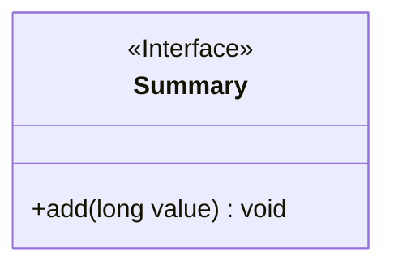
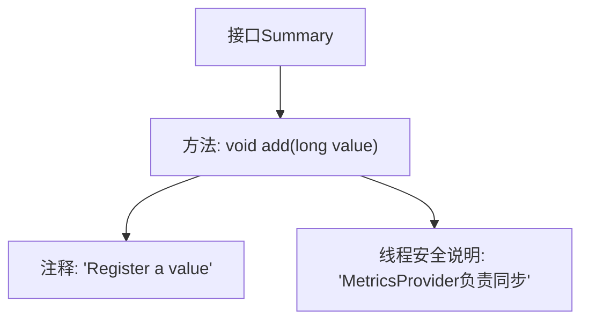

# 基础信息

|      |      |
|------|------|
| 名称 | Summary |
| 编码语言 | .java |
| 代码路径 | zookeeper/zookeeper-server/src/main/java/org/apache/zookeeper/metrics/Summary.java |
| 包名 | org.apache.zookeeper.metrics |
| 依赖项 | [] |
| 概述说明 | 接口Summary定义了一个线程安全的add方法，用于注册长整型数值，MetricsProvider负责同步处理。 |

# 说明

这是一个公开的接口Summary，定义了一个线程安全的数值注册方法add。该方法接受一个长整型参数value，用于记录当前值。接口注释明确指出MetricsProvider会处理同步问题，确保多线程环境下的安全调用。该设计适用于需要收集和汇总数值型指标的监控场景。

# 类列表 Class Summary

| 名称   | 类型  | 说明 |
|-------|------|-------------|
| Summary | interface | 接口Summary定义了一个线程安全的add方法，用于注册长整型数值，同步由MetricsProvider处理。 |

## 类 Summary

|      |      |
|------|------|
| 访问范围 | public |
| 类型 | interface |
| 名称 | Summary |
| 说明 | 接口Summary定义了一个线程安全的add方法，用于注册长整型数值，同步由MetricsProvider处理。 |

### UML类图

这段代码定义了一个名为`Summary`的接口，其中包含一个线程安全的`add`方法，用于注册长整型数值。接口通过`<<Interface>>`标记明确标识，方法`add`以`+`表示公有访问权限，接收`long`类型参数且无返回值。该接口设计简洁，专注于数值注册功能，适合作为度量指标收集系统的核心组件。

### 内部方法调用关系图

这段流程图展示了Summary接口的核心结构，重点描述了add方法的定义及其关键特性。接口仅包含一个线程安全的add方法，用于注册长整型数值，并由MetricsProvider处理同步问题。注释明确说明了方法的功能和线程安全机制，体现了清晰的契约设计。整个结构简洁但完整，符合度量统计场景下数值收集的接口设计需求。

### 字段列表 Field List

| 名称  | 类型  | 说明 |
|-------|-------|------|

### 方法列表 Method List

| 名称  | 类型  | 说明 |
|-------|-------|------|
| add | void | 向集合中添加一个长整型数值。 |

