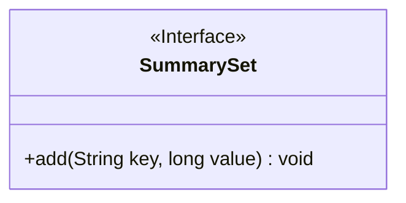
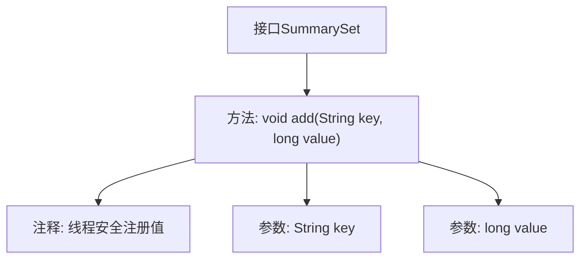

# 基础信息

|      |      |
|------|------|
| 名称 | SummarySet |
| 编码语言 | .java |
| 代码路径 | zookeeper/zookeeper-server/src/main/java/org/apache/zookeeper/metrics/SummarySet.java |
| 包名 | org.apache.zookeeper.metrics |
| 依赖项 | [] |
| 概述说明 | 接口SummarySet定义了一个线程安全的add方法，用于通过键注册长整型值，MetricsProvider负责同步处理。 |

# 说明

该内容定义了一个名为SummarySet的公共接口，包含一个add方法用于注册数值。该方法接收两个参数：一个字符串类型的key用于访问对应摘要，一个长整型的value表示当前值。文档注明该方法线程安全，同步处理由MetricsProvider负责。接口功能明确，专注于数值记录的注册操作。

# 类列表 Class Summary

| 名称   | 类型  | 说明 |
|-------|------|-------------|
| SummarySet | interface | 接口SummarySet定义线程安全的add方法，用于通过key注册value值，MetricsProvider负责同步处理。 |

## 类 SummarySet

|      |      |
|------|------|
| 访问范围 | public |
| 类型 | interface |
| 名称 | SummarySet |
| 说明 | 接口SummarySet定义线程安全的add方法，用于通过key注册value值，MetricsProvider负责同步处理。 |

### UML类图

这段代码定义了一个名为`SummarySet`的接口，该接口声明了一个`add`方法用于注册键值对。接口明确标注了线程安全性由`MetricsProvider`保证，方法接收一个字符串类型的键和长整型的值作为参数，无返回值。该接口适用于需要收集和汇总数据的场景，为具体实现类提供了标准化的数据注册方法契约。

### 内部方法调用关系图

该流程图展示了SummarySet接口的核心结构，重点描述了add方法的定义及其关键特性。接口包含一个线程安全的add方法，用于通过字符串键注册长整型数值，注释明确说明由MetricsProvider处理同步问题。方法接收两个参数：key用于标识摘要，value表示当前数值。整个设计简洁清晰地体现了该接口的监控统计功能。

### 字段列表 Field List

| 名称  | 类型  | 说明 |
|-------|-------|------|

### 方法列表 Method List

| 名称  | 类型  | 说明 |
|-------|-------|------|
| add | void | 添加键值对方法：参数为字符串键和长整型值。 |

