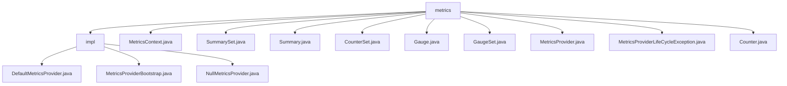

# 基础信息

|      |      |
|------|------|
| 名称 | metrics |
| 编码语言 | .java |
| 代码路径 | zookeeper/zookeeper-server/src/main/java/org/apache/zookeeper/metrics |
| 包名 | zookeeper.docs.zookeeper-server.src.main.java.org.apache.zookeeper.metrics |
| 概述说明 | Zookeeper指标采集系统，统一管理性能指标，支持动态扩展。核心包括MetricsProvider接口、线程安全指标容器及反射加载机制。涵盖指标全生命周期管理，提供SPI接口和测试隔离方案，用于服务端监控。 |

# 说明

## 概述  
1.该模块是Zookeeper的性能监控核心组件，负责统一管理服务端指标（例如Counter/Summary）并支持运行时动态加载。  
2.主要接口为MetricsProvider规范，通过Java反射机制加载实现类（例如`startMetricsProvider`启动方法）。  
3.关键数据结构采用线程安全的并发映射容器，类似增强型哈希表管理各类指标实例。  
4.依赖Java反射API实现SPI扩展，异常处理基于SLF4J日志框架。  

## 主要业务场景  
1.支持指标全生命周期管理（例如配置-采集-转储），测试时可通过Null实现隔离真实系统。  
2.采用同步回调模式传递数据，通过BiConsumer接口实现观察者模式的数据分发。  
3.功能覆盖指标CRUD、线程安全操作及空模式兼容，满足监控系统基础需求。  
4.主要用于服务端性能分析，测试场景通过NullMetricsProvider避免资源消耗。  
5.提供SPI扩展接口，支持Default/Null双模式运行时切换。  
6.已集成至Zookeeper服务端，通过Bootstrap类统一初始化监控模块。

### 包内部结构视图

该流程图展示了Zookeeper项目中metrics模块的层级结构。根节点metrics包含impl子目录和多个接口文件，impl目录下有三个实现类文件。所有节点均使用路径末端名称表示，完整呈现了11个文件与2个目录的从属关系，符合路径信息的原始结构。

# 文件列表 File List

| 名称   | 类型  | 说明 |
|-------|------|-------------|
| [GaugeSet.java](GaugeSet.md) | file | GaugeSet接口提供values方法，返回所有键值对，需应用自行处理线程安全。 |
| [Gauge.java](Gauge.md) | file | Gauge接口定义获取当前值的方法get()，应用需自行处理线程安全。 |
| [CounterSet.java](CounterSet.md) | file | CounterSet接口提供线程安全的计数器功能，包含inc方法（默认+1）和add方法（自定义增量），均通过MetricsProvider保证同步。key为计数键，delta需非负。 |
| [Summary.java](Summary.md) | file | 接口Summary定义了一个线程安全的add方法，用于注册长整型数值，MetricsProvider负责同步处理。 |
| [SummarySet.java](SummarySet.md) | file | 接口SummarySet定义了一个线程安全的add方法，用于通过键注册长整型值，MetricsProvider负责同步处理。 |
| [Counter.java](Counter.md) | file | 计数器接口提供线程安全操作：inc()默认加1，add(long delta)按指定值增加（非负），get()获取当前值。MetricsProvider负责同步。 |
| [MetricsProviderLifeCycleException.java](MetricsProviderLifeCycleException.md) | file | 自定义异常类MetricsProviderLifeCycleException，继承Exception，提供四种构造方法，支持消息、原因或两者组合传递。序列化ID为1L。 |
| [MetricsProvider.java](MetricsProvider.md) | file | MetricsProvider接口定义了指标提供者的核心功能：配置、启动、获取根上下文、停止、导出指标和重置。配置和启动可能抛出异常，停止需幂等，重置可选实现。 |
| [MetricsContext.java](MetricsContext.md) | file | MetricsContext接口提供获取子上下文、计数器、计数器集、摘要及摘要集的方法，支持注册和注销Gauge和GaugeSet，包含BASIC和ADVANCED两种摘要级别。 |
| [impl](impl/_module.md) | package | DefaultMetricsProvider是默认指标提供者，管理各类指标并支持配置、启动、停止等功能。MetricsProviderBootstrap通过反射启动指标提供者。NullMetricsProvider为空实现，用于测试。 |

