# 基础信息

|      |      |
|------|------|
| 名称 | DefaultMetricsProvider |
| 编码语言 | .java |
| 代码路径 | zookeeper/zookeeper-server/src/main/java/org/apache/zookeeper/metrics/impl/DefaultMetricsProvider.java |
| 包名 | org.apache.zookeeper.metrics.impl |
| 依赖项 | ['java.util.Objects', 'java.util.Properties', 'java.util.concurrent.ConcurrentHashMap', 'java.util.concurrent.ConcurrentMap', 'java.util.function.BiConsumer', 'org.apache.zookeeper.metrics.Counter', 'org.apache.zookeeper.metrics.CounterSet', 'org.apache.zookeeper.metrics.Gauge', 'org.apache.zookeeper.metrics.GaugeSet', 'org.apache.zookeeper.metrics.MetricsContext', 'org.apache.zookeeper.metrics.MetricsProvider', 'org.apache.zookeeper.metrics.MetricsProviderLifeCycleException', 'org.apache.zookeeper.metrics.Summary', 'org.apache.zookeeper.metrics.SummarySet', 'org.apache.zookeeper.server.metric.AvgMinMaxCounter', 'org.apache.zookeeper.server.metric.AvgMinMaxCounterSet', 'org.apache.zookeeper.server.metric.AvgMinMaxPercentileCounter', 'org.apache.zookeeper.server.metric.AvgMinMaxPercentileCounterSet', 'org.apache.zookeeper.server.metric.SimpleCounter', 'org.apache.zookeeper.server.metric.SimpleCounterSet'] |
| 概述说明 | DefaultMetricsProvider实现MetricsProvider接口，提供根上下文管理、指标注册与收集功能，支持计数器、仪表、摘要等多种指标类型，具备重置和导出能力。 |

# 说明

DefaultMetricsProvider是一个实现了MetricsProvider接口的默认指标提供者类，包含一个内部类DefaultMetricsContext用于管理各类指标。主要功能包括配置、启动、停止、获取根上下文、数据转储和重置指标值。DefaultMetricsContext使用并发映射存储不同类型的指标，如Gauge、Counter、Summary等，并提供注册、注销、获取和重置这些指标的方法。数据转储功能通过BiConsumer将指标名称和值传递给接收器，重置功能则将所有计数器类指标归零。

# 类列表 Class Summary

| 名称   | 类型  | 说明 |
|-------|------|-------------|
| DefaultMetricsProvider | class | DefaultMetricsProvider实现MetricsProvider接口，管理根MetricsContext，支持配置、启动、停止、数据转储和重置功能。内部DefaultMetricsContext维护多种度量类型（如Gauge、Counter、Summary等）的并发映射，提供注册、注销和操作接口。 |


## 类 DefaultMetricsProvider

|      |      |
|------|------|
| 访问范围 | public |
| 类型 | class |
| 名称 | DefaultMetricsProvider |
| 说明 | DefaultMetricsProvider实现MetricsProvider接口，管理根MetricsContext，支持配置、启动、停止、数据转储和重置功能。内部DefaultMetricsContext维护多种度量类型（如Gauge、Counter、Summary等）的并发映射，提供注册、注销和操作接口。 |


### UML类图

```mermaid
classDiagram
    class DefaultMetricsProvider {
        -DefaultMetricsContext rootMetricsContext
        +configure(Properties configuration) void
        +start() void
        +getRootContext() MetricsContext
        +stop() void
        +dump(BiConsumer~String, Object~ sink) void
        +resetAllValues() void
    }

    class DefaultMetricsContext {
        -ConcurrentMap~String, Gauge~ gauges
        -ConcurrentMap~String, GaugeSet~ gaugeSets
        -ConcurrentMap~String, SimpleCounter~ counters
        -ConcurrentMap~String, SimpleCounterSet~ counterSets
        -ConcurrentMap~String, AvgMinMaxCounter~ basicSummaries
        -ConcurrentMap~String, AvgMinMaxPercentileCounter~ summaries
        -ConcurrentMap~String, AvgMinMaxCounterSet~ basicSummarySets
        -ConcurrentMap~String, AvgMinMaxPercentileCounterSet~ summarySets
        +getContext(String name) MetricsContext
        +getCounter(String name) Counter
        +getCounterSet(String name) CounterSet
        +registerGauge(String name, Gauge gauge) void
        +unregisterGauge(String name) void
        +registerGaugeSet(String name, GaugeSet gaugeSet) void
        +unregisterGaugeSet(String name) void
        +getSummary(String name, DetailLevel detailLevel) Summary
        +getSummarySet(String name, DetailLevel detailLevel) SummarySet
        -dump(BiConsumer~String, Object~ sink) void
        -reset() void
    }

    <<Interface>> MetricsProvider {
        <<Interface>>
        +configure(Properties configuration) void
        +start() void
        +getRootContext() MetricsContext
        +stop() void
        +dump(BiConsumer~String, Object~ sink) void
        +resetAllValues() void
    }

    <<Interface>> MetricsContext {
        <<Interface>>
        +getContext(String name) MetricsContext
        +getCounter(String name) Counter
        +getCounterSet(String name) CounterSet
        +registerGauge(String name, Gauge gauge) void
        +unregisterGauge(String name) void
        +registerGaugeSet(String name, GaugeSet gaugeSet) void
        +unregisterGaugeSet(String name) void
        +getSummary(String name, DetailLevel detailLevel) Summary
        +getSummarySet(String name, DetailLevel detailLevel) SummarySet
    }

    DefaultMetricsProvider ..|> MetricsProvider : 实现
    DefaultMetricsContext ..|> MetricsContext : 实现
    DefaultMetricsProvider --> DefaultMetricsContext : 包含
```

这段代码展示了一个默认的度量指标提供者实现，包含核心的度量上下文管理功能。DefaultMetricsProvider实现了MetricsProvider接口，负责管理度量系统的生命周期和根上下文；DefaultMetricsContext实现了MetricsContext接口，内部维护了多种度量指标（如计数器、仪表盘、摘要等）的并发安全存储，并提供了丰富的注册、获取和操作接口。该设计支持多种度量类型的分层次管理，通过泛型集合确保线程安全，并提供了数据导出和重置功能。


### 内部方法调用关系图

```mermaid
graph TD
    A["类DefaultMetricsProvider"]
    B["属性: DefaultMetricsContext rootMetricsContext"]
    C["方法: configure(Properties)"]
    D["方法: start()"]
    E["方法: getRootContext()"]
    F["方法: stop()"]
    G["方法: dump(BiConsumer<String, Object>)"]
    H["方法: resetAllValues()"]
    I["内部类DefaultMetricsContext"]
    J["属性: 8个ConcurrentMap集合"]
    K["方法: getContext(String)"]
    L["方法: getCounter(String)"]
    M["方法: getCounterSet(String)"]
    N["方法: registerGauge(String, Gauge)"]
    O["方法: unregisterGauge(String)"]
    P["方法: registerGaugeSet(String, GaugeSet)"]
    Q["方法: unregisterGaugeSet(String)"]
    R["方法: getSummary(String, DetailLevel)"]
    S["方法: getSummarySet(String, DetailLevel)"]
    T["方法: dump(BiConsumer<String, Object>)"]
    U["方法: reset()"]

    A --> B
    A --> C
    A --> D
    A --> E
    A --> F
    A --> G
    A --> H
    A --> I
    I --> J
    I --> K
    I --> L
    I --> M
    I --> N
    I --> O
    I --> P
    I --> Q
    I --> R
    I --> S
    I --> T
    I --> U
    E --> B
    F --> B
    G --> B
    H --> B
    T --> J
    U --> J
```



这段代码实现了一个默认的指标提供者(DefaultMetricsProvider)及其内部指标上下文(DefaultMetricsContext)。主要功能包括配置管理、指标注册/注销、数据转储和重置等。内部类通过多个并发映射表管理不同类型的指标(计数器、计量器、摘要等)，提供线程安全的指标操作。外部类作为入口点，管理上下文生命周期并转发核心操作。整个设计采用组合模式，支持指标的分组管理和批量操作。

### 字段列表 Field List

| 名称  | 类型  | 说明 |
|-------|-------|------|
| rootMetricsContext = new DefaultMetricsContext() | DefaultMetricsContext | 私有成员rootMetricsContext初始化为DefaultMetricsContext实例。 |

### 方法列表 Method List

| 名称  | 类型  | 说明 |
|-------|-------|------|
| start | void | 重写start方法，可能抛出MetricsProviderLifeCycleException异常。 |
| getRootContext | MetricsContext | 重写getRootContext方法，返回rootMetricsContext对象。 |
| configure | void | Java方法重写，配置属性，可能抛出生命周期异常。 |
| stop | void | 重写stop方法，清空rootMetricsContext中的gauges和gaugeSets引用。 |
| dump | void | 重写dump方法，调用rootMetricsContext的dump方法，通过BiConsumer处理键值对输出。 |
| resetAllValues | void | 重置所有值：调用rootMetricsContext的reset方法。 |


