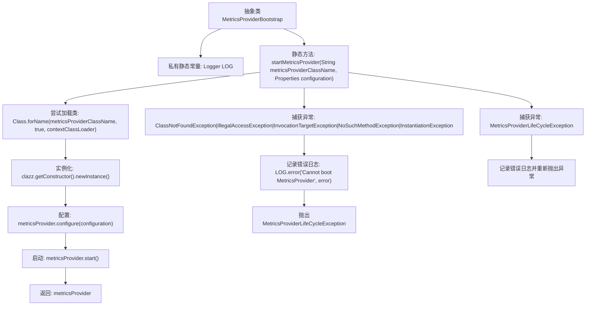

# 基础信息

|      |      |
|------|------|
| 名称 | MetricsProviderBootstrap |
| 编码语言 | .java |
| 代码路径 | zookeeper/zookeeper-server/src/main/java/org/apache/zookeeper/metrics/impl/MetricsProviderBootstrap.java |
| 包名 | org.apache.zookeeper.metrics.impl |
| 依赖项 | ['java.lang.reflect.InvocationTargetException', 'java.util.Properties', 'org.apache.zookeeper.metrics.MetricsProvider', 'org.apache.zookeeper.metrics.MetricsProviderLifeCycleException', 'org.slf4j.Logger', 'org.slf4j.LoggerFactory'] |
| 概述说明 | 抽象类MetricsProviderBootstrap提供启动MetricsProvider的静态方法，通过反射实例化指定类名并初始化，捕获异常并记录日志。 |

# 说明

这是一个抽象类MetricsProviderBootstrap，用于启动指标提供者。它包含一个静态方法startMetricsProvider，接收指标提供者类名和配置属性作为参数。方法通过反射加载指定类，创建实例，配置并启动该指标提供者。若过程中出现类未找到、非法访问、调用目标异常、无此方法、实例化异常或指标提供者生命周期异常，会记录错误日志并抛出MetricsProviderLifeCycleException。成功则返回指标提供者实例。

# 类列表 Class Summary

| 名称   | 类型  | 说明 |
|-------|------|-------------|
| MetricsProviderBootstrap | class | 抽象类MetricsProviderBootstrap提供启动MetricsProvider的静态方法，通过反射实例化指定类名并配置启动，捕获异常并记录日志。 |


## 类 MetricsProviderBootstrap

|      |      |
|------|------|
| 访问范围 | public abstract |
| 类型 | class |
| 名称 | MetricsProviderBootstrap |
| 说明 | 抽象类MetricsProviderBootstrap提供启动MetricsProvider的静态方法，通过反射实例化指定类名并配置启动，捕获异常并记录日志。 |


### UML类图

```mermaid
classDiagram
    class MetricsProviderBootstrap {
        -Logger LOG
        +startMetricsProvider(String metricsProviderClassName, Properties configuration) MetricsProvider
    }

    <<Interface>> MetricsProvider {
        +configure(Properties configuration) void
        +start() void
    }

    MetricsProviderBootstrap --> MetricsProvider : 依赖
    // MetricsProviderBootstrap通过反射实例化并启动MetricsProvider实现类
```

类图描述：
该图展示了一个指标提供者引导类MetricsProviderBootstrap与指标提供者接口MetricsProvider之间的关系。MetricsProviderBootstrap包含静态方法startMetricsProvider，通过反射机制动态加载并实例化指定的MetricsProvider实现类，然后调用其配置和启动方法。MetricsProvider接口定义了配置和启动两个核心方法，具体实现由子类完成。整个过程包含完善的异常处理机制，能捕获类加载、实例化等过程中的各类异常。


### 内部方法调用关系图



这段代码展示了一个抽象类MetricsProviderBootstrap，它包含一个核心静态方法startMetricsProvider，用于动态加载、配置和启动指定的MetricsProvider实现类。流程图清晰描述了从类加载、实例化、配置、启动到异常处理的完整流程，包括对多种反射异常和自定义异常的处理逻辑。该方法通过反射机制实现插件式架构，允许运行时动态加载不同的指标提供者实现。

### 字段列表 Field List

| 名称  | 类型  | 说明 |
|-------|-------|------|
| LOG = LoggerFactory.getLogger(MetricsProviderBootstrap.class) | Logger | 私有静态日志常量LOG，用于MetricsProviderBootstrap类的日志记录。 |

### 方法列表 Method List

| 名称  | 类型  | 说明 |
|-------|-------|------|
| startMetricsProvider | MetricsProvider | 静态方法startMetricsProvider启动指定类名的MetricsProvider实例，配置并启动它，捕获异常并记录错误日志。 |


