# 基础信息

|      |      |
|------|------|
| 名称 | NullMetricsProvider |
| 编码语言 | .java |
| 代码路径 | zookeeper/zookeeper-server/src/main/java/org/apache/zookeeper/metrics/impl/NullMetricsProvider.java |
| 包名 | org.apache.zookeeper.metrics.impl |
| 依赖项 | ['java.util.Properties', 'java.util.function.BiConsumer', 'org.apache.zookeeper.metrics.Counter', 'org.apache.zookeeper.metrics.CounterSet', 'org.apache.zookeeper.metrics.Gauge', 'org.apache.zookeeper.metrics.GaugeSet', 'org.apache.zookeeper.metrics.MetricsContext', 'org.apache.zookeeper.metrics.MetricsProvider', 'org.apache.zookeeper.metrics.MetricsProviderLifeCycleException', 'org.apache.zookeeper.metrics.Summary', 'org.apache.zookeeper.metrics.SummarySet'] |
| 概述说明 | 空实现MetricsProvider接口的NullMetricsProvider类，包含空方法及嵌套空上下文类，用于测试场景。 |

# 说明

NullMetricsProvider是一个空实现的度量指标提供者类，主要用于测试场景。它包含一个静态实例INSTANCE，并实现了MetricsProvider接口的所有方法，但这些方法均为空操作。其内部类NullMetricsContext同样为空实现，返回空实例或零值，支持获取上下文、计数器、计数器集、注册和注销测量仪以及获取摘要和摘要集等功能。此外，还包含NullCounter、NullCounterSet、NullSummary和NullSummarySet等私有静态内部类，均为空实现，用于提供默认的零值或空操作行为。整个设计旨在提供一个不执行任何实际操作的度量指标框架。

# 类列表 Class Summary

| 名称   | 类型  | 说明 |
|-------|------|-------------|
| NullMetricsProvider | class | 空实现MetricsProvider接口的类，包含空MetricsContext、Counter、CounterSet、Summary和SummarySet实现，用于测试或默认场景。 |


## 类 NullMetricsProvider

|      |      |
|------|------|
| 访问范围 | public |
| 类型 | class |
| 名称 | NullMetricsProvider |
| 说明 | 空实现MetricsProvider接口的类，包含空MetricsContext、Counter、CounterSet、Summary和SummarySet实现，用于测试或默认场景。 |


### UML类图

```mermaid
classDiagram
    class NullMetricsProvider {
        +MetricsProvider INSTANCE
        +configure(Properties configuration) void
        +start() void
        +getRootContext() MetricsContext
        +dump(BiConsumer~String, Object~ sink) void
        +resetAllValues() void
        +stop() void
    }

    class NullMetricsContext {
        +NullMetricsContext INSTANCE
        +getContext(String name) MetricsContext
        +getCounter(String name) Counter
        +getCounterSet(String name) CounterSet
        +registerGauge(String name, Gauge gauge) void
        +unregisterGauge(String name) void
        +registerGaugeSet(String name, GaugeSet gaugeSet) void
        +unregisterGaugeSet(String name) void
        +getSummary(String name, DetailLevel detailLevel) Summary
        +getSummarySet(String name, DetailLevel detailLevel) SummarySet
    }

    class NullCounter {
        +NullCounter INSTANCE
        +add(long delta) void
        +get() long
    }

    class NullCounterSet {
        +NullCounterSet INSTANCE
        +add(String key, long delta) void
    }

    class NullSummary {
        +NullSummary INSTANCE
        +add(long value) void
    }

    class NullSummarySet {
        +NullSummarySet INSTANCE
        +add(String key, long value) void
    }

    <<Interface>> MetricsProvider {
        <<Interface>>
        +configure(Properties configuration) void
        +start() void
        +getRootContext() MetricsContext
        +dump(BiConsumer~String, Object~ sink) void
        +resetAllValues() void
        +stop() void
    }

    <<Interface>> MetricsContext {
        <<Interface>>
        +getContext(String name) MetricsContext
        +getCounter(String name) Counter
        +getCounterSet(String name) CounterSet
        +registerGauge(String name, Gauge gauge) void
        +unregisterGauge(String name) void
        +registerGaugeSet(String name, GaugeSet gaugeSet) void
        +unregisterGaugeSet(String name) void
        +getSummary(String name, DetailLevel detailLevel) Summary
        +getSummarySet(String name, DetailLevel detailLevel) SummarySet
    }

    <<Interface>> Counter {
        <<Interface>>
        +add(long delta) void
        +get() long
    }

    <<Interface>> CounterSet {
        <<Interface>>
        +add(String key, long delta) void
    }

    <<Interface>> Summary {
        <<Interface>>
        +add(long value) void
    }

    <<Interface>> SummarySet {
        <<Interface>>
        +add(String key, long value) void
    }

    NullMetricsProvider ..|> MetricsProvider : 实现
    NullMetricsContext ..|> MetricsContext : 实现
    NullCounter ..|> Counter : 实现
    NullCounterSet ..|> CounterSet : 实现
    NullSummary ..|> Summary : 实现
    NullSummarySet ..|> SummarySet : 实现
    NullMetricsProvider --> NullMetricsContext : 包含
    NullMetricsContext --> NullCounter : 创建
    NullMetricsContext --> NullCounterSet : 创建
    NullMetricsContext --> NullSummary : 创建
    NullMetricsContext --> NullSummarySet : 创建
```

这段代码展示了一个空实现的度量系统架构，其中`NullMetricsProvider`作为`MetricsProvider`接口的空实现，通过嵌套类`NullMetricsContext`、`NullCounter`等提供各组件（计数器、统计集等）的空操作实现。所有方法均为无操作或返回默认值，适用于测试或禁用度量功能的场景。类图清晰地展示了接口与实现类的关系，以及核心类之间的组合关系。


### 内部方法调用关系图

```mermaid
graph TD
    A["类NullMetricsProvider"]
    B["静态实例: INSTANCE"]
    C["方法: configure(Properties)"]
    D["方法: start()"]
    E["方法: getRootContext()"]
    F["方法: dump(BiConsumer)"]
    G["方法: resetAllValues()"]
    H["方法: stop()"]
    I["内部类NullMetricsContext"]
    J["静态实例: INSTANCE"]
    K["方法: getContext(String)"]
    L["方法: getCounter(String)"]
    M["方法: getCounterSet(String)"]
    N["方法: registerGauge(String, Gauge)"]
    O["方法: unregisterGauge(String)"]
    P["方法: registerGaugeSet(String, GaugeSet)"]
    Q["方法: unregisterGaugeSet(String)"]
    R["方法: getSummary(String, DetailLevel)"]
    S["方法: getSummarySet(String, DetailLevel)"]
    T["内部类NullCounter"]
    U["静态实例: INSTANCE"]
    V["方法: add(long)"]
    W["方法: get()"]
    X["内部类NullCounterSet"]
    Y["静态实例: INSTANCE"]
    Z["方法: add(String, long)"]
    AA["内部类NullSummary"]
    AB["静态实例: INSTANCE"]
    AC["方法: add(long)"]
    AD["内部类NullSummarySet"]
    AE["静态实例: INSTANCE"]
    AF["方法: add(String, long)"]

    A --> B
    A --> C
    A --> D
    A --> E
    A --> F
    A --> G
    A --> H
    A --> I
    I --> J
    I --> K
    I --> L
    I --> M
    I --> N
    I --> O
    I --> P
    I --> Q
    I --> R
    I --> S
    I --> T
    T --> U
    T --> V
    T --> W
    I --> X
    X --> Y
    X --> Z
    I --> AA
    AA --> AB
    AA --> AC
    I --> AD
    AD --> AE
    AD --> AF
```



这段代码展示了一个空实现的MetricsProvider类及其相关组件。NullMetricsProvider实现了MetricsProvider接口，但所有方法均为空操作或返回空实例，适用于测试或不需要实际指标收集的场景。它包含多个内部类（NullMetricsContext、NullCounter等），每个内部类也都有对应的空实现和静态实例。整个结构通过静态实例提供全局访问点，所有方法调用都不会产生实际效果，但保持了接口的完整性。

### 字段列表 Field List

| 名称  | 类型  | 说明 |
|-------|-------|------|
| INSTANCE = new NullMetricsProvider() | MetricsProvider | 静态常量INSTANCE初始化为NullMetricsProvider实例。 |

### 方法列表 Method List

| 名称  | 类型  | 说明 |
|-------|-------|------|
| start | void | 重写start方法，可能抛出MetricsProviderLifeCycleException异常。 |
| getRootContext | MetricsContext | 重写getRootContext方法，返回NullMetricsContext的单例实例。 |
| configure | void | Java方法重写，配置属性，可能抛出生命周期异常。 |
| dump | void | 重写dump方法，接收BiConsumer参数，无具体实现。 |
| resetAllValues | void | 方法重置所有值，当前为空实现。 |
| stop | void | 重写stop方法，方法体为空。 |


