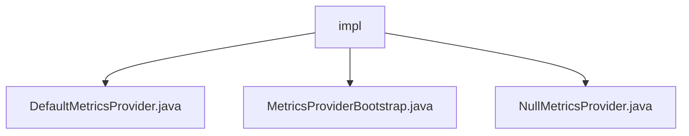

# 基础信息

|      |      |
|------|------|
| 名称 | impl |
| 编码语言 | .java |
| 代码路径 | zookeeper/zookeeper-server/src/main/java/org/apache/zookeeper/metrics/impl |
| 包名 | zookeeper.docs.zookeeper-server.src.main.java.org.apache.zookeeper.metrics.impl |
| 概述说明 | DefaultMetricsProvider是默认指标提供者，管理各类指标并支持配置、启动、停止等功能。MetricsProviderBootstrap通过反射启动指标提供者。NullMetricsProvider为空实现，用于测试。 |

# 说明

## 概述  
1.该模块是Zookeeper的指标采集系统，核心职责为统一管理服务端性能指标（例如Gauge/Counter）并支持动态扩展。  
2.主要接口遵循MetricsProvider规范，通过反射机制加载实现类（例如`startMetricsProvider`静态方法）。  
3.关键数据结构为并发映射存储的指标容器，类似线程安全的哈希表管理Counter等类型。  
4.依赖Java反射API实现动态加载，异常处理依赖SLF4J日志组件。  

## 主要业务场景  
1.支持指标采集全生命周期（例如配置-启动-转储-重置），Null实现用于测试隔离。  
2.采用同步注册模式，通过BiConsumer回调传递指标数据（类似观察者模式）。  
3.功能完整性涵盖指标CRUD、空操作兼容及反射加载，符合监控系统基础要求。  
4.主要用于服务端性能监控，测试场景通过NullMetricsProvider避免副作用。  
5.提供SPI风格接口，允许替换指标实现（例如Default/Null双模式）。  
6.集成案例见Zookeeper服务端，通过Bootstrap类统一初始化指标模块。

### 包内部结构视图

该流程图展示了Zookeeper项目中metrics模块下impl目录的层级结构。根节点"impl"包含三个Java实现类文件：DefaultMetricsProvider、MetricsProviderBootstrap和NullMetricsProvider，这三个文件都直接位于impl目录下，没有更深层级的子目录结构。图表清晰地反映了该包内三个核心指标提供者的实现类文件与父目录的从属关系。

# 文件列表 File List

| 名称   | 类型  | 说明 |
|-------|------|-------------|
| [NullMetricsProvider.java](NullMetricsProvider.md) | file | 空实现MetricsProvider接口的NullMetricsProvider类，包含空方法及嵌套空上下文类，用于测试场景。 |
| [MetricsProviderBootstrap.java](MetricsProviderBootstrap.md) | file | 抽象类MetricsProviderBootstrap提供启动MetricsProvider的静态方法，通过反射实例化指定类名并初始化，捕获异常并记录日志。 |
| [DefaultMetricsProvider.java](DefaultMetricsProvider.md) | file | DefaultMetricsProvider实现MetricsProvider接口，提供根上下文管理、指标注册与收集功能，支持计数器、仪表、摘要等多种指标类型，具备重置和导出能力。 |

