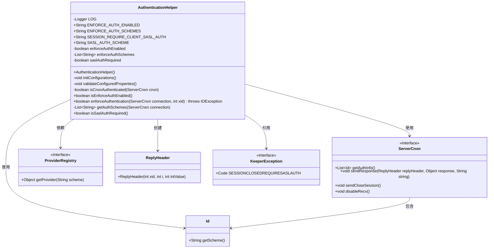
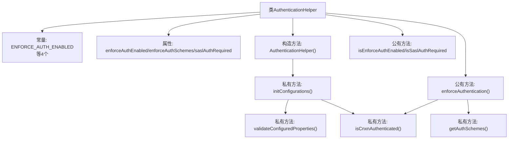
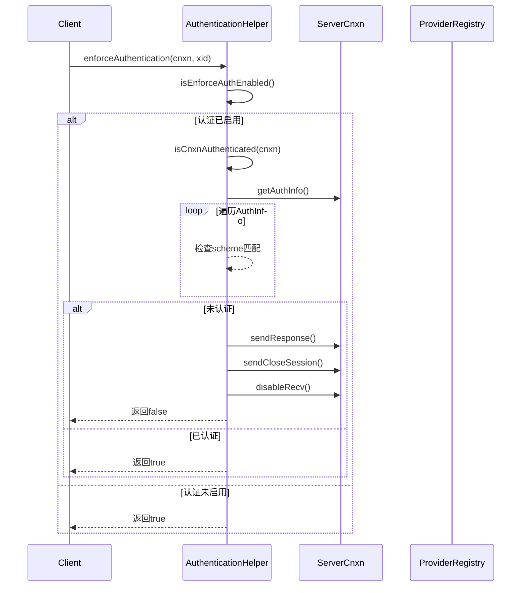

# 基础信息

|      |      |
|------|------|
| 名称 | AuthenticationHelper |
| 编码语言 | .java |
| 代码路径 | zookeeper/zookeeper-server/src/main/java/org/apache/zookeeper/server/AuthenticationHelper.java |
| 包名 | org.apache.zookeeper.server |
| 依赖项 | ['java.io.IOException', 'java.util.ArrayList', 'java.util.Arrays', 'java.util.List', 'java.util.stream.Collectors', 'org.apache.zookeeper.KeeperException', 'org.apache.zookeeper.data.Id', 'org.apache.zookeeper.proto.ReplyHeader', 'org.apache.zookeeper.server.auth.ProviderRegistry', 'org.slf4j.Logger', 'org.slf4j.LoggerFactory'] |
| 概述说明 | AuthenticationHelper类用于管理ZooKeeper认证配置，检查连接认证状态，支持SASL等认证方案，未认证则关闭连接。 |

# 说明

这是一个用于ZooKeeper认证管理的辅助类AuthenticationHelper。它通过系统属性配置认证方案，支持SASL等多种认证方式。主要功能包括：初始化认证配置参数，验证配置有效性，检查连接是否已认证，强制执行认证策略。当检测到未认证连接时，会关闭会话并返回错误信息。类中维护了三个关键状态：是否启用强制认证、支持的认证方案列表、是否要求SASL认证。通过日志记录配置信息，并在配置错误时抛出异常。

# 类列表 Class Summary

| 名称   | 类型  | 说明 |
|-------|------|-------------|
| AuthenticationHelper | class | AuthenticationHelper类用于Zookeeper认证管理，包含认证配置初始化、验证及执行逻辑，支持SASL等认证方案，未认证连接会被关闭。 |

## 类 AuthenticationHelper

|      |      |
|------|------|
| 访问范围 | public |
| 类型 | class |
| 名称 | AuthenticationHelper |
| 说明 | AuthenticationHelper类用于Zookeeper认证管理，包含认证配置初始化、验证及执行逻辑，支持SASL等认证方案，未认证连接会被关闭。 |

### UML类图

这段代码描述了一个ZooKeeper认证辅助类AuthenticationHelper，它负责管理客户端连接认证的强制执行逻辑。类中包含配置初始化、认证方案验证、连接认证状态检查等核心功能，通过系统属性控制认证行为，支持SASL等多种认证方案。当检测到未认证连接时，会发送错误响应并关闭会话。类图展示了它与ServerCnxn接口、Id认证标识类、ProviderRegistry等组件的交互关系。

### 内部方法调用关系图

该流程图展示了AuthenticationHelper类的核心结构和认证强制执行流程。类结构包含4个配置常量、3个状态属性和7个主要方法，其中initConfigurations()会触发属性验证和SASL标志计算。时序图详细描述了enforceAuthentication()的执行路径：首先检查认证开关状态，然后验证连接是否包含合法认证方案，对未认证连接会发送关闭会话响应。整个过程严格遵循配置参数，并确保认证方案在ProviderRegistry中可用。

### 字段列表 Field List

| 名称  | 类型  | 说明 |
|-------|-------|------|
| saslAuthRequired | boolean | 私有布尔变量saslAuthRequired，表示是否需要SASL认证。 |
| ENFORCE_AUTH_SCHEMES = "zookeeper.enforce.auth.schemes" | String | 静态常量ENFORCE_AUTH_SCHEMES定义ZooKeeper强制认证方案配置键。 |
| LOG = LoggerFactory.getLogger(AuthenticationHelper.class) | Logger | 声明一个名为LOG的私有静态常量日志记录器，用于AuthenticationHelper类的日志输出。 |
| SASL_AUTH_SCHEME = "sasl" | String | 定义常量SASL_AUTH_SCHEME，值为"sasl"，表示SASL认证方案。 |
| SESSION_REQUIRE_CLIENT_SASL_AUTH =        "zookeeper.sessionRequireClientSASLAuth" | String | ZooKeeper配置参数，强制客户端SASL认证。 |
| enforceAuthSchemes = new ArrayList<>() | List<String> | 定义私有字符串列表enforceAuthSchemes并初始化为空ArrayList。 |
| enforceAuthEnabled | boolean | 私有布尔变量，用于控制是否启用强制认证。 |
| ENFORCE_AUTH_ENABLED = "zookeeper.enforce.auth.enabled" | String | ZooKeeper认证启用配置项。 |

### 方法列表 Method List

| 名称  | 类型  | 说明 |
|-------|-------|------|
| getAuthSchemes | List<String> | 获取连接认证方案列表的方法，将认证信息流式处理并映射为方案字符串列表。 |
| initConfigurations | void | 方法初始化配置：检查系统属性决定是否启用强制认证及认证方案，记录配置状态并验证。若启用且包含SASL方案则标记为需SASL认证。 |
| enforceAuthentication | boolean | 方法检查连接是否通过认证，若未认证则发送错误响应并关闭会话，返回false；否则返回true。 |
| isCnxnAuthenticated | boolean | 检查连接是否通过认证：遍历连接的认证信息，若存在符合强制认证方案的标识则返回真，否则返回假。 |
| validateConfiguredProperties | void | 验证配置属性：若启用强制认证，检查认证方案是否配置且可用，否则抛出异常并记录错误。 |
| isEnforceAuthEnabled | boolean | 检查是否启用强制认证，返回布尔值enforceAuthEnabled。 |
| isSaslAuthRequired | boolean | 方法检查是否需要SASL认证，返回布尔值saslAuthRequired。 |

