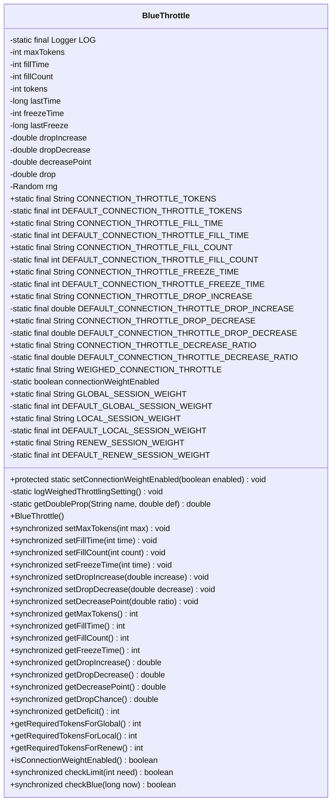
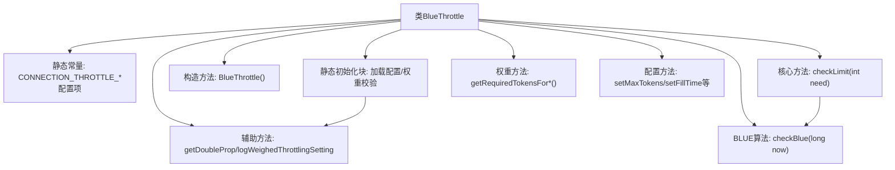

# 基础信息

|      |      |
|------|------|
| 名称 | BlueThrottle |
| 编码语言 | .java |
| 代码路径 | zookeeper/zookeeper-server/src/main/java/org/apache/zookeeper/server/BlueThrottle.java |
| 包名 | org.apache.zookeeper.server |
| 依赖项 | ['java.util.Random', 'org.apache.zookeeper.common.Time', 'org.slf4j.Logger', 'org.slf4j.LoggerFactory'] |
| 概述说明 | BlueThrottle类实现连接限流功能，支持令牌桶算法和BLUE随机限流，可配置不同类型会话的权重和限流参数。 |

# 说明

BlueThrottle是一个用于连接限流的类，支持基于令牌桶和BLUE算法的混合限流策略。它通过配置参数控制最大令牌数、填充速率、冻结时间、丢包概率等核心参数，并支持根据会话类型（全局/本地/续约）设置不同权重。类初始化时会读取系统属性配置默认值，提供同步方法动态调整参数，并通过checkLimit方法执行限流检查。BLUE算法部分通过随机丢包实现拥塞控制，权重机制允许对不同会话类型差异化处理。

# 类列表 Class Summary

| 名称   | 类型  | 说明 |
|-------|------|-------------|
| BlueThrottle | class | BlueThrottle类实现连接限流，支持权重分配和BLUE算法，可配置令牌桶参数和会话权重，默认禁用。 |

## 类 BlueThrottle

|      |      |
|------|------|
| 访问范围 | public |
| 类型 | class |
| 名称 | BlueThrottle |
| 说明 | BlueThrottle类实现连接限流，支持权重分配和BLUE算法，可配置令牌桶参数和会话权重，默认禁用。 |

### UML类图

该图展示了BlueThrottle类的完整结构，它是一个用于连接节流的复杂控制器。类包含多个私有配置参数（如令牌数、填充时间等）和公共静态常量（如ZK配置键名），通过同步方法管理令牌分配和BLUE随机节流算法。核心功能包括：基于权重的连接控制、动态令牌补充机制、以及通过随机丢弃实现的拥塞避免策略。初始化时从系统属性加载默认值，支持全局/本地/续约会话的差异化权重配置。

### 内部方法调用关系图

该流程图展示了BlueThrottle类的核心结构，这是一个实现连接限流和BLUE算法的复杂控制类。静态初始化块负责加载14种配置参数并进行权重校验，构造方法初始化令牌桶状态。核心方法checkLimit实现了双重限流机制：先通过令牌桶算法控制连接速率，再通过checkBlue方法执行BLUE算法的随机丢弃策略。类还提供权重计算、参数配置和辅助工具方法，整体构成一个支持加权连接管理和自适应流量控制的完整体系。

### 字段列表 Field List

| 名称  | 类型  | 说明 |
|-------|-------|------|
| freezeTime | int | 私有整型变量，用于存储冻结时间。 |
| decreasePoint | double | 私有双精度浮点数变量decreasePoint |
| DEFAULT_CONNECTION_THROTTLE_DROP_DECREASE | double | 私有静态常量，类型为双精度浮点数，默认连接节流下降减少值。 |
| DEFAULT_GLOBAL_SESSION_WEIGHT | int | 私有静态常量，默认全局会话权重。 |
| GLOBAL_SESSION_WEIGHT = "zookeeper.connection_throttle_global_session_weight" | String | 全局会话权重配置项，用于Zookeeper连接限流的全局会话权重参数。 |
| RENEW_SESSION_WEIGHT = "zookeeper.connection_throttle_renew_session_weight" | String | ZooKeeper连接节流会话续订权重参数。 |
| DEFAULT_RENEW_SESSION_WEIGHT | int | 私有静态常量整型变量，默认会话续期权重。 |
| WEIGHED_CONNECTION_THROTTLE = "zookeeper.connection_throttle_weight_enabled" | String | 这是一个静态常量字符串，用于标识ZooKeeper连接节流权重功能的启用状态。 |
| DEFAULT_CONNECTION_THROTTLE_DROP_INCREASE | double | 私有静态常量，默认连接节流降速增量值。 |
| LOCAL_SESSION_WEIGHT = "zookeeper.connection_throttle_local_session_weight" | String | 该代码定义了一个静态常量字符串，用于配置ZooKeeper本地会话的权重参数。 |
| drop | double | 声明一个私有的双精度浮点变量drop。 |
| CONNECTION_THROTTLE_DROP_DECREASE = "zookeeper.connection_throttle_drop_decrease" | String | ZooKeeper连接限流下降阈值配置项。 |
| DEFAULT_CONNECTION_THROTTLE_FILL_TIME | int | 私有静态常量，默认连接节流填充时间。 |
| fillCount | int | 私有整型变量fillCount，用于记录填充数量。 |
| connectionWeightEnabled | boolean | 私有静态布尔变量connectionWeightEnabled |
| DEFAULT_CONNECTION_THROTTLE_FREEZE_TIME | int | 私有静态常量，默认连接节流冻结时间。 |
| fillTime | int | 私有整型变量fillTime，用于存储填充时间。 |
| DEFAULT_CONNECTION_THROTTLE_FILL_COUNT | int | 私有静态常量，默认连接节流填充计数。 |
| CONNECTION_THROTTLE_DECREASE_RATIO = "zookeeper.connection_throttle_decrease_ratio" | String | ZooKeeper连接限流降低比例配置项。 |
| CONNECTION_THROTTLE_FREEZE_TIME = "zookeeper.connection_throttle_freeze_time" | String | 这是一个静态常量字符串，定义ZooKeeper连接节流冻结时间的配置键名。 |
| CONNECTION_THROTTLE_DROP_INCREASE = "zookeeper.connection_throttle_drop_increase" | String | ZooKeeper连接限流丢弃增长配置项。 |
| LOG = LoggerFactory.getLogger(BlueThrottle.class) | Logger | BlueThrottle类中定义了一个名为LOG的私有静态日志记录器常量。 |
| tokens | int | 私有整型变量tokens。 |
| DEFAULT_CONNECTION_THROTTLE_DECREASE_RATIO | double | 私有静态常量，默认连接节流降低比率。 |
| CONNECTION_THROTTLE_FILL_COUNT = "zookeeper.connection_throttle_fill_count" | String | 静态常量字符串，定义ZooKeeper连接限流填充计数的配置键名。 |
| CONNECTION_THROTTLE_TOKENS = "zookeeper.connection_throttle_tokens" | String | 该代码定义了一个静态常量字符串，用于配置ZooKeeper连接限流的令牌参数。 |
| maxTokens | int | 私有整型变量maxTokens，用于存储最大令牌数。 |
| CONNECTION_THROTTLE_FILL_TIME = "zookeeper.connection_throttle_fill_time" | String | 这是一个静态常量字符串，定义了ZooKeeper连接限流填充时间的配置键名。 |
| dropDecrease | double | 私有双精度浮点数变量dropDecrease。 |
| DEFAULT_LOCAL_SESSION_WEIGHT | int | 私有静态常量，默认本地会话权重值。 |
| dropIncrease | double | 私有双精度浮点数变量dropIncrease |
| rng | Random | 随机数生成器实例化。 |
| lastTime | long | 私有长整型变量lastTime，用于记录时间戳。 |
| DEFAULT_CONNECTION_THROTTLE_TOKENS | int | 私有静态常量，默认连接节流令牌数。 |
| lastFreeze | long | 
声明一个私有长整型变量lastFreeze。 |

### 方法列表 Method List

| 名称  | 类型  | 说明 |
|-------|-------|------|
| setConnectionWeightEnabled | void | 设置连接权重启用状态的静态方法，更新标志并记录日志。 |
| setDecreasePoint | void | 这是一个Java同步方法，用于设置decreasePoint的值，参数为ratio。方法线程安全。 |
| setDropIncrease | void | 同步方法设置掉落增量，参数为double类型，直接赋值给成员变量dropIncrease。 |
| getDropIncrease | double | 同步方法返回双精度数值dropIncrease。 |
| getFillCount | int | 同步方法返回填充计数值。 |
| getDropChance | double | 这是一个同步方法，返回名为drop的double类型变量值。 |
| getFreezeTime | int | 同步方法返回冻结时间值。 |
| getMaxTokens | int | 这是一个同步方法，返回maxTokens的值。 |
| getDecreasePoint | double | 这是一个同步方法，返回double类型的decreasePoint值。 |
| setFillCount | void | 同步方法setFillCount用于设置fillCount的值，参数为count。 |
| getDropDecrease | double | 这是一个同步方法，返回double类型的dropDecrease值。 |
| setMaxTokens | void | 同步方法`setMaxTokens`更新最大令牌数，调整当前令牌数以保持差值不变。 |
| logWeighedThrottlingSetting | void | 私有方法记录连接权重限流设置：若启用则显示全局、续约、本地会话权重默认值，否则提示禁用。仅当限流启用时权重才生效。 |
| getDoubleProp | double | 获取系统属性值并转为double，若不存在则返回默认值。 |
| getFillTime | int | 同步方法返回填充时间值。 |
| setFillTime | void | 同步方法设置填充时间为指定值。 |
| getDeficit | int | 同步方法getDeficit返回最大令牌数与当前令牌数的差值。 |
| setDropDecrease | void | Java同步方法，设置dropDecrease变量值，参数为double类型decrease。 |
| setFreezeTime | void | 同步方法setFreezeTime用于设置freezeTime变量值，参数为time。 |
| getRequiredTokensForGlobal | int | 方法返回全局会话所需的令牌数，默认值为BlueThrottle.DEFAULT_GLOBAL_SESSION_WEIGHT。 |
| getRequiredTokensForLocal | int | 方法返回本地会话所需的令牌数，默认值为BlueThrottle.DEFAULT_LOCAL_SESSION_WEIGHT。 |
| getRequiredTokensForRenew | int | 方法返回默认会话续期所需的令牌数，值为BlueThrottle.DEFAULT_RENEW_SESSION_WEIGHT。 |
| isConnectionWeightEnabled | boolean | 方法检查连接权重功能是否启用，返回布尔值。 |
| checkLimit | boolean | 同步方法检查令牌限制：若maxTokens为0则不限流；根据时间差补充令牌；若freezeTime非-1则检查BLUE限流；令牌不足返回false，足够则扣除并返回true。 |
| checkBlue | boolean | 检查令牌状态并更新丢弃概率，若时间差超过冻结时间，根据当前令牌数量调整丢弃率，最后返回是否丢弃的随机结果。 |

