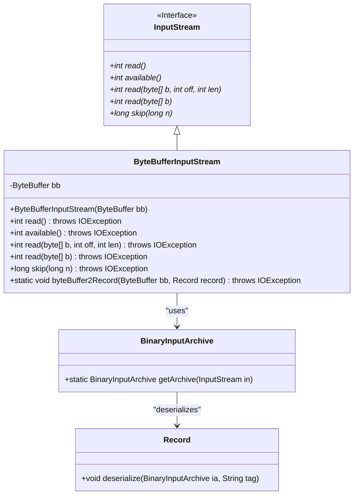
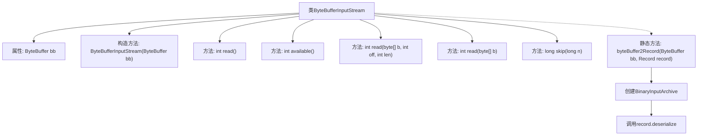

# 基础信息

|      |      |
|------|------|
| 名称 | ByteBufferInputStream |
| 编码语言 | .java |
| 代码路径 | zookeeper/zookeeper-server/src/main/java/org/apache/zookeeper/server/ByteBufferInputStream.java |
| 包名 | org.apache.zookeeper.server |
| 依赖项 | ['java.io.IOException', 'java.io.InputStream', 'java.nio.ByteBuffer', 'javax.annotation.Nonnull', 'org.apache.jute.BinaryInputArchive', 'org.apache.jute.Record'] |
| 概述说明 | ByteBufferInputStream继承InputStream，封装ByteBuffer实现读取、跳过字节功能，提供剩余字节数查询，支持将ByteBuffer数据反序列化为Record对象。 |

# 说明

ByteBufferInputStream是一个继承自InputStream的类，用于从ByteBuffer读取数据。它包含一个ByteBuffer成员变量bb，通过构造函数初始化。类实现了read方法，支持读取单个字节或字节数组，当无数据可读时返回-1。available方法返回剩余可读字节数。skip方法支持跳过指定字节数。此外，提供了静态方法byteBuffer2Record，将ByteBuffer数据通过BinaryInputArchive反序列化为Record对象。所有方法均可能抛出IOException异常。

# 类列表 Class Summary

| 名称   | 类型  | 说明 |
|-------|------|-------------|
| ByteBufferInputStream | class | ByteBufferInputStream继承InputStream，封装ByteBuffer实现读取、跳过和可用字节检查功能，并提供字节缓冲到记录的转换方法。 |

## 类 ByteBufferInputStream

|      |      |
|------|------|
| 访问范围 | public |
| 类型 | class |
| 名称 | ByteBufferInputStream |
| 说明 | ByteBufferInputStream继承InputStream，封装ByteBuffer实现读取、跳过和可用字节检查功能，并提供字节缓冲到记录的转换方法。 |

### UML类图

类图描述：ByteBufferInputStream是InputStream的实现类，用于从ByteBuffer中读取数据。它重写了read()、available()等核心方法，并新增了byteBuffer2Record静态方法，通过BinaryInputArchive将ByteBuffer数据反序列化为Record对象。BinaryInputArchive作为工具类提供反序列化功能，Record则是数据载体类，三者形成"读取-转换-存储"的协作关系。

### 内部方法调用关系图

该流程图展示了ByteBufferInputStream类的结构和主要方法调用关系。该类继承自InputStream，核心功能是通过ByteBuffer实现输入流操作，包含读取字节、检查可用字节数、跳过字节等方法。静态方法byteBuffer2Record展示了如何将ByteBuffer转换为Record对象的过程，通过创建BinaryInputArchive并调用反序列化方法完成数据转换。所有方法都围绕ByteBuffer操作展开，体现了对字节缓冲区的封装和流式处理能力。

### 字段列表 Field List

| 名称  | 类型  | 说明 |
|-------|-------|------|
| bb | ByteBuffer | 私有字节缓冲区变量bb，类型为ByteBuffer。 |

### 方法列表 Method List

| 名称  | 类型  | 说明 |
|-------|-------|------|
| read | int | Java方法重写，读取字节流。若缓冲区无数据返回-1，否则返回无符号字节值。 |
| read | int | 这是一个Java方法重写，用于读取字节数组，调用另一个read方法并返回读取的字节数。 |
| available | int | 重写available方法，返回缓冲区剩余字节数。 |
| read | int | 重写read方法，检查剩余字节数，若为0返回-1，否则读取不超过剩余字节数的数据到数组，返回实际读取长度。 |
| skip | long | 重写skip方法：若n小于0返回0，否则跳过n或剩余字节数中的较小值，并返回实际跳过的字节数。 |
| byteBuffer2Record | void | 将ByteBuffer数据反序列化为Record对象，使用BinaryInputArchive处理输入流。 |

