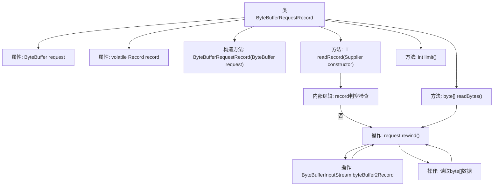

# 基础信息

|      |      |
|------|------|
| 名称 | ByteBufferRequestRecord |
| 编码语言 | .java |
| 代码路径 | zookeeper/zookeeper-server/src/main/java/org/apache/zookeeper/server/ByteBufferRequestRecord.java |
| 包名 | org.apache.zookeeper.server |
| 依赖项 | ['java.io.IOException', 'java.nio.ByteBuffer', 'java.util.function.Supplier', 'org.apache.jute.Record'] |
| 概述说明 | ByteBufferRequestRecord类实现RequestRecord接口，封装ByteBuffer请求数据，提供读取记录、字节数组和缓冲区大小的方法，支持懒加载和线程安全。 |

# 说明

ByteBufferRequestRecord类实现了RequestRecord接口，用于处理字节缓冲区的请求记录。它包含一个final的ByteBuffer类型字段request和一个volatile的Record类型字段record。构造函数接收ByteBuffer参数初始化request。提供了三个方法：readRecord方法通过Supplier构造Record对象并填充数据，readBytes方法读取字节数组，limit方法返回缓冲区限制大小。所有操作前都会重置缓冲区位置。

# 类列表 Class Summary

| 名称   | 类型  | 说明 |
|-------|------|-------------|
| ByteBufferRequestRecord | class | ByteBufferRequestRecord类实现RequestRecord接口，封装ByteBuffer请求数据，提供读取记录、字节数组和缓冲区限制的方法。通过懒加载优化记录读取，确保线程安全。 |


## 类 ByteBufferRequestRecord

|      |      |
|------|------|
| 访问范围 | public |
| 类型 | class |
| 名称 | ByteBufferRequestRecord |
| 说明 | ByteBufferRequestRecord类实现RequestRecord接口，封装ByteBuffer请求数据，提供读取记录、字节数组和缓冲区限制的方法。通过懒加载优化记录读取，确保线程安全。 |


### UML类图

```mermaid
classDiagram
    class ByteBufferRequestRecord {
        -ByteBuffer request
        -volatile Record record
        +ByteBufferRequestRecord(ByteBuffer request)
        +~T~ readRecord(Supplier~T~ constructor)~T~ throws IOException
        +byte[] readBytes()
        +int limit()
    }

    <<interface>> ByteBufferRequestRecord {
        <<Interface>>
        +~T~ readRecord(Supplier~T~ constructor)~T~ throws IOException
        +byte[] readBytes()
        +int limit()
    }

    class Record {
        <<Interface>>
    }

    ByteBufferRequestRecord ..|> RequestRecord : 实现
    ByteBufferRequestRecord --> Record : 包含
    ByteBufferRequestRecord --> ByteBuffer : 依赖
```

这段类图展示了ByteBufferRequestRecord类的结构，它实现了RequestRecord接口，包含一个ByteBuffer类型的请求数据和volatile修饰的Record记录。类中提供了三个主要方法：readRecord用于读取记录（使用泛型和Supplier构造器模式），readBytes用于读取字节数组，limit用于获取缓冲区限制。该类通过ByteBuffer进行数据操作，并在方法调用前后维护缓冲区的rewind状态。


### 内部方法调用关系图



流程图描述了ByteBufferRequestRecord类的结构和核心方法调用关系。该类封装了ByteBuffer请求处理逻辑，包含三个关键方法：readRecord通过构造器读取记录并缓存，readBytes提取字节数据，limit获取缓冲区大小。readRecord方法实现了懒加载模式，首次调用时通过ByteBufferInputStream转换数据，后续直接返回缓存记录。所有方法都维护request缓冲区的指针状态，确保数据一致性。流程图中特别突出了rewind操作和字节流转换的关键步骤。

### 字段列表 Field List

| 名称  | 类型  | 说明 |
|-------|-------|------|
| request | ByteBuffer | 私有字节缓冲区请求对象。 |
| record | Record | 私有易变记录变量。 |

### 方法列表 Method List

| 名称  | 类型  | 说明 |
|-------|-------|------|
| limit | int | 重写limit方法，直接返回request对象的limit值。 |
| readRecord | T | 方法`readRecord`读取记录：若存在则返回，否则构造新记录并从字节流填充数据后返回。处理前会重置请求流位置。 |
| readBytes | byte[] | 重写readBytes方法，将请求数据读取到字节数组并重置请求位置后返回。 |


