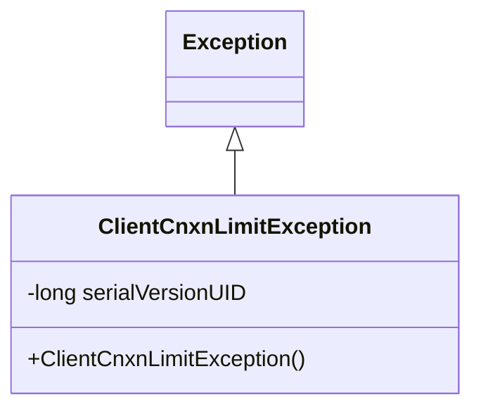
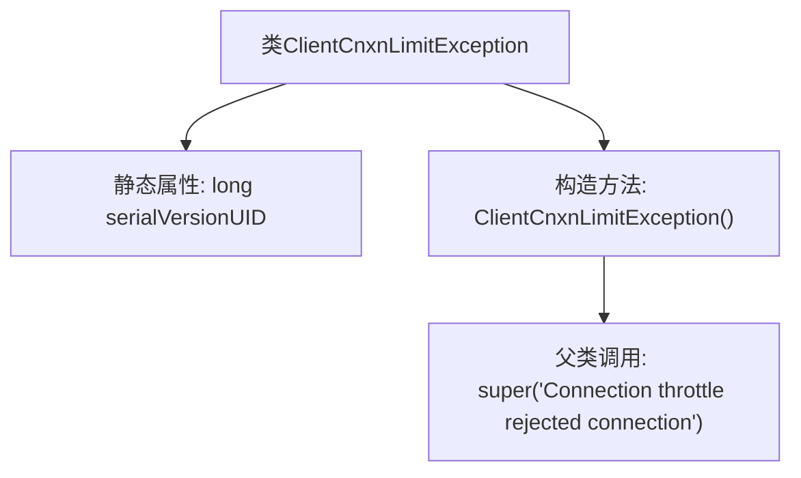

# 基础信息

|      |      |
|------|------|
| 名称 | ClientCnxnLimitException |
| 编码语言 | .java |
| 代码路径 | zookeeper/zookeeper-server/src/main/java/org/apache/zookeeper/server/ClientCnxnLimitException.java |
| 包名 | org.apache.zookeeper.server |
| 依赖项 | [] |
| 概述说明 | ClientCnxnLimitException是继承Exception的自定义异常，用于连接被限流拒绝时抛出，包含默认错误信息。 |

# 说明

这是一个名为ClientCnxnLimitException的自定义异常类，继承自Exception基类。该类用于表示客户端连接被限制的情况，包含一个静态的serialVersionUID字段用于序列化版本控制。异常类提供了一个无参构造函数，默认抛出包含"Connection throttle rejected connection"错误信息的异常实例。该异常通常用于处理系统因连接数限制而拒绝新连接的场景。

# 类列表 Class Summary

| 名称   | 类型  | 说明 |
|-------|------|-------------|
| ClientCnxnLimitException | class | 客户端连接限制异常类，继承自Exception，用于处理连接被限流拒绝的情况。序列化ID为-8655587505476768446L，构造时默认提示"Connection throttle rejected connection"。 |

## 类 ClientCnxnLimitException

|      |      |
|------|------|
| 访问范围 | public |
| 类型 | class |
| 名称 | ClientCnxnLimitException |
| 说明 | 客户端连接限制异常类，继承自Exception，用于处理连接被限流拒绝的情况。序列化ID为-8655587505476768446L，构造时默认提示"Connection throttle rejected connection"。 |

### UML类图

这段类图展示了一个自定义异常类`ClientCnxnLimitException`，它继承自Java标准库中的`Exception`类。该类包含一个私有的静态常量`serialVersionUID`用于序列化版本控制，以及一个公有的无参构造函数，该构造函数调用父类构造方法并设置默认错误消息"Connection throttle rejected connection"。这个异常类通常用于表示客户端连接数超过限制时的错误情况，通过继承关系获得了Java异常处理的基本功能。

### 内部方法调用关系图

这段代码定义了一个继承自Exception的自定义异常类ClientCnxnLimitException。该类包含一个静态的序列化版本ID和一个构造函数，构造函数通过super调用父类Exception的构造函数并传递错误信息字符串"Connection throttle rejected connection"。该异常用于在连接被节流拒绝时抛出，流程图清晰地展示了类结构和构造函数的调用关系。

### 字段列表 Field List

| 名称  | 类型  | 说明 |
|-------|-------|------|
| serialVersionUID = -8655587505476768446L | long | 私有静态长整型常量serialVersionUID，值为-8655587505476768446L，用于序列化版本控制。 |

### 方法列表 Method List

| 名称  | 类型  | 说明 |
|-------|-------|------|

