# 基础信息

|      |      |
|------|------|
| 名称 | ConnectionBean |
| 编码语言 | .java |
| 代码路径 | zookeeper/zookeeper-server/src/main/java/org/apache/zookeeper/server/ConnectionBean.java |
| 包名 | org.apache.zookeeper.server |
| 依赖项 | ['java.net.Inet6Address', 'java.net.InetAddress', 'java.net.InetSocketAddress', 'java.util.Arrays', 'javax.management.ObjectName', 'org.apache.zookeeper.common.Time', 'org.apache.zookeeper.jmx.MBeanRegistry', 'org.apache.zookeeper.jmx.ZKMBeanInfo', 'org.slf4j.Logger', 'org.slf4j.LoggerFactory'] |
| 概述说明 | ConnectionBean类实现ConnectionMXBean和ZKMBeanInfo接口，管理ZooKeeper服务器连接，包含会话ID、客户端IP、统计数据和操作控制方法。 |

# 说明

ConnectionBean类实现了ConnectionMXBean和ZKMBeanInfo接口，用于管理ZooKeeper服务器连接。它包含连接信息如远程IP、会话ID、统计数据和操作。提供获取会话ID、源IP、临时节点、连接时间等方法，支持终止会话、重置计数器等操作。还能获取延迟、请求数、数据包收发等性能指标，以及最后操作、响应时间等详细信息。

# 类列表 Class Summary

| 名称   | 类型  | 说明 |
|-------|------|-------------|
| ConnectionBean | class | ConnectionBean类实现ConnectionMXBean和ZKMBeanInfo接口，管理ZooKeeper服务器连接，包含会话ID、客户端IP、统计数据和操作如终止会话、重置计数器等。 |


## 类 ConnectionBean

|      |      |
|------|------|
| 访问范围 | public |
| 类型 | class |
| 名称 | ConnectionBean |
| 说明 | ConnectionBean类实现ConnectionMXBean和ZKMBeanInfo接口，管理ZooKeeper服务器连接，包含会话ID、客户端IP、统计数据和操作如终止会话、重置计数器等。 |


### UML类图

```mermaid
classDiagram
    class ConnectionBean {
        -ServerCnxn connection
        -Stats stats
        -ZooKeeperServer zk
        -String remoteIP
        -long sessionId
        -Logger LOG
        +ConnectionBean(ServerCnxn connection, ZooKeeperServer zk)
        +String getSessionId()
        +String getSourceIP()
        +String getName()
        +boolean isHidden()
        +String[] getEphemeralNodes()
        +String getStartedTime()
        +void terminateSession()
        +void terminateConnection()
        +void resetCounters()
        +String toString()
        +long getOutstandingRequests()
        +long getPacketsReceived()
        +long getPacketsSent()
        +int getSessionTimeout()
        +long getMinLatency()
        +long getAvgLatency()
        +long getMaxLatency()
        +String getLastOperation()
        +String getLastCxid()
        +String getLastZxid()
        +String getLastResponseTime()
        +long getLastLatency()
    }

    <<Interface>> ConnectionMXBean
    <<Interface>> ZKMBeanInfo

    ConnectionBean ..|> ConnectionMXBean : 实现
    ConnectionBean ..|> ZKMBeanInfo : 实现

    class ServerCnxn {
        +InetSocketAddress getRemoteSocketAddress()
        +long getSessionId()
        +void sendCloseSession()
        +int getSessionTimeout()
    }

    class Stats {
        +Date getEstablished()
        +void resetStats()
        +long getOutstandingRequests()
        +long getPacketsReceived()
        +long getPacketsSent()
        +long getMinLatency()
        +long getAvgLatency()
        +long getMaxLatency()
        +String getLastOperation()
        +long getLastCxid()
        +long getLastZxid()
        +long getLastResponseTime()
        +long getLastLatency()
    }

    class ZooKeeperServer {
        +ZKDatabase getZKDatabase()
        +void closeSession(long sessionId)
    }

    ConnectionBean --> ServerCnxn : 依赖
    ConnectionBean --> Stats : 依赖
    ConnectionBean --> ZooKeeperServer : 依赖
```

类图描述：ConnectionBean类实现了ConnectionMXBean和ZKMBeanInfo接口，用于管理ZooKeeper服务器连接的相关信息。它包含连接状态、会话ID、远程IP等属性，并提供获取会话信息、终止连接、重置计数器等方法。该类依赖于ServerCnxn处理网络连接，Stats收集统计信息，以及ZooKeeperServer进行会话管理。整体设计体现了JMX管理接口的实现和ZooKeeper连接管理的核心功能。


### 内部方法调用关系图

```mermaid
graph TD
    A["类ConnectionBean"]
    B["属性: ServerCnxn connection"]
    C["属性: Stats stats"]
    D["属性: ZooKeeperServer zk"]
    E["属性: String remoteIP"]
    F["属性: long sessionId"]
    G["构造方法: ConnectionBean(ServerCnxn, ZooKeeperServer)"]
    H["方法: String getSessionId()"]
    I["方法: String getSourceIP()"]
    J["方法: String getName()"]
    K["方法: boolean isHidden()"]
    L["方法: String[] getEphemeralNodes()"]
    M["方法: String getStartedTime()"]
    N["方法: void terminateSession()"]
    O["方法: void terminateConnection()"]
    P["方法: void resetCounters()"]
    Q["方法: String toString()"]
    R["方法: long getOutstandingRequests()"]
    S["方法: long getPacketsReceived()"]
    T["方法: long getPacketsSent()"]
    U["方法: int getSessionTimeout()"]
    V["方法: long getMinLatency()"]
    W["方法: long getAvgLatency()"]
    X["方法: long getMaxLatency()"]
    Y["方法: String getLastOperation()"]
    Z["方法: String getLastCxid()"]
    AA["方法: String getLastZxid()"]
    AB["方法: String getLastResponseTime()"]
    AC["方法: long getLastLatency()"]

    A --> B
    A --> C
    A --> D
    A --> E
    A --> F
    A --> G
    A --> H
    A --> I
    A --> J
    A --> K
    A --> L
    A --> M
    A --> N
    A --> O
    A --> P
    A --> Q
    A --> R
    A --> S
    A --> T
    A --> U
    A --> V
    A --> W
    A --> X
    A --> Y
    A --> Z
    A --> AA
    A --> AB
    A --> AC
```



该流程图展示了ConnectionBean类的完整结构，包含5个私有属性和20个公共方法。核心功能包括：通过构造方法初始化连接信息；提供会话管理（terminateSession/Connection）；统计网络数据（PacketsReceived/Sent）；监控性能指标（Latency相关方法）；以及实现MXBean标准接口方法。所有方法均围绕ZooKeeper服务器连接状态管理展开，体现了对连接生命周期、性能监控和故障处理的完整封装。

### 字段列表 Field List

| 名称  | 类型  | 说明 |
|-------|-------|------|
| remoteIP | String | 私有字符串变量remoteIP，存储远程IP地址。 |
| stats | Stats | 私有不可变的统计对象stats。 |
| connection | ServerCnxn | 私有成员变量connection，类型为ServerCnxn，表示服务器连接。 |
| zk | ZooKeeperServer | 私有不可变的ZooKeeper服务器实例。 |
| LOG = LoggerFactory.getLogger(ConnectionBean.class) | Logger | 定义ConnectionBean类的私有静态日志对象LOG，使用LoggerFactory获取日志实例。 |
| sessionId | long | 私有长整型会话ID变量。 |

### 方法列表 Method List

| 名称  | 类型  | 说明 |
|-------|-------|------|
| getLastLatency | long | 获取最后一次延迟时间的方法，返回stats中的lastLatency值。 |
| getMinLatency | long | 获取最小延迟时间的方法，返回stats对象中的最小延迟值。 |
| getAvgLatency | long | 获取平均延迟的方法，返回stats对象中的平均延迟值。 |
| getSessionTimeout | int | 该方法返回连接的会话超时时间，直接调用connection对象的getSessionTimeout方法获取结果。 |
| getLastResponseTime | String | 方法返回最后响应时间的字符串表示，由时间戳转换而来。 |
| getPacketsSent | long | 获取发送的数据包数量。 |
| getMaxLatency | long | 获取最大延迟的方法，返回stats对象中的maxLatency值。 |
| resetCounters | void | 重置计数器方法，调用stats.resetStats()清零统计信息。 |
| getLastZxid | String | Java方法：返回以"0x"开头的stats.getLastZxid()的十六进制字符串表示。 |
| getLastOperation | String | 获取最后一次操作的方法，返回stats中的最后操作记录。 |
| getName | String | Java方法：返回连接全路径，格式为"Connections/远程IP/会话ID"。 |
| getLastCxid | String | 该方法返回最后事务ID的十六进制字符串表示，前缀为"0x"。 |
| getEphemeralNodes | String[] | 获取临时节点：检查ZK数据库存在后，返回按会话ID排序的临时节点数组，否则返回null。 |
| getSourceIP | String | 获取远程连接的IP地址和端口，若不存在则返回空。 |
| getSessionId | String | 方法getSessionId返回以"0x"开头的会话ID十六进制字符串。 |
| terminateSession | void | 终止会话方法，尝试关闭指定会话ID，失败时记录警告日志。 |
| toString | String | Java重写toString方法，返回包含ClientIP和SessionId的ConnectionBean字符串。 |
| getPacketsReceived | long | 获取接收数据包数量的方法，返回stats中的packetsReceived值。 |
| getOutstandingRequests | long | 该方法返回当前未处理的请求数量，通过调用stats对象的getOutstandingRequests方法实现。 |
| getStartedTime | String | 该方法返回统计数据的起始时间字符串，调用stats对象的getEstablished方法并转为字符串格式。 |
| isHidden | boolean | 方法isHidden返回false，表示对象未被隐藏。 |
| terminateConnection | void | 终止连接：发送关闭会话指令。 |


