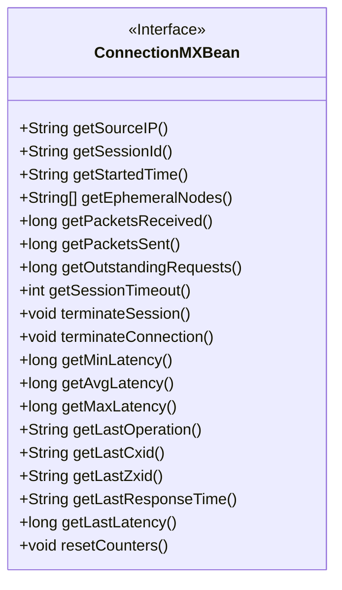

# 基础信息

|      |      |
|------|------|
| 名称 | ConnectionMXBean |
| 编码语言 | .java |
| 代码路径 | zookeeper/zookeeper-server/src/main/java/org/apache/zookeeper/server/ConnectionMXBean.java |
| 包名 | org.apache.zookeeper.server |
| 依赖项 | [] |
| 概述说明 | ConnectionMXBean接口提供客户端连接管理功能，包括获取IP、会话ID、起止时间、收发数据包数、延迟统计及终止会话或连接的方法。 |

# 说明

该接口定义了一个连接管理相关的MXBean，提供了获取客户端连接信息的方法，包括源IP、会话ID、连接开始时间、临时节点列表、收发数据包数量、待处理请求数、会话超时时间等。还包含终止会话或连接的操作。自3.3.0版本起新增了延迟统计（最小、平均、最大）、最后操作信息、最后响应时间及延迟等指标，并提供了重置计数器功能。

# 类列表 Class Summary

| 名称   | 类型  | 说明 |
|-------|------|-------------|
| ConnectionMXBean | interface | ConnectionMXBean接口提供客户端连接管理功能，包括获取IP、会话ID、起止时间、收发数据包、延迟统计等，支持终止会话或连接，并可重置计数器。 |

## 类 ConnectionMXBean

|      |      |
|------|------|
| 访问范围 | public |
| 类型 | interface |
| 名称 | ConnectionMXBean |
| 说明 | ConnectionMXBean接口提供客户端连接管理功能，包括获取IP、会话ID、起止时间、收发数据包、延迟统计等，支持终止会话或连接，并可重置计数器。 |

### UML类图

这段代码定义了一个名为ConnectionMXBean的接口，该接口提供了监控和管理客户端连接的各种方法。接口包含获取客户端IP、会话ID、连接时间、临时节点等基本信息的方法，以及数据包收发统计、延迟测量等性能监控方法，还包括终止会话/连接的操作方法和重置计数器功能。该接口主要用于JMX(Java Management Extensions)技术中，实现对ZooKeeper等分布式系统客户端连接的管理和监控。

### 内部方法调用关系图

```mermaid
graph TD
    A["接口ConnectionMXBean"]
    B["方法: String getSourceIP()"]
    C["方法: String getSessionId()"]
    D["方法: String getStartedTime()"]
    E["方法: String[] getEphemeralNodes()"]
    F["方法: long getPacketsReceived()"]
    G["方法: long getPacketsSent()"]
    H["方法: long getOutstandingRequests()"]
    I["方法: int getSessionTimeout()"]
    J["方法: void terminateSession()"]
    K["方法: void terminateConnection()"]
    L["方法: long getMinLatency()"]
    M["方法: long getAvgLatency()"]
    N["方法: long getMaxLatency()"]
    O["方法: String getLastOperation()"]
    P["方法: String getLastCxid()"]
    Q["方法: String getLastZxid()"]
    R["方法: String getLastResponseTime()"]
    S["方法: long getLastLatency()"]
    T["方法: void resetCounters()"]

    A --> B
    A --> C
    A --> D
    A --> E
    A --> F
    A --> G
    A --> H
    A --> I
    A --> J
    A --> K
    A --> L
    A --> M
    A --> N
    A --> O
    A --> P
    A --> Q
    A --> R
    A --> S
    A --> T
```

该流程图展示了ConnectionMXBean接口的所有方法定义，这是一个用于监控和管理客户端连接的JMX接口。接口包含20个方法，分为三类功能：1) 获取连接信息(如IP、会话ID、启动时间)；2) 连接控制(终止会话/连接)；3) 性能统计(延迟、最后操作、计数器重置)。所有方法均为抽象方法，需由实现类具体实现，适用于ZooKeeper等分布式系统的连接监控场景。

### 字段列表 Field List

| 名称  | 类型  | 说明 |
|-------|-------|------|

### 方法列表 Method List

| 名称  | 类型  | 说明 |
|-------|-------|------|
| getStartedTime | String | 方法`getStartedTime`返回字符串格式的启动时间。 |
| terminateSession | void | 终止当前会话。 |
| getMaxLatency | long | 获取最大延迟值的方法。 |
| getEphemeralNodes | String[] | 获取临时节点列表的方法。 |
| getSessionTimeout | int | 获取会话超时时间的整型函数。 |
| getPacketsReceived | long | 获取接收数据包总数的方法。 |
| terminateConnection | void | 终止连接。 |
| getMinLatency | long | 获取最小延迟值的方法。 |
| getSessionId | String | 获取当前会话的唯一标识符。 |
| getPacketsSent | long | 获取发送的数据包数量。 |
| getAvgLatency | long | 获取平均延迟的方法。 |
| getSourceIP | String | 获取源IP地址的方法。 |
| getLastOperation | String | 获取最后一次操作的方法。 |
| getOutstandingRequests | long | 获取未完成请求的数量。 |
| getLastCxid | String | 获取最后的事务ID。 |
| getLastZxid | String | 获取最后的事务ID。 |
| getLastLatency | long | 获取最后延迟时间的方法。 |
| getLastResponseTime | String | 获取最后一次响应时间的方法。 |
| resetCounters | void | 重置计数器函数，无参数无返回值。 |

